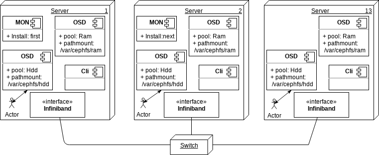

# Проверка кластера ceph

[[_TOC_]]

Здесь приведена методика проверки кластера ceph

**Принятые определения**:
- Доступность информации — состояние информации (ресурсов автоматизированной информационной системы), при котором субъекты, имеющие права доступа, могут реализовывать их беспрепятственно. К правам доступа относятся: право на чтение, изменение, хранение, копирование, уничтожение информации, а также права на изменение, использование, уничтожение ресурсов.
- КС - командная строка на любом сервере кластера ceph

Ограничения
----

В связи с тем, что количество инструментов доступных в репозиториях "Astra Linux SE 1.6" ограничено, данная проверка может не соответствовать общепринятым стандартам подобных проверок.

Сложности, с которыми столкнулись
----

Что необходимо сделать
----

Необходимо создать нагрузку на кластер ceph и выявить возможные ошибки возникающие при этом, а также проверить доступность данных.

Описание вычислительной инфраструктуры 1622
----
[http://10.53.212.174/bin/view/Sec45/ENSK1622](http://10.53.212.174/bin/view/Sec45/ENSK1622)

Диаграмма развёртывания кластера ceph
----

Методика выявления возможных ошибок и проверки доступности данных.
----

На кластере ceph следить за параметром "Health" и возможностью чтения записи и удаления файла расположенном на двух pool: на RAM и HDD дисках.

Последовательность действий для этой методики:
----

- Проверить состояние кластера ceph
- Проверить доступность информации на кластере ceph
- Нагрузить кластер ceph и повторить шаги 1-2
- Снять нагрузку с кластера ceph и повторить шаги 1-2

Какие подсистемы серверов кластера ceph нагружать
----

Серверы используются для вычислительных задач и задач хранения данных.
Сеть Infiniband используется для обмена данными между узлами комплекса в процессе выполнения им задач.
Сеть Ethernet используется для задач администрирования и управления
Поэтому, утилиты должны уметь создать нагрузку на подсистему хранения, ЦПУ, оперативную память и сеть Infiniband.

Выбор утилит для нагрузки на кластер ceph
----

В связи с тем, что количество инструментов, доступных в репозиториях "Astra Linux SE 1.6" ограничено, для целей проверки кластера ceph будут использоваться инструменты самого ceph и утилита `dd`.

Методика проведения эксперимента
----

Данная методика позволяет отследить появление возможных ошибок в кластере ceph и доступность информации в нём, при создании различной нагрузки на аппаратные компоненты сервера (подсистему хранения, ЦПУ, оперативную память и сеть Infiniband). В процессе применения данной методики проверяется общее состояние кластера ceph и возможность создания чтения и удаления файлов на на двух pool (ram и hdd). Проверка выполняется при трёх уровнях нагрузки на компоненты всех серверов кластера: 10%, 40%, 80%. Под каждой нагрузкой проверка осуществляется три раза. Три проверки при трёх нагрузках, всего девять проверок. Перед каждым началом трех проверок при одной нагрузке все кеши очищаются (буферов ОС и устройств). На девять проверок, соответственно три раза очищаются кеши.

Последовательность операций, предусмотренная данной методикой (выполнить для описанных выше уровней нагрузки):
- Выполнить команду в КС `ceph health`. Она должна вернуть `health ok` и не выдать информации об ошибках кластера ceph
- Запустить скрипт нагружающий сервер на всех серверах (скрипт заносит уровень нагрузки в таблицу)
- Запустить скрипт проверки кластера ceph (скрипт заносит результаты проверок в таблицу)
- Остановить скрипт нагружающий сервер на всех серверах
- Выполнить команду в КС `ceph health`. Она должна вернуть `health ok` и не выдать информации об ошибках кластера ceph
Скрипты, скрипт нагружающий сервер и скрипт проверки прилагаются.

Результат проверки
----

Таблица с результатом проверки состояния и доступности информации кластера ceph до, во время и после снятия нагрузки в зависимости от величины нагрузки на кластер ceph

Пример таблицы.
| Нагрузка| Health | w ram | r ram | d ram | w hdd | r hdd | d hdd |
|--|--|--|--|--|
|  |  |  |  |  |

*Написать, если будем тестировать:*
Методика тестирования кластера с использованием реального приложения
Условно :
- Запустить несколько раз реальное приложение эмулирующее различную нагрузку на кластер ceph
- Проверить состояние кластера после завершения работы приложения командой `ceph health`
