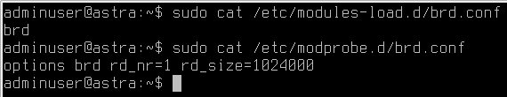

# Идеи по доработке модуля

[[_TOC_]]

Здесь перечисляются идеи по доработке модуля. Реализованные идеи соответствующим образом отмечены. Идея отмечается как выполненная, когда реализация протестирована и изменения попали в стабильную ветку разработки.

- [x] Написать модуль подготовительной настройки сервера к развёртыванию ceph
- [x] Написать модуль создания и монтирования cephfs
- [x] Написать модули развёртывания компонент ceph (MON, MDS, OSD и других по необходимости)
- [x] Удалить из модуля непрофильную логику управления ssh сервером и его конфигурационным файлом fff567010c21f03d162dc8af4ae76dbd86dc291f
- [ ] Реализовать восстановление Ram pool.\
Для выполнения этой задачи требуется выполнение следующих необходимых условий (согласовано с Курлыковым А.):
- Гарантируется, что с ceph не работают пользователи, нет интенсивных операций чтения-записи в ceph на этапах выключения-включения кластера
- Гарантируется, что перед выключением кластера, после включения кластера (перед началом работы скрипта подготовки к работе ceph), состояние ceph, показываемое командой *ceph health* равно *HEALTH_OK*
- Существует пользователь cephadm, настраиваемый модулем ceph
  - [x] Написать скрипт подготовки к выключению кластера ceph
  - [x] Написать скрипт подготовки к работе ceph
  - [x] Интегрировать скрипт подготовки к работе ceph в systemd
  - [х] Написать инструкцию выключения и включения кластера ceph и добавить её в документцию
  - [x] Прописать в скрипты включения выключения ceph отсылку результатов их работы в журнал
  - [ ] Написать сервис слежения за состоянием RAM OSD
- [ ] Объединить два манифеста монтирования в один
- [ ] Объединить два манифеста osd{ram,hdd}.pp в один
- [ ] Проверить корректность работы параметра $ensure установленного в absent во всех манифестах
- [ ] Проверка health_ok не должна выполняться при применении Каталога puppet, если ceph уже установлен.
- [х] Создавать ram диск на стадии загрузки ОС, через сервис
>>>
За загрузку отвечает сервис systemd-modules-load, если ему что-то не удастся, то после запуска он будет в статусе failed
conf-файлы, думаю, можно переименовать, чтобы было понятно, что это ramdisk для ceph.
>>>

- [x] Убрать из скриптов вкл. выкл. ceph использование скрипта runcmd.sh
- [х] Добавить в скрипты вкл. выкл. ceph логирование в журнал
- [x] Добавить Nagios проверки для кластера ceph
  - [x] Написать плагин интегральной проверки MDS
- [х] Убрать из модуля управление файлом /etc/hosts
- [ ] Написать Руководство по эксплуатации. Раздел Ceph - устранение неисправностей.
- [ ] Отказаться от экспорта файла ceph.conf
- [ ] Автоматически заполнять fsid. Пока не понятно как его генерировать один раз, так как нужно будет повторно заполнить файл ceph.conf параметром mon_initial_members... ?Например, так: написать в манифесте код генерации fsid командой uuidgen и передача его параметром в шаблон ceph.conf.erb
https://ask.puppet.com/question/19306/execute-command-in-erb/

Генерация fsid

<pre><code>
# In manifest.pp...
$mytext = generate('/path/to/command')
# In myfile.txt.erb...
<%= @mytext -%>
cephadm@cephmon07:~/cephdeploy$ cat line.pp
$mytext = generate('/usr/bin/uuidgen')
notice("$mytext")
cephadm@cephmon07:~/cephdeploy$ puppet apply  line.pp
</code></pre>

Идеи от реализации которых отказались
---
- [ ] Отказаться от заполнения параметра mon_initial_members в файле ceph.conf. Нельзя его не заполнять, так как при выходе из строя MON устанавливаемого первым, последующие устанавливаемые сервера не смогут соединиться с кластером ceph. Необходимо заполнять параметр mon_initial_members в файле ceph.conf. В параметре mon_initial_members в файле ceph.conf должны быть указаны все MON на последнем этапе развёртывания кластера ceph. Например при применении манифеста отвечающего за настройку монтирования директорий ceph на всех узлах кластера ceph.
- [ ] Интегрировать скрипт подготовки к выключению кластера ceph в systemd\
Скрипт запускается на сервере, при применении каталога Puppet, если указан соответствующий параметр в модуле os_base_config
- [ ] Удалить из модуля этапы смены hostname сервера\
Основываясь на моих знаниях, нет возможности на этапе установки сконфигурировать ceph так, чтоб клиенты (например, ОПО АПОИ) обменивались данными с ceph по интерфейсу Infiniband, в случае, если команда *hostname -s*, запущенная на сервере ceph, не выдаёт имя, которое ссылается на интерфейс Infiniband сервера. Это приводит к необходимости менять hostname сервера на этапе установки ceph, заполнять файл /etc/hosts сервера. Наличие двух разных имён сервера (постоянного, и временного на момент установки ceph) приводит к наличию разных имён в "базах" ceph, что в свою очередь приводит к сложностям при обслуживании и эксплуатации ceph. Необходимо на постоянной основе установить hostname сервера, таким, чтоб он ссылался на Infiniband интерфейс. *Задача отменилась, так как задачу установки hostname сервера, таким, чтоб он ссылался на Infiniband интерфейс посчитали трудоёмкой.*
- [ ] Автоматическое заполнение файла /etc/hosts IP адресами и именами интерфейса передачи данных серверов (обычно, это интерфейс infiniband). Он у нас сейчас не управляется dns-ом. *Задача отменяется, так как модуль не должен управлять системным файлом hosts.* С другой стороны, поступила идея установить заполнение файла /etc/hosts параметром. Сам параметр должен иметь тип текст, который устанавливается в ITM. *Задача повторно отменилась, так как приняли решение в DNS прописать имена интерфейса передачи данных серверов*
>>>
...... всё так же, как с другими erb шаблонами. Просто в этом ничего, кроме подстановки единственного параметра, не будет, а в параметре будет сразу всё содержимое файла. Когда добавишь параметр в модуле - в itm на странице модуля можно открыть манифест и изменить тип параметра как на скриншоте. Меняешь на text и становится можно удобно вводить многострочное значение параметра в itm
.......надо нажать потом внизу коммит и закоммитить новую версию модуля. И следует учитывать, что при следующем импорте тип перезапишется и надо будет снова менять.
>>>
- [ ] При передачи заказчику модуля, убрать из модуля шаги создания пользователя cephadm. Этот пользователь нужен только для отладки модуля и проведения восстановительных работ на кластере ceph. *Отменилась, так как пользователь нужен для включения-выключения кластера ceph*
- [ ] Реализовать аккуратное удаление всех компонент ceph. *Задача отменяется, так как не предполагается полностью очищать кластер от ceph с помощью модуля. Проще переразвернуть кластер заново.*
* После удаления OSD остаются директории /var/lib/ceph/osd/ (с поддиректориями содержащими данные от удалённых OSD) и директория /var/lib/ceph/bootstrap-osd/. Проверить, безопасно ли их удалять.
* После удаления OSD, на сервере, где не было ни MDS ни MON, остаются пакеты от ceph. И много разных файлов относящихся к ceph. Проверить, безопасно ли их удалять.
>>>
"Бывает что после удаление пакетов в Debian Linux и просмотре их через dpkg видно что пакеты не полностью удалились и напротив них стоит флаг «rc». Такое случается когда пакеты не полностью удаляются и остаются конфигурационные и прочие файлы. Чтобы полностью удалить такие пакеты нужно выполнить следующую команду:\
dpkg --list |grep "^rc" | cut -d " " -f 3 | xargs sudo dpkg --purge"*
>>>
* После удаления ceph где был MON и MDS не остаётся установленных пакетов и остаётся не так много файлов.  Проверить, безопасно ли их удалять.
* Сложности удаления MON:
  * Ниже приведённый Блок удаления MON не отрабатывает, потому как после остановки сервиса MON, кластеру ceph нужно продолжительное время  чтобы создать кворум. На это время получение информации о кластере не доступно. Подумать, что можно сделать.
  * После удаления предпоследнего MON команда _ceph_ не выдаёт информацию о состоянии кластера. Подумать, что можно сделать.
  * При удалении последнего MON  завершения выполнения  команды _ceph_ дождаться не удалось (выполнение команды "зависает"). Возможно, применять команду _ceph_ нужно до удаления пакета MON и остановки сервиса MON.

Блок удаления MON

<pre><code>
# Удаляем MON из кластера ceph
exec { 'MonRemoveMon':
  command =>  "ceph mon remove ${MONNameServerIB}",
  onlyif  =>  "sleep 5 && ceph health detail|grep ${MONNameServerIB}|grep '(out of quorum)'",
</code></pre>

Текущее
Не работает:
Service['ceph-osd.target'] ~>

      # Проверка, что установка ceph прошла удачно. Выполняем exec-ом команду ceph health и ожидаем, что она вернёт "HEALTH_OK". Здесь это не работает,  так как ~> не срабатывает.
      ceph::healthcheck{'osdhddCheckHealthOk':}
    }

    тоже самое
      ceph::healthcheck{'osdramCheckHealthOk':}
