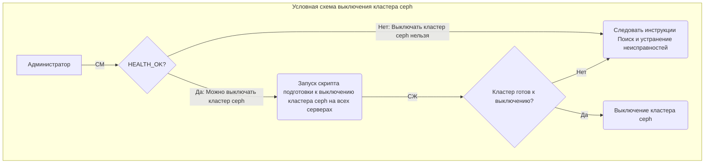
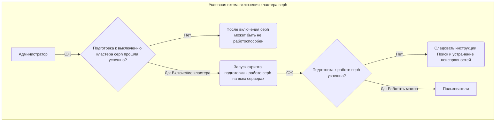

# Инструкция по выключению и включению кластера ceph

[[_TOC_]]

Здесь приведена инструкция которой необходимо следовать для штатного выключения и включения кластера ceph

**Принятые определения**:
- СПО КВР - СПО для управления вычислительной инфраструктурой посредством веб интерфейса в веб браузере.
- Администратор - человек, с ролью "Администратор" в СПО КВР
- Пользователи - люди и сервисы зарегистрированные в СПО КВР
- СМ - система мониторинга СПО КВР
- СЖ - система журналирования СПО КВР
- Разрешающий сигнал - система идентификации, принятая в системе мониторинга СПО КВР, информирующая об успешном завершении задачи, разрешении на выполнение задачи или показывающая состояния объекта в работоспособном состоянии

Выключение кластера ceph
----

**Важно:** Выключение кластера ceph приводит к удалению всех данных сохранённых в RAM pool-е. Это связано с тем, что RAM pool располагается на RAM OSD. RAM OSD созданы на RAM дисках, которые в свою очередь находятся в RAM памяти, а RAM память не является долговременной и очищается при выключении сервера.

- Перед выключением кластера ceph Администратор должен обеспечить возможность автоматического отмонтирования директорий CephFS на всех серверах кластера ceph или отмонтировать их все вручную. Директории могут быть заблокированы от отмонтирования, например, операциями чтения и записи каким либо СПО, а также другими менее очевидными операциями, например, такими: `watch df -h`
- Перед выключением кластера ceph Администратор должен проверить в СМ его состояние, параметр `PM::Ceph::Cluster::Health`. Кластер ceph должен быть в состоянии *HEALTH_OK*. Если состояние кластера ceph долгое время, несколько часов, не становится равным *HEALTH_OK*, необходимо устранить эту неисправность следуя документу "Поиск и устранение неисправностей".
- Администратор выключает в любом порядке все сервера кластера ceph. Выключать необходимо сразу все сервера. Допустимо, если в течении одной-двух минут все сервера получат сигнал на выключение. Инструкцию на физическое выключение серверов кластера ceph необходимо смотреть в *Руководстве по эксплуатации на СПО КВР (АФЕК.467379.395 РЭ)*.
- После запуска процедуры выключения кластера ceph, на всех серверах кластера ceph запускается "скрипт подготовки к выключению кластера ceph". Пока скрипт не вернёт код выхода "0" сервер не получит команду shutdown.
- Администратор должен наблюдать за выключением кластера ceph в СЖ и убедиться, что в СЖ всех серверов кластера ceph присутствует сообщение о том, что подготовка к выключению кластера ceph прошла успешно: `"Остановка ceph завершена успешно."`. Если такое сообщение отсутствует хотя бы на одном сервере кластера ceph, значит подготовка к выключению кластера ceph прошла не штатно. Следует устранить неисправность препятствующую "скрипту подготовки к выключению кластера ceph" выполнить свою задачу. Устранять неисправность необходимо следуя документу "Поиск и устранение неисправностей".
- Если подготовка к выключению кластера ceph прошла не штатно, выключать кластер ceph каким либо способом не рекомендуется.

Реализация (на текущий момент - 2022.06.23, может измениться в будующем):
- Выключение серверов в СПО КВР реализовано посредством применения Каталога Puppet. В модуль os_base_config добавлен параметр `shutdown`. Параметр `shutdown` может принимать значения `false` или `true`. Если `shutdown` установлен в `true`, то при применении Каталога Puppet на этом сервере запустится процесс выключения сервера (запустится команда `shutdown`). При этом, если сервер является сервером кластера ceph, тогда до запуcка на нём команды `shutdown` запустится "скрипт подготовки к выключению кластера ceph".
- Для выключения кластера ceph необходимо:
  - Установить параметр `shutdown` в модуле os_base_config равным `true` в КСУ серверов ceph. Это позволит изменить его значение на всех серверах использующих это КСУ
  - Применить каталог на всех серверах кластера ceph вручную или реализованной возможностью параллельного применения Каталога Puppet на всех отмеченных галочкой серверах
  - Проконтролировать, что  кластер ceph выключился штатно (описано выше)
  - Установить параметр `shutdown` в модуле os_base_config равным `false` в КСУ серверов ceph
- При выключении кластера ceph запускается "скрипт подготовки к выключению кластера ceph". Скрипт запускается на всех серверах кластера ceph, работая от пользователя cephadm (создаваемого и настраиваемого модулем ceph).
- Скрипт начинает свою работу по подготовке к выключению кластера ceph только в том случае, если состояние кластера ceph равно *HEALTH_OK*.
- "скрипт подготовки к выключению кластера ceph", старается размонтировать директории CephFS, проводит необходимую подготовку к выключению кластера ceph, работы по удалению RAM pool, а также необходимые завершающие работы.
- Cкрипт подготовки к выключению кластера ceph сообщает о результатах своей работы в СЖ. Эти сообщения Администратор должен контролировать в СЖ на каждом сервере кластера ceph.
- После успешного завершения работы скрипта подготовки к выключению кластера ceph, скрипт возвращает код выхода `0` и сервер получает команду `shutdown`.
- Если "скрипт подготовки к выключению кластера ceph" не вернул код завершения `0`, сервер не получит команду `shutdown` и не выключится.

Включение кластера ceph
----

- Перед включением, кластера ceph Администратор должен убедиться, что в СЖ всех серверов кластера ceph присутствует сообщение о том, что подготовка к выключению кластера ceph прошла успешно. Если такое сообщение отсутствует хотя бы на одном сервере кластера ceph, после включения, ceph может быть не работоспособен.
- Администратор включает в любом порядке все сервера кластера ceph. Включать необходимо сразу все сервера. Допустимо, если в течение 1-2 минуты все сервера получат сигнал на включение. Инструкцию на физическое включение серверов необходимо смотреть в *Руководстве по эксплуатации на СПО КВР (АФЕК.467379.395 РЭ)*.
- Пользователи начинают работать с кластером ceph по наличию разрешающего сигнала от СМ сообщающего о том, что кластер ceph готов к работе. Таким сигналом может быть наличие на каждом сервере кластера ceph сообщения "Запуск ceph завершен успешно.".

Реализация:
- После включения сервера, на нём, посредством systemd, запускается скрипт подготовки к работе ceph. Скрипт запускается на всех серверах кластера ceph от пользователя cephadm (создаваемого и настраиваемого модулем ceph).
- Скрипт начинает свою работу по подготовке к работе ceph только в том случае, если состояние кластера ceph равно *HEALTH_OK*.
- Скрипт подготовки к работе ceph проводит необходимую подготовку к включению, работы по созданию RAM pool, а также необходимые завершающие работы стараясь смонтировать директории CephFS.
- По окончании подготовки к работе ceph и монтирования директорий CephFS скрипт подготовки к работе ceph проверяет состояние кластера ceph и если оно равно *HEALTH_OK*, успешно завершает свою работу.
- Cкрипт подготовки к работе ceph сообщает о результатах своей работы в СЖ.

Сложности, с которыми столкнулись
----

При выключении:
- Не отмонтируется директория hdd или ram в CephFS

При включении:
- Кластер ceph долгое время не приходит в состояние *HEALTH_OK*
