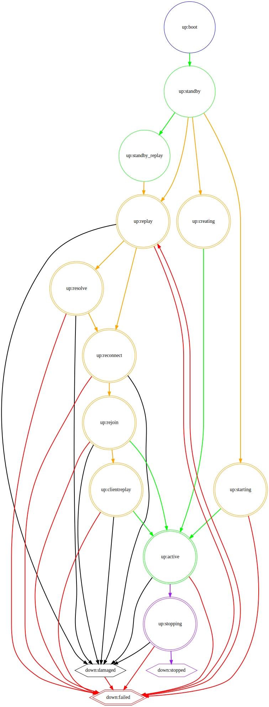

# Мониторинг Ceph с помощью Nagios Core

[[_TOC_]]

Введение
----
Nagios Core - это решение с открытым исходным кодом для мониторинга програмного и аппаратного обеспечения. Для мониторинга кластера Ceph мы используем Nagios Core и NRPE. Nagios проверяет каждый узел кластера Ceph и передаёт эти данные в СПО КВР. СПО КВР отображает информацию о состоянии операционной системы, состоянии кластера Ceph и другую информацию.

Важность мониторинга Ceph
----
Мониторинг Ceph необходимо выполнять для того, чтобы иметь актуальную информацию о его состоянии. 
Например, если объём данных хранимых в кластере Ceph превысит определённый порог (настраиваемый параметр), он прекратит приём запросов на операции ввода/вывода и не будет способен производить восстановление, поэтому необходимо отслеживать объём хранимых данных, и вовремя принимать необходимые действия.
В случае если Ceph не находится в работоспособном состоянии, шансы утраты данных возрастают. Хотя Ceph спроектирован для возможности самовосстановления, мониторинг помогает определить когда требуется вмешательство администратора.

Что подлежит мониторингу
----
Простым ответом будет - всё, столько, сколько возможно. Наличие мониторинга может помочь предупредить развитие события приводящего к потере данных.

Сложность интерпретации мониторинга Ceph
----
Ceph является унифицированной, высоко надёжной, распределённой, программно-определённой системой хранения данных, которая предоставляет доступ на уровне блоков, объектов и файлов. Может использоваться на системах, состоящих как из нескольких узлов, так и из тысяч узлов. Известно об эксплуатации систем с размером Ceph в сотни петабайт (например у Yahoo!). Для возможности выполнения задач мониторинга разработчики Ceph вынуждены были создавать разветвлённую подробную карту состояний многих, различных объектов Ceph. В итоге, иногда интерпретация этих состояний оказыватеся сложной для неподготовленого Администратора. Для примера приведу ниже диаграму состояний одного, не основного, сервиса Ceph - MDS.

Перечень объектов подлежащих мониторингу
----
1. Операционная система и оборудование\
\- Использование ЦПУ и оперативной памяти\
\- Отказ оборудования, такого как диски, источники питания, вентиляторы и другого\
\- Наблюдение за сетевыми соединениями на предмет наличия соединения\
\- Наблюдение за сетевыми устройствами на предмет ошибок и проблем с производительностью\
\- Наблюдение за счётчиками производительности как самой операционной системы, так и Ceph (пока отсутствуют...)

1. Состояние кластера Ceph\
Источником информации о состоянии кластера Ceph является проверка в СПО КВР с именем *PM::Ceph::Cluster::Health*. Возвращаемые ей значения могут быть следующие: *Health_OK*, *HEALTH_WARN* или *HEALTH_ERR*. Наблюдая за этими состояниями, вы можете видеть, всё ли впорядке с Ceph. Если состояние Ceph не *Health_OK*, проверка *PM::Ceph::Cluster::Health* выводит дополнительные сведения, сообщающие в чём именно заключается проблема. Это позволяет Администратору её локализовать.

1. Состояния PG\
Группы размещения (PG) - это внутренняя реализации распределения данных в Ceph. Все состояния PG можно условно объединить в три группы - *Рабочее состояние*, *Состояние требующее внимания* и *Опасное состояние*. Информация о состоянии PG присутствует в проверке *PM::Ceph::Cluster::Health*.\
Понимание того что означает каждое состояние может помочь определить что происходит с PG и нужно ли предпринимать какие то действия.
    1. Рабочее состояние\
Все следующие состояния отображают жизнеспособную работу кластера, нет необходимости предпринимать какие-либо действия.
        1. Активное состояние
Состояние *active* означает, что PG полностью жизнеспособна и имеет возможность принимать запросы клиентов.
        1. Чистое состояние\
Состояние *clean* означает, что объекты PG реплицированы правильное число раз и все находятся в согласованном состоянии.
        1. Очистка и глубокая чистка\
Очистка (*scrubbing*) означает, что Ceph проверяет согласованность данных и это обычный фоновый процесс. При очистке Ceph проверяет что все объекты и соответствующие метаданные присутствуют. Когда Ceph выполняет глубокую очистку *deep-scrubbing*, он сравнивает само содержимое объектов и их реплик на согласованность.
    1. Состояние требующее внимания\
Все следующие состояния отображают, что Ceph не полностью жизнеспособен, однако это не должно немедленно приводить к  проблемам.
        1. Несогласованное состояние\
Состояние *inconsistent* означает, что в процессе очистки Ceph обнаружил один или более объектов, которые не согласуются со своими репликами.
        1. Состояния заполнения (*backfilling*), ожидания заполнения (*backfill_wait*), восстановления (*recovering*), ожидания восстановления (*recovery_wait*)\
Все эти состояния означают, что Ceph выполняет копирование или миграцию данных с одного OSD на другой. Это может означать, что данная PG имеет число копии менее желаемого числа. Если PG находится ещё и в состоянии *wait*, то это объясняется наличием очереди на каждом OSD. Ceph ограничивает число одновременных операций на OSD для снижения воздействия на операции клиентов.
        1. Состояние деградации\
Когда клиент записывает объект в основное OSD, основное OSD отвечает за запись реплик в реплики OSD. После того, как основное OSD запишет объект в хранилище, PG будет оставаться в *degraded* состоянии до тех пор, пока основное OSD не получит подтверждение от реплик OSD, что Ceph успешно создал объекты реплики.
        1. Обновление карты\
PG в настоящее время располагается (*remapped*) на других OSD или других наборах OSD, отличных от указанных в CRUSH. CRUSH это алгоритм, который определяет как хранить и извлекать данные, вычисляя места хранения. Состояние *remapped* чаще всего реализуется, когда OSD остановлен (*down*), но ещё пока не был восстановлен в оставшиеся OSD.
        1. Недостаточного размера\
Состояние *undersized* указывает, что в PG меньше копий, чем настроенный уровень репликации pool.
        1. Одноранговый обмен\
Состояние *peering* является частью нормального процесса. Сообщает о том, что PG становится активной, но операции ввода/вывода будут блокироваться до тех пор, пока не будет достигнуто достаточное количество копий для достижения настроенного параметра репликации pool.
    1. Опасное состояние\
Если PG находится в одном из перечисленных ниже состояний, то это, скорее всего, означает, что доступ клиента к кластеру нарушен. Пока данная ситуация не будет разрешена данные могут быть потеряны.
        1. Незавершённое состояние\
Состояние *incomplete* означает, что Ceph не способен обнаружить консистентную (непротиворечивую) копию объекта внутри PG во всех OSD, которые в настоящее время работают (*up*) в данном кластере.
        1. Состояние останова\
Аналогично *incomplete*, для данной PG может не хватать объектов. Эти объекты могут располагаться на недоступных OSD. Реплика с необходимыми данными не работает, поэтому PG отключена.
        1. Состояние чрезмерной заполненности и переполнения восстановления\
В состоянии *backfill_toofull* Ceph пытается восстановить данные, однако диски OSD слишком заполнены. Для исправления данной ситуации требуются дополнительные OSD.
        1. Устарело\
В состоянии *Stale* PG будет находиться, если главный OSD действующего набора PG не информирует MON о своём состоянии некоторое время или если другие OSD сообщают об отключении главного OSD.\
Кластер не всегда находится в состоянии *HEALTH OK*. Это может быть рабочее состояние. Что касается PG, кластер не будет в состоянии *HEALTH OK* в следующих ожидаемых обстоятельствах:\
\- Вы только что создали pool и PG еще не подключены.\
\- PG восстанавливаются.\
\- Вы только что добавили или удалили OSD из кластера.\
\- Вы только что изменили карту CRUSH, и PG переносятся.\
\- присутствуют несогласованные данные в разных репликах PG.\
\- Ceph очищает реплики PG.\
\- Ceph не имеет достаточного объёма для выполнения операций *backfill*.\
Если одно из вышеперечисленных обстоятельств приводит к состоянию Ceph *HEALTH WARN*, это может быть рабочее состояние Ceph. Во многих случаях кластер восстанавливается самостоятельно. В некоторых случаях вам может потребоваться принять меры. Важной задачей мониторинга PG является оперативное реагирование Администратора на состояния PG для обеспечение состояния PG *active+clean*.
1. Состояние OSD\
OSD это физическое или логическое устройство хранения в Ceph. *Ceph OSD* это сервис обслуживающий OSD. OSD может находится либо в кластере *in*, либо вне кластера *out*; и он может быть либо запущен и работает, *up*, либо не запущен *down*.\
Информация о состоянии OSD присутствует в проверках *PM::Ceph::Osd::Health*, а также *PM::Ceph::Osd::ram::Health* и *PM::Ceph::Osd::hdd::Health*. Проверка *PM::Ceph::Osd::Health* информирует об OSD всех типов на сервере, находящихся в состоянии *up*, *down*, *in*, *out*. Проверки *PM::Ceph::Osd::ram::Health* и *PM::Ceph::Osd::hdd::Health* информирует об OSD соответствуюего типа на сервере, находящихся в состоянии *up* и *down*.\
Все состояния OSD могут быть рабочими состояниями, не требующими вмешательства Администратора. Вмешательство Администратора требуется, если OSD долгое время, более часа, находится в следующих состояниях:\
\- *out* и *down*\
\- *in* и *down*, требуется оценка разработчика СПО КВР (АО НИИ ТП).\
\- *out* и *up*\
Кластер не всегда находится в состоянии *HEALTH OK*. Это может быть рабочее состояние. Что касается OSD, кластер НЕ будет в состоянии *HEALTH OK* в следующих ожидаемых обстоятельствах:\
\- Кластер, только что запущен или перезапущен.\
\- Только что добавлен или удалён OSD.
1. Состояние MON\
MON это сервис монитора кластера Ceph. Информация о состоянии MON присутствует в проверке *PM::Ceph::Mon::Health*. MON ответит на запрос статуса только при наличии сформированного кворума. Если проверка *PM::Ceph::Cluster::Health* не получает ответа от кластера или не показывает сообщения об ошибках, то вполне вероятно, что все мониторы полностью отключены, либо работает только их часть. Этой части недостаточно для формирования кворума.\
Если кворум есть, но минимум один монитор не в кворуме. Сообщением будет похожим на *mon is down (out of quorum)*. Вышеприведённая проверка может в этом случае показать, что состояние MON одно из следующих: *probing*, *electing*, *synchronizing*. Это нормальные состояния MON, но не в случае, если MON долгое время, более 10 минут, находится в этих состояниях.
1. Состояние MDS\
MDS это сервис сервера метаданных для распределенной файловой системы Ceph. Информация о состоянии MDS присутствует в проверке *PM::Ceph::Mds::Health*.\
Серверы метаданных имеют два набора состояний: *up или down* и *active или inactive*. Если долгое время, более 10 минут, MDS находится в состояниий отличном от следующих:\
\- up:active\
\- up:standby\
\- up:standby_replay\
тогда, для исправления ситуации, требуется вмешательство Администратора.\
Если есть проблема с MDS, она отобразится в проверке *PM::Ceph::Mds::Health*. Сообщение будет похоже на: *slow requests blocked* (медленные запросы заблокированы).\
Появление сообщения в системе мониторинга - *MOUNTING MOUNT 5 ERROR* обычно возникает, если сервер MDS работает с задержкой или в случае сбоя.
1. Заполненность кластера\
Вопросы заполненности кластера так или иначе сводятся к вопросам заполнености OSD. Информация о заполненности OSD присутствует в проверках PM::Ceph::Cluster::Raw usage, PM::Ceph::Cluster::Osd::Raw usage, PM::Ceph::Pool::${name_pool}::Raw usage (где *name_pool* имена pools).\
В некоторых обстоятельствах заполнение одного OSD выше критического значения приводит блокированию операций записи на весь pool, который он обслуживает. Ceph предотвращает запись в заполненное OSD, чтобы вы не потеряли данные. При заполнении OSD вы можете получить предупреждение. По умолчанию коэффициент заполнения *full_ratio* равен 0,95, или 95% емкости, при достижении которого клиенты не смогут записывать данные в кластер. Коэффициент *backfillfull_ratio* по умолчанию равен 0,90, или 90% емкости, при превышении которой OSD не сможет выполнять сервисные задачи, в том числе по обеспечению отказоустойчивости и надёжности. Коэффициент *nearfull_ratio* по умолчанию равен 0,85, или 85% емкости, при достижении которого отображается предупреждение о заполнении кластера. Обратите внимание, что заполненность отдельных OSD в кластере будет различаться в зависимости от того, сколько данных Ceph распределяет на них. Распределение происходит автоматически.\
Лучший способ справиться с переполненным кластером - это добавить емкость кластеру с помощью новых OSD.

**Диаграмма состояний MDS:**\

