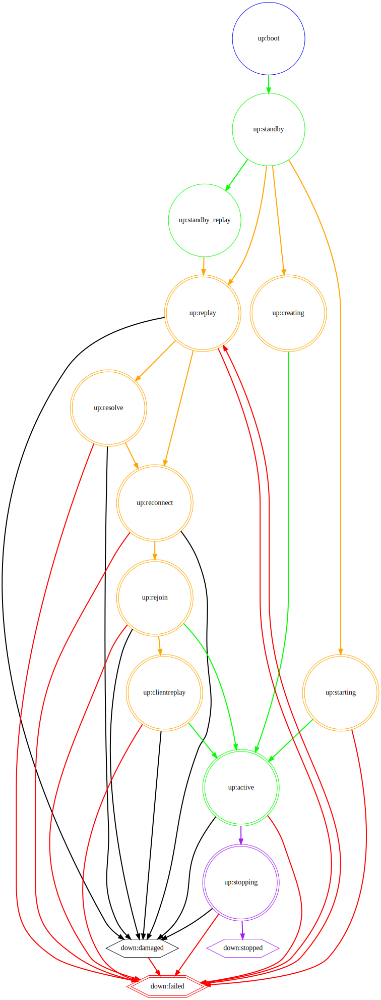

Поиск и устранение неисправностей
=======================

[Перейти к основному содержанию](#начало-устранения-неполадок)

[[_TOC_]]

Принятые в этом документе определения
------------------------------------

- СПО КВР - СПО для управления вычислительной инфраструктурой посредством веб интерфейса в веб браузере.
- Администратор - человек, с ролью "Администратор" в СПО КВР
- Пользователи - люди и сервисы, зарегистрированные в СПО КВР
- СМ - система мониторинга СПО КВР
- СЖ - система журналирования СПО КВР
- КС - командная строка доступа к кластеру Ceph с привилегиями пользователя root

Необходимые условия для успешного устранения неполадок
------------------------------------

- Доступ к СПО КВР. Инструкцию по доступу смотреть в *Руководстве по эксплуатации на СПО КВР (АФЕК.467379.395 РЭ)*.
- Доступ к СМ. Инструкцию по доступу смотреть в *Руководстве по эксплуатации на СПО КВР (АФЕК.467379.395 РЭ)*.
- Доступ к СЖ. Инструкцию по доступу смотреть в *Руководстве по эксплуатации на СПО КВР (АФЕК.467379.395 РЭ)*.
- Работающая сетевая инфраструктура объекта. Смотреть в СМ проверку с именем *PM::Ceph::Cluster::Health*.
- Работающий кластер Ceph. Смотреть в СМ проверку с именем *PM::Ceph::Cluster::Health*.
- Доступ к командной строке кластера Ceph с привилегиями пользователя root. Инструкцию по доступу смотреть в *Руководстве по эксплуатации на СПО КВР (АФЕК.467379.395 РЭ)*.
- Возможность запроса поддержки от разработчиков СПО КВР (АО НИИ ТП).

Разумный подход
------------------------------------

Не смотря на то, что Ceph спроектирован для возможности самовосстановления, мониторинг помогает определить, когда требуется вмешательство администратора. Не все состояния Ceph приводят к немедленным отказам в обслуживании. Более того, многие состояния являются следствием нормальной работы Ceph. Но всё же часть состояний требует вмешательства Администратора, а в некоторых случаях, немедленного его реагирования. Как следствие архитектуры Ceph в большинстве случаях данные оказывается возможным восстановить, но это требует от Администратора квалификации и спокойствия.

# 1. Начало устранения неполадок

**Описание**

В этом документе описывается, как решить общие проблемы с Ceph. Ceph является унифицированной, высоконадёжной, распределённой, программно-определённой системой хранения данных, которая предоставляет доступ на уровне блоков, объектов и файлов. Может использоваться на системах, состоящих как из нескольких узлов, так и из тысяч узлов. Известно об эксплуатации систем с размером Ceph в сотни петабайт (например, у Yahoo!). Следствием такой универсальности является некоторая усложненность системы. Как и любые другие системы хранения Ceph необходимо обслуживать.

* * * * *

В этой главе содержится информация о:

- Как начать устранение ошибок Ceph [Выявление проблем](#выявление-проблем)
- Наиболее распространенные сообщения об ошибках, проверка с именем *PM::Ceph::Cluster::Health* в СМ [Понимание Ceph Health](#понимание-ceph-health)
- Наиболее распространенные сообщения об ошибках, журнал Ceph [Общие сведения о журнале Ceph](#общие-сведения-о-журнале-ceph)

1.1. Необходимые предварительные условия
------------------

-   Работающий кластер Ceph.

1.2. Выявление проблем
-------------------------

Чтобы определить возможные причины ошибки с кластером Ceph, ответьте на вопросы в разделе **Технологический процесс**.

**Необходимые предварительные условия**

-   Работающий кластер Ceph.

**Технологический процесс**

1.  Вы знаете, какая подсистема Ceph вызывает проблему? Какие подсистемы существуют смотри [«Подсистемы Ceph»](#подсистемы-ceph) для получения дополнительной информации.
    1. Нет. Следуйте процедуре [*Диагностика работоспособности кластера хранения Ceph*](#диагностика-работоспособности-кластера-хранения-ceph).
    2. MONs Ceph. Смотри Раздел [*Устранение неполадок MONs Ceph*](#устранение-неполадок-mons-ceph).
    3. OSD. Смотри Раздел [*Устранение неполадок Ceph OSD*](#устранение-неполадок-ceph-osd).
    4. Группы размещения Ceph. Смотри Раздел [*Устранение неполадок Ceph PG*](#устранение-неполадок-ceph-pg).

### 1.2.1. Диагностика работоспособности кластера хранения Ceph

В этой процедуре перечислены основные шаги для диагностики работоспособности кластера Ceph.

**Необходимые предварительные условия**

-   Работающий кластер Ceph.

**Технологический процесс**

1.  Посмотреть в СМ проверку с именем *PM::Ceph::Cluster::Health* или проверить в КС

    ``` {.screen}
    [root@mon ~]# sudo ceph health detail
    ```

    Если команда возвращает `HEALTH_WARN` или `HEALTH_ERR`, смотри [*Понимание Ceph health*](#понимание-ceph-health) для получения подробной информации.

2. Проверьте в СЖ журналы Ceph на наличие сообщений об ошибках, перечисленных в [*Общие сведения о журнале Ceph*](#общие-сведения-о-журнале-ceph). Журналы Ceph по умолчанию расположены в каталоге `/var/log/ceph/`.
3. Если журналы не содержат достаточного количества информации, увеличьте уровень отладки и попробуйте воспроизвести действие, которое не удалось. Смотри [*Настройка ведения журнала*](#настройка-ведения-журнала) для получения подробной информации.

1.3. Понимание Ceph health
------------------------------

Проверка с именем *PM::Ceph::Cluster::Health* или команда `sudo ceph health` возвращают информацию о состоянии кластера Ceph:

-   `HEALTH_OK` указывает, что кластер исправен.
-   `HEALTH_WARN` указывает на предупреждение. В некоторых случаях статус Ceph возвращается к HEALTH_OK автоматически. Например, когда кластер Ceph завершает процесс балансировки. Однако рассмотрите возможность устранения неполадок, если кластер находится в состоянии `HEALTH_WARN` длительное время, более часа.
-   `HEALTH_ERR` указывает на более серьезную проблему, требующую вашего немедленного внимания.
Если состояние Ceph не HEALTH_OK, а информации предоставляемой проверкой *PM::Ceph::Cluster::Health* в СМ недостаточно, используйте команду *ceph health detail* в КС, чтобы получить более подробный вывод.


**Дополнительные ресурсы**

-   Смотрите таблицу [*Сообщения об ошибках MON Ceph*](#сообщения-об-ошибках-mon-ceph).
-   Смотрите таблицу [*Сообщения об ошибках Ceph OSD*](#сообщения-об-ошибках-ceph-osd).
-   Смотрите таблицу [*Сообщения об ошибках PG*](#сообщения-об-ошибках-pg).

1.4. Общие сведения о журнале Ceph
----------------------------

Посмотреть сообщения Ceph можно в СЖ. СЖ необходимо смотреть только на узлах Ceph MON. Там присутствует главный журнал кластера Ceph. Является ли узел MON необходимо смотреть в СПО КВР, в параметрах модуля Ceph конкретного узла. Инструкцию по работе с модулями необходимо смотреть в *Руководстве по эксплуатации на СПО КВР (АФЕК.467379.395 РЭ)*. По умолчанию Ceph хранит свои журналы в каталоге `/var/log/ceph/`.

CLUSTER_NAME.log - это файл основного журнала кластера, который включает глобальные события. По умолчанию имя файла журнала - `ceph.log`. Только на узлах Ceph MON присутствует этот журнал.

У каждого OSD и MON есть свой собственный файл журнала с именами `CLUSTER_NAME-osd.NUMBER.log` и `CLUSTER_NAME-mon.HOSTNAME.log`.

Посмотреть сообщения о подсистемах Ceph в СЖ можно на соответствующих узлах Ceph. Какие подсистемы присутствуют на узле необходимо смотреть в СПО КВР, в параметрах модуля Ceph конкретного узла. Инструкцию по работе с модулями необходимо смотреть в *Руководстве по эксплуатации на СПО КВР (АФЕК.467379.395 РЭ)*.

Когда вы увеличиваете уровень отладки для подсистем Ceph, Ceph начинает генерировать новые файлы журнала для этих подсистем.

**Дополнительные ресурсы**

-   Подробнее о ведении журнала смотри [*Настройка ведения журнала*](#настройка-ведения-журнала).
-   Смотри Таблицу [*Сообщения об ошибках MON в журналах Ceph*](#сообщения-об-ошибках-mon-в-журналах-ceph).
-   Смотри Таблицу [*Общие сообщения об ошибках OSD в журналах Ceph*](#общие-сообщения-об-ошибках-osd-в-журналах-ceph).

# 2. Настройка ведения журнала

В этой главе описывается, как настроить ведение журнала для различных подсистем Ceph.

Важно

Ведение журнала требует значительных ресурсов. Кроме того, подробное ведение журнала может генерировать огромный объем данных за относительно короткое время. Если вы столкнулись с проблемами в определенной подсистеме кластера, включите ведение журнала только этой подсистемы. Смотри [«Подсистемы Ceph»](#подсистемы-ceph) для получения дополнительной информации.

Кроме того, рассмотрите возможность настройки ротации файлов журнала. Смотри [«Ускорение ротации журналов»](#ускорение-ротации-журналов) для подробностей.

После завершения устранения любых проблем, с которыми вы сталкиваетесь, установите для журнала подсистем и уровней памяти значения по умолчанию. Смотри [Приложение A, *Значения уровня ведения журнала по умолчанию для подсистем Ceph*](#приложение-а.-значения-уровня-ведения-журнала-по-умолчанию-для-подсистем-ceph) для получения списка всех подсистем Ceph и их значений логирования по умолчанию.

Вы можете настроить ведение журнала Ceph:

-   Посредством использования команды `ceph`. Это наиболее распространенный подход. Подробнее смотри [«Настройка ведения журнала во время выполнения»](#настройка-ведения-журнала-во-время-выполнения).
-   Обновление файла конфигурации Ceph. Используйте этот подход, если вы столкнулись с проблемами при запуске кластера. Подробнее смотри [«Настройка ведения журнала в файле конфигурации»](#настройка-ведения-журнала-в-файле-конфигурации).

2.1. Необходимые предварительные условия
------------------

-   Работающий кластер Ceph.

2.2. Подсистемы Ceph
--------------------

В этом разделе содержится информация о подсистемах Ceph и их уровнях ведения журнала.

**Понимание подсистем Ceph и их уровней ведения журнала**

Ceph состоит из нескольких подсистем.

Каждая подсистема имеет свой уровень ведения журнала:

- Журналы, которые по умолчанию хранятся в каталоге `/var/log/ceph/`
- Журналы, которые хранятся в Кеш-памяти

Обычно Ceph не отправляет журналы, хранящиеся в памяти, в журналы на диске. Ceph может их отправить, если:

- Получен сигнал `fatal`
- Это требует исходный код
- Это запрашивает Администратор

Вы можете установить разные значения для каждой из этих подсистем. Уровни ведения журнала Ceph изменяются от «1» до «20», где «1» кратко, а «20» - многословно.

Используйте одно число, чтобы установить для уровней журнала в памятии и на диске одно и то же значение. Например, debug_osd = 5 устанавливает уровень отладки для daemon ceph-osd `5`.

Чтобы использовать разные значения для журнала на диске и в памяти, разделите значения косой чертой (`/`). Например, debug_mon = 1/5 устанавливает уровни  `1`, и `5` для журнала на диске и в памяти соответственно.

**Таблица 2.1. Подсистемы Ceph и значения по умолчанию для ведения журнала**

| Subsystem | Log Level | Memory Level | Description |
|-----------|:---------:|:------------:|-------------|
|`asok`|1|5|Административный socket|
|`auth`|1|5|Аутентификация|
|`client`|0|5|Любое приложение или библиотека, которые используют librados для подключения к кластеру|
|`bluestore`|1|5|BlueStore OSD, серверная часть|
|`journal`|1|5|Журнал OSD|
|`mds`|1|5|Серверы метаданных|
|`monc`|0|5|Клиент MON, управляет обменом данными между большинством daemons Ceph и MON|
|`mon`|1|5|MON|
|`ms`|0|5|Система обмена сообщениями между подсистемами Ceph|
|`osd`|0|5|Daemons OSD|
|`paxos`|0|5|Алгоритм, который используют MONs для достижения кворума|
|`rados`|0|5|Надежное автономное распределенное хранилище объектов, основная подсистема Ceph|
|`rbd`|0|5|Блочные устройства Ceph|
|`rgw`|1|5|Объектный шлюз Ceph|

**Пример вывода журнала**

В следующих примерах показан тип сообщений в журналах при увеличении детализации для MON и OSD

**Уровень Debug для журнала MON**

``` {.screen}
debug_ms = 5
debug_mon = 20
debug_paxos = 20
debug_auth = 20
```

**Пример вывода журнала MON**

``` {.screen}
2021-02-12 12:37:04.278761 7f45a9afc700 10 mon.cephn2@0(leader).osd e322 e322: 2 osds: 2 up, 2 in
2021-02-12 12:37:04.278792 7f45a9afc700 10 mon.cephn2@0(leader).osd e322  min_last_epoch_clean 322
2021-02-12 12:37:04.278795 7f45a9afc700 10 mon.cephn2@0(leader).log v1010106 log
2021-02-12 12:37:04.278799 7f45a9afc700 10 mon.cephn2@0(leader).auth v2877 auth
2021-02-12 12:37:04.278811 7f45a9afc700 20 mon.cephn2@0(leader) e1 sync_trim_providers
2021-02-12 12:37:09.278914 7f45a9afc700 11 mon.cephn2@0(leader) e1 tick
2021-02-12 12:37:09.278949 7f45a9afc700 10 mon.cephn2@0(leader).pg v8126 v8126: 64 pgs: 64 active+clean; 60168 kB data, 172 MB used, 20285 MB / 20457 MB avail
2021-02-12 12:37:09.278975 7f45a9afc700 10 mon.cephn2@0(leader).paxosservice(pgmap 7511..8126) maybe_trim trim_to 7626 would only trim 115 < paxos_service_trim_min 250
2021-02-12 12:37:09.278982 7f45a9afc700 10 mon.cephn2@0(leader).osd e322 e322: 2 osds: 2 up, 2 in
2021-02-12 12:37:09.278989 7f45a9afc700  5 mon.cephn2@0(leader).paxos(paxos active c 1028850..1029466) is_readable = 1 - now=2021-02-12 12:37:09.278990 lease_expire=0.000000 has v0 lc 1029466
....
2021-02-12 12:59:18.769963 7f45a92fb700  1 -- 192.168.0.112:6789/0 <== osd.1 192.168.0.114:6800/2801 5724 ==== pg_stats(0 pgs tid 3045 v 0) v1 ==== 124+0+0 (2380105412 0 0) 0x5d96300 con 0x4d5bf40
2021-02-12 12:59:18.770053 7f45a92fb700  1 -- 192.168.0.112:6789/0 --> 192.168.0.114:6800/2801 -- pg_stats_ack(0 pgs tid 3045) v1 -- ?+0 0x550ae00 con 0x4d5bf40
2021-02-12 12:59:32.916397 7f45a9afc700  0 mon.cephn2@0(leader).data_health(1) update_stats avail 53% total 1951 MB, used 780 MB, avail 1053 MB
....
2021-02-12 13:01:05.256263 7f45a92fb700  1 -- 192.168.0.112:6789/0 --> 192.168.0.113:6800/2410 -- mon_subscribe_ack(300s) v1 -- ?+0 0x4f283c0 con 0x4d5b440
```

**Уровень Debug для журнала OSD**

``` {.screen}
debug_ms = 5
debug_osd = 20
```

**Пример вывода журнала OSD**

``` {.screen}
2021-02-12 11:27:53.869151 7f5d55d84700  1 -- 192.168.17.3:0/2410 --> 192.168.17.4:6801/2801 -- osd_ping(ping e322 stamp 2021-02-12 11:27:53.869147) v2 -- ?+0 0x63baa00 con 0x578dee0
2021-02-12 11:27:53.869214 7f5d55d84700  1 -- 192.168.17.3:0/2410 --> 192.168.0.114:6801/2801 -- osd_ping(ping e322 stamp 2021-02-12 11:27:53.869147) v2 -- ?+0 0x638f200 con 0x578e040
2021-02-12 11:27:53.870215 7f5d6359f700  1 -- 192.168.17.3:0/2410 <== osd.1 192.168.0.114:6801/2801 109210 ==== osd_ping(ping_reply e322 stamp 2021-02-12 11:27:53.869147) v2 ==== 47+0+0 (261193640 0 0) 0x63c1a00 con 0x578e040
2021-02-12 11:27:53.870698 7f5d6359f700  1 -- 192.168.17.3:0/2410 <== osd.1 192.168.17.4:6801/2801 109210 ==== osd_ping(ping_reply e322 stamp 2021-02-12 11:27:53.869147) v2 ==== 47+0+0 (261193640 0 0) 0x6313200 con 0x578dee0
....
2021-02-12 11:28:10.432313 7f5d6e71f700  5 osd.0 322 tick
2021-02-12 11:28:10.432375 7f5d6e71f700 20 osd.0 322 scrub_random_backoff lost coin flip, randomly backing off
2021-02-12 11:28:10.432381 7f5d6e71f700 10 osd.0 322 do_waiters -- start
2021-02-12 11:28:10.432383 7f5d6e71f700 10 osd.0 322 do_waiters -- finish
```

**Дополнительные ресурсы**

-   [*Настройка ведения журнала во время выполнения*](#настройка-ведения-журнала-во-время-выполнения)
-   [*Настройка ведения журнала в файле конфигурации*](#настройка-ведения-журнала-в-файле-конфигурации)

2.3. Настройка ведения журнала во время выполнения
-----------------------------------

**Необходимые предварительные условия**

-   Работающий кластер Ceph.
-   Доступ к отладчику Ceph.

**Технологический процесс**

1.  Выполните в КС

    ``` {.screen}
    ceph tell TYPE.ID injectargs --debug-SUBSYSTEM VALUE [--NAME VALUE]
    ```

2.  Заменить:

    -   `TYPE` типом daemons Ceph (`osd`, `mon` или `mds`)
    -   `ID` конкретным идентификатором daemon Ceph. В качестве альтернативы, используйте `*`, чтобы применить настройку ко всем daemons определенного типа.
    -   `SUBSYSTEM` определенной подсистемой (например `osd`).
    -   `VALUE` числом от «1» до «20», где «1» кратко, а «20» - многословно.

        Например, чтобы установить уровень 0 для журнала на диске и уровень 5 для журнала в памяти подсистемы OSD с именем `osd.0` выполните:

        ``` {.screen}
        # ceph tell osd.0 injectargs --debug-osd 0/5
        ```

Чтобы просмотреть параметры конфигурации:

1. Войдите на сервер с работающим daemonом Ceph, например, ceph-osd или ceph-mon.
2. Выполните в КС:

    ``` {.screen}
    ceph daemon NAME config show | less
    ```

    **Пример**

    ``` {.screen}
    # ceph daemon osd.0 config show | less
    ```

**Дополнительные ресурсы**

-   Подробнее смотри [*Подсистемы Ceph*](#подсистемы-ceph).
-   Подробнее смотри [*Настройка ведения журнала в файле конфигурации*](#настройка-ведения-журнала-в-файле-конфигурации).

2.4. Настройка ведения журнала в файле конфигурации
----------------------------------------------

Настройте подсистемы Ceph для записи информационных сообщений, предупреждений и сообщений об ошибках в файл журнала. Вы можете указать уровень отладки в файле конфигурации Ceph `/etc/ceph/ceph.conf`.

**Необходимые предварительные условия**

-   Работающий кластер Ceph.

**Технологический процесс**

1. Чтобы активировать режим отладки журнала Ceph во время загрузки, добавьте параметры отладки в файл конфигурации Ceph.

    1. Для подсистем, общих для каждого daemon, добавьте настройки в раздел «[global]«.
    2. Для определенных daemons добавьте настройки в раздел daemon, например, `[mon]`, `[osd]`, or `[mds]`.

        **Пример**

        ``` {.screen}
        [global]
                debug_ms = 1/5

        [mon]
                debug_mon = 20
                debug_paxos = 1/5
                debug_auth = 2

        [osd]
                debug_osd = 1/5
                debug_monc = 5/20

        [mds]
                debug_mds = 1
        ```

**Дополнительные ресурсы**

-   [*Подсистемы Ceph*](#подсистемы-ceph)
-   [*Настройка ведения журнала во время выполнения*](#настройка-ведения-журнала-во-время-выполнения)

2.5. Ускорение ротации журналов
------------------------------

Повышение уровня отладки журнала для подсистем Ceph может привести к возникновению огромного количества данных. Вы можете ускорить ротацию журналов, изменив файл ротации журналов Ceph в `/etc/logrotate.d/ceph`. Планировщик заданий Cron использует этот файл для планирования ротации журналов.

**Необходимые предварительные условия**

-   Работающий кластер Ceph.

**Технологический процесс**

1.  Добавьте параметр size после параметра rotate в файл ротации журнала `/etc/logrotate.d/ceph` (если его нет, создайте его):

    ``` {.screen}
    rotate 7
    weekly
    size SIZE
    compress
    sharedscripts
    ```

    Например, чтобы пересоздавать файл журнала, когда он достигнет 500 МБ:

    ``` {.screen}
    rotate 7
    weekly
    size 500 MB
    compress
    sharedscripts
    size 500M
    ```

2.  Откройте редактор `crontab`:

    ``` {.screen}
    [root@mon ~]# crontab -e
    ```

3.  Добавьте запись в файл. Например, чтобы настроить Cron на проверку каждые 30 минут:

    ``` {.screen}
    30 * * * * /usr/sbin/logrotate /etc/logrotate.d/ceph >/dev/null 2>&1
    ```

# 3. Устранение неполадок в сети

В этой главе перечислены основные процедуры устранения неполадок, связанных с сетью и протоколом сетевого времени (NTP).

3.1. Необходимые предварительные условия
------------------

-   Работающий кластер Ceph.

3.2. Устранение основных сетевых неполадок
-------------------------------------

Ceph сильно зависит от надежного сетевого подключения. Узлы Ceph используют сеть для связи друг с другом. Проблемы с сетью могут вызвать множество проблем с OSD, например, неправильное сообщение о неработоспособности. Проблемы с сетью также могут вызывать рассогласование часов на серверах Ceph. Кроме того, потеря пакетов, высокая задержка или ограниченная полоса пропускания могут повлиять на производительность и стабильность кластера.

**Необходимые предварительные условия**

-   Доступ к КС.

**Технологический процесс**

1.  Убедитесь, что параметр `public_network` в файле конфигурации Ceph имеет правильное значения:

    **Пример**

    ``` {.screen}
    [root@mon ~]# cat /etc/ceph/ceph.conf | grep net
    cluster_network = 192.168.1.0/24
    public_network = 192.168.0.0/24
    ```

2.  Убедитесь, что сетевые интерфейсы включены:

    **Пример**

    ``` {.screen}
    [root@mon ~]# ip link list
    1: lo: <LOOPBACK,UP,LOWER_UP> mtu 65536 qdisc noqueue state UNKNOWN mode DEFAULT group default qlen 1000
        link/loopback 00:00:00:00:00:00 brd 00:00:00:00:00:00
    2: enp22s0f0: <BROADCAST,MULTICAST,UP,LOWER_UP> mtu 1500 qdisc mq state UP mode DEFAULT group default qlen 1000
        link/ether 40:f2:e9:b8:a0:48 brd ff:ff:ff:ff:ff:ff
    ```

3.  Убедитесь, что узлы Ceph могут связаться друг с другом, используя свои короткие имена серверов. Проверьте это на каждом узле в кластере:

    **Синтаксис**

    ``` {.screen}
    ping SHORT_HOST_NAME
    ```

    **Пример**

    ``` {.screen}
    [root@mon ~]# ping pnode01ib
    ```

4.  Если вы используете брандмауэр, убедитесь, что узлы Ceph могут связаться с другими по их соответствующим портам. Инструмент telnet может проверить статус порта:

    **Синтаксис**

    ``` {.screen}
    telnet IP_ADDRESS PORT
    ```

    **Пример**

    ``` {.screen}
      [root@mon ~]# telnet 192.168.0.22 9100
    ```

5.  Убедитесь, что на счетчиках интерфейса нет ошибок. Убедитесь, что сетевое соединение между узлами имеет ожидаемую задержку и что нет потери пакетов.

    1.  Используя команду `ethtool`:

         Установите пакет iperf на узлы Ceph, пропускную способность которых вы хотите проверить:

        ``` {.screen}
        [root@mon ~]# sudo apt-get install ethtool
        ```

         **Синтаксис**

        ``` {.screen}
        ethtool -S INTERFACE
        ```

         **Пример**

        ``` {.screen}
        [root@mon ~]# ethtool -S enp22s0f0 | grep errors
        NIC statistics:
             rx_fcs_errors: 0
             rx_align_errors: 0
             rx_frame_too_long_errors: 0
             rx_in_length_errors: 0
             rx_out_length_errors: 0
             tx_mac_errors: 0
             tx_carrier_sense_errors: 0
             tx_errors: 0
             rx_errors: 0
        ```

    2.  Используя команду `ifconfig`:

        **Пример**

        ``` {.screen}
        [root@mon ~]# ifconfig | grep errors
        RX errors 0 dropped 22 overruns 0 frame 0
        TX errors 0 dropped 0 overruns 0 carrier 0 collisions 0
        RX errors 0 dropped 0 overruns 0 frame 0
        TX errors 0 dropped 0 overruns 0 carrier 0 collisions
        ```

    3.  Используя команду `netstat`:

        **Пример**

        ``` {.screen}
        [root@mon ~]# netstat -ai
        Kernel Interface table
        Iface          MTU   RX-OK RX-ERR RX-DRP RX-OVR  TX-OK TX-ERR TX-DRP TX-OVR Flg
        docker0       1500       0      0      0 0           0      0      0      0 BMU
        eno2          1500       0      0      0 0           0      0      0      0 BMU
        eno3          1500       0      0      0 0           0      0      0      0 BMU
        eno4          1500       0      0      0 0           0      0      0      0 BMU
        enp0s20u13u5  1500  253277      0      0 0           0      0      0      0 BMRU
        enp22s0f0     9000  234160      0      0 0      432326      0      0      0 BMRU 1
        lo           65536   10366      0      0 0       10366      0      0      0 LRU
        ```

6.  Для проверки производительности, помимо проверок времени задержки проверяйте пропускную способность сети между всеми узлами кластера хранения, используйте инструмент iperf. Инструмент iperf выполняет простой тест пропускной способности сети точка-точка между сервером и клиентом.

    1.  Установите пакет iperf на узлы Ceph, пропускную способность которых вы хотите проверить:

         ``` {.screen}
        [root@mon ~]# sudo apt-get install iperf
        ```

    2. На узле Ceph запустите сервер iperf:

        **Пример**

         ``` {.screen}
        [root@mon ~]# iperf -s
        -----------------------------------------------------------
        Server listening on 5201
        -----------------------------------------------------------
        ```

        Примечание

        Порт по умолчанию - 5201, но его можно установить с помощью аргумента команды `-p`.

    3.  На другом узле Ceph запустите клиент `iperf`:

        **Пример**

         ``` {.screen}
        [root@osd ~]# iperf -c mon
        Connecting to host mon, port 5201
        [  4] local xx.x.xxx.xx port 52270 connected to xx.x.xxx.xx port 5201
        [ ID] Interval           Transfer     Bandwidth       Retr  Cwnd
        [  4]   0.00-1.00   sec   114 MBytes   954 Mbits/sec    0    409 KBytes
        [  4]   1.00-2.00   sec   113 MBytes   945 Mbits/sec    0    409 KBytes
        [  4]   2.00-3.00   sec   112 MBytes   943 Mbits/sec    0    454 KBytes
        [  4]   3.00-4.00   sec   112 MBytes   941 Mbits/sec    0    471 KBytes
        [  4]   4.00-5.00   sec   112 MBytes   940 Mbits/sec    0    471 KBytes
        [  4]   5.00-6.00   sec   113 MBytes   945 Mbits/sec    0    471 KBytes
        [  4]   6.00-7.00   sec   112 MBytes   937 Mbits/sec    0    488 KBytes
        [  4]   7.00-8.00   sec   113 MBytes   947 Mbits/sec    0    520 KBytes
        [  4]   8.00-9.00   sec   112 MBytes   939 Mbits/sec    0    520 KBytes
        [  4]   9.00-10.00  sec   112 MBytes   939 Mbits/sec    0    520 KBytes
        - - - - - - - - - - - - - - - - - - - - - - - -
        [ ID] Interval           Transfer     Bandwidth       Retr
        [  4]   0.00-10.00  sec  1.10 GBytes   943 Mbits/sec    0             sender
        [  4]   0.00-10.00  sec  1.10 GBytes   941 Mbits/sec                  receiver
        iperf Done.
        ```

    Эти выходные данные показывают пропускную способность сети 1.1 Gbits/second между узлами Ceph, а также отсутствие повторных передач (`Retr`) во время теста.

7. Убедитесь, что все узлы имеют одинаковую скорость сетевого соединения. Узлы с меньшей скоростью подключения, могут замедлить работу узлов с большей скоростью подключения.

    **Синтаксис**

    ``` {.screen}
    ethtool INTERFACE
    ```

    **Пример**

    ``` {.screen}
    [root@mon ~]# ethtool enp22s0f0
    Settings for enp22s0f0:
    Supported ports: [ TP ]
    Supported link modes:   10baseT/Half 10baseT/Full
                            100baseT/Half 100baseT/Full
                            1000baseT/Half 1000baseT/Full
    Supported pause frame use: No
    Supports auto-negotiation: Yes
    Supported FEC modes: Not reported
    Advertised link modes:  10baseT/Half 10baseT/Full
                            100baseT/Half 100baseT/Full
                            1000baseT/Half 1000baseT/Full
    Advertised pause frame use: Symmetric
    Advertised auto-negotiation: Yes
    Advertised FEC modes: Not reported
    Link partner advertised link modes:  10baseT/Half 10baseT/Full
                                         100baseT/Half 100baseT/Full
                                         1000baseT/Full
    Link partner advertised pause frame use: Symmetric
    Link partner advertised auto-negotiation: Yes
    Link partner advertised FEC modes: Not reported
    Speed: 1000Mb/s 1
    Duplex: Full 2
    Port: Twisted Pair
    PHYAD: 1
    Transceiver: internal
    Auto-negotiation: on
    MDI-X: off
    Supports Wake-on: g
    Wake-on: d
    Current message level: 0x000000ff (255)
           drv probe link timer ifdown ifup rx_err tx_err
    Link detected: yes 3
    ```

3.3. Устранение основных неполадок NTP
------------------------------

Этот раздел включает в себя основные шаги по устранению неполадок NTP.

**Необходимые предварительные условия**

-   Доступ к КС.

**Технологический процесс**

1. Убедитесь, что на серверах MON запущен daemon `ntpd`:

    ``` {.screen}
    # sudo systemctl status ntp
    ```

2. Если `ntpd` не запущен, включите и запустите его:

    ``` {.screen}
    # sudo systemctl enable ntp
    # sudo systemctl start ntp
    ```

3. Убедитесь, что `ntpd` правильно синхронизирует часы:

    ``` {.screen}
    $ ntpq -p
    ```

**Дополнительные ресурсы**

-   Смотри [*Отклонение часов*](#отклонение-часов) для получения подробной информации.

# 4. Устранение неполадок MONs Ceph

В этой главе содержится информация о том, как исправить наиболее распространенные ошибки, связанные с MONs.

4.1. Необходимые предварительные условия
------------------

-   Проверьте сетевое соединение.

4.2. Наиболее распространенные ошибки MON Ceph
------------------------------------

В следующих таблицах перечислены наиболее распространенные сообщения об ошибках, которые можно увидеть в проверке с именем *PM::Ceph::Cluster::Health* в СМ, выводе команды `ceph health detail`, в СЖ или в журналах Ceph. В таблицах приведены ссылки на соответствующие разделы, в которых объясняются ошибки и указываются конкретные процедуры по их устранению.

### 4.2.1. Необходимые предварительные условия

-   Работающий кластер Ceph.

### 4.2.2. Сообщения об ошибках MON Ceph

Таблица сообщений об ошибках MON и рекомендации для их исправлений.

| Сообщение об ошибке | Смотреть раздел |
|---------------------|-----------------|
| `mon.X is down (out of quorum)` | [MON Ceph находится вне кворума](#mon-ceph-находится-вне-кворума) |
|`clock skew` | [Отклонение часов](#отклонение-часов)|
|`store is getting too big!` |[Хранилище Ceph MON становится слишком большим](#хранилище-ceph-mon-становится-слишком-большим) |

### 4.2.3. Сообщения об ошибках MON в журналах Ceph

Таблица сообщений об ошибках MON, в журналах Ceph, и рекомендации для их исправлений.

| Сообщение об ошибке | Лог-файл | Смотреть раздел |
|---------------------|-----------------|-----------------|
| `clock skew` | Главный журнал кластера | [Отклонение часов](#отклонение-часов)|
| `clocks not synchronized` | Главный журнал кластера | [Отклонение часов](#отклонение-часов) |
| `Corruption: error in middle of record` | Журнал Мониторинга |[MON Ceph находится вне кворума](#mon-ceph-находится-вне-кворума) [Восстановление хранилища MON Ceph](#восстановление-хранилища-mon-ceph) |
| `Corruption: 1 missing files` | Журнал Мониторинга | [MON Ceph находится вне кворума](#mon-ceph-находится-вне-кворума) [Восстановление хранилища MON Ceph](#восстановление-хранилища-mon-ceph) |
| `Caught signal (Bus error)` | Журнал Мониторинга| [MON Ceph находится вне кворума](#mon-ceph-находится-вне-кворума) |

### 4.2.4. MON Ceph находится вне кворума

Один или несколько MONs помечены как `down`, но другие MONs все еще могут формировать кворум. Кроме того, проверка с именем *PM::Ceph::Cluster::Health* в СМ или команда `ceph health detail` показывает сообщение об ошибке, подобной следующей:

``` {.screen}
HEALTH_WARN 1 mons down, quorum 1,2 mon.pnode02ib,mon.pnode03ib
mon.pnode01ib (rank 0) addr 127.0.0.1:6789/0 is down (out of quorum)
```

**Что это значит**

Ceph помечает Ceph MON как `down` по разным причинам.

Если daemon `ceph-mon` не запущен, возможно, у него повреждено хранилище или какая-то другая ошибка препятствует запуску daemon. Кроме того, раздел `/var/` может быть заполнен. Как следствие, `ceph-mon` не может выполнять какие-либо операции с хранилищем, расположенным по умолчанию в `/var/lib/ceph/mon-SHORT_HOST_NAME/store.db`, ​​и завершает свою работу.

Если daemon `ceph-mon` запущен, но Ceph MON находится вне кворума и помечен как `down`, причина проблемы зависит от состояния Ceph MON:

-   Если MON находится в состоянии *probing* дольше часа, он не может найти другие MONs. Эта проблема может быть вызвана сетевыми проблемами или Ceph МON может иметь устаревшую карту Ceph МON (`monmap`) и пытаться связаться с другими MONs по неправильным IP-адресам или часы кластера Ceph не синхронизированы.
-   Если Ceph МON находится в состоянии *electing* дольше часа, возможно, что часы кластера Ceph не синхронизированы.
-   Если Ceph МON изменяет свое состояние с *synchronizing* на *electing* и обратно, это означает, что кластер генерирует новые `monmap` быстрее, чем может обработать процесс синхронизации.
-   Если Ceph МON помечает себя как *leader* или *peon*, то он считает, что находится в кворуме, в то время как другие MON уверены, что это не так. Эта проблема, возможно, означает, что часы кластера Ceph не синхронизированы.

** Чтобы устранить эту проблему **

1.  Убедитесь, что ceph-mon daemon запущен. Если нет, запустите:

    ``` {.screen}
    [root@mon ~]# sudo systemctl status ceph-mon@HOST_NAME
    [root@mon ~]# sudo systemctl start ceph-mon@HOST_NAME
    ```

    Замените HOST_NAME коротким именем сервера, на котором работает daemon. Обычно это имя Infiniband интерфейса, например *pnode01ib*.

2.  Если вы не можете запустить `ceph-mon`, выполните действия, описанные в разделе *Daemon `ceph-mon` не может запуститься*.
3.  Если вы можете запустить daemon `ceph-mon`, но он отмечен как `down`, выполните действия, описанные в *Daemon `ceph-mon` запущен, но помечен как `down`*.

**Daemon `ceph-mon` не может запуститься**

1.  Проверьте соответствующий журнал Ceph МON, расположенный по умолчанию по адресу /var/log/ceph/ceph-mon.HOST_NAME.log, где HOST_NAME короткое имя сервера, на котором работает daemon. Обычно это имя Infiniband интерфейса, например _pnode01ib_.
2.  Если журнал содержит сообщения об ошибках, подобные следующим, возможно, в Ceph МON повреждено хранилище.

    ``` {.screen}
    Corruption: error in middle of record
    Corruption: 1 missing files; e.g.: /var/lib/ceph/mon/mon.0/store.db/1234567.ldb
    ```

    Чтобы решить эту проблему, замените Ceph MON. Смотри [*Замена вышедшего из строя MON*](#замена-вышедшего-из-строя-mon).

3.  Если журнал содержит сообщение об ошибке, подобной приведенной ниже, возможно, раздел `/var/` заполнен. Удалите все ненужные данные из `/var/`.

    ``` {.screen}
    Caught signal (Bus error)
    ```

    Важно

    Не удаляйте данные из каталога MON вручную. Смотри [*Сжатие хранилища MON Ceph*](#сжатие-хранилища-mon-ceph) для подробностей.

4. Если вы видите другие сообщения об ошибках, обратитесь к разработчикам СПО КВР (АО НИИ ТП).

**Daemon `ceph-mon` запущен, но помечен как `down`**

1.  На сервере Ceph MON, не входящем в кворум, смотрите проверку *PM::Ceph::Mon::Health* в СМ или используйте команду mon_status для проверки его состояния:

    ``` {.screen}
    [root@mon ~]# sudo ceph daemon ID mon_status
    ```

    Замените `ID` идентификатором MON, например:

    ``` {.screen}
    [root@mon ~]# sudo ceph daemon mon.pnode01ib mon_status
    ```
    Смотри [*Понимание статуса Ceph MON*](#понимание-статуса-ceph-mon) для примера выходных данных  `mon_status`.

2. Если статус - *probing*, проверьте расположение других MONs в выходных данных `mon_status`.

    1. Если адреса неверны, Ceph MON имеет неправильную карту Ceph MON (`monmap`). Чтобы решить эту проблему, смотри [*Внедрение карты MON Ceph*](#внедрение-карты-mon-ceph).
    2. Если адреса верны, убедитесь, что часы Ceph MON синхронизированы. Смотри подробности в [*Отклонение часов*](#отклонение-часов). Кроме того, устраните любые проблемы с сетью, подробности смотри в разделе [*Устранение неполадок в сети*](#устранение-неполадок-в-сети).

3.  Если статус - *electing*, убедитесь, что часы Ceph MON синхронизированы. Смотри подробности в [*Отклонение часов*](#отклонение-часов).
4.  Если статус изменяется с *electing* на *synchronizing*, обратитесь к разработчикам СПО КВР (АО НИИ ТП).
5.  Если Ceph МON помечает себя как *leader* или *peon*, убедитесь, что часы Ceph MON синхронизированы. Смотри подробности в [*Отклонение часов*](#отклонение-часов). Если синхронизация часов не решает проблему, обратитесь к разработчикам СПО КВР (АО НИИ ТП).

**Дополнительные ресурсы**

-   Смотри [*Понимание статуса Ceph MON*](#понимание-статуса-ceph-mon) для получения подробной информации.

### 4.2.5. Отклонение часов

MON находится вне кворума, и выходные данные проверки *PM::Ceph::Mon::Health* на сервере, не входящем в кворум, в СМ или команды `ceph health detail` содержат сообщения об ошибках, подобные этим:

``` {.screen}
mon.pnode01ib (rank 0) addr 127.0.0.1:6789/0 is down (out of quorum)
mon.pnode01ib addr 127.0.0.1:6789/0 clock skew 0.08235s > max 0.05s (latency 0.0045s)
```

Кроме того, журналы Ceph содержат сообщения об ошибках, подобные этим:

``` {.screen}
2021-06-04 07:28:32.035795 7f806062e700 0 log [WRN] : mon.pnode01ib 127.0.0.1:6789/0 clock skew 0.14s > max 0.05s
2021-06-04 04:31:25.773235 7f4997663700 0 log [WRN] : message from mon.pnode01ib was stamped 0.186257s in the future, clocks not synchronized
```
**Что это значит**

Сообщение об ошибке `clock skew` указывает, что часы MONs не синхронизированы. Синхронизация часов важна, потому что MONs зависят от точности времени и ведут себя непредсказуемо, если их часы не синхронизированы.

Параметр `mon_clock_drift_allowed` определяет допустимое несоответствие между часами. По умолчанию этот параметр установлен в значение 0,05 секунды.

Важно

Не изменяйте значение по умолчанию параметра `mon_clock_drift_allowed` без предварительного тестирования. Изменение этого значения может повлиять на стабильность MONs и кластера хранения Ceph в целом.

Возможные причины ошибки `clock skew` включают проблемы с сетью или проблемы с синхронизацией по протоколу сетевого времени (NTP), если она настроена.

**Чтобы устранить эту проблему**

1.  Убедитесь, что ваша сеть работает правильно. Подробнее смотри [*Устранение неполадок в сети*](#устранение-неполадок-в-сети). В частности, устраните любые проблемы с клиентами NTP смотри [*Устранение основных неполадок NTP*](#устранение-основных-неполадок-ntp) для получения дополнительной информации.

Примечание

Ceph оценивает синхронизацию времени только каждые пять минут, поэтому после устранения проблемы и очисткой сообщений `clock skew` будет задержка.

**Дополнительные ресурсы**

-   [*Понимание статуса Ceph MON*](#понимание-статуса-ceph-mon)
-   [*MON Ceph находится вне кворума*](#mon-ceph-находится-вне-кворума)

### 4.2.6. Хранилище Ceph MON становится слишком большим

Проверка *PM::Ceph::Cluster::Health* в СМ или `ceph health` в КС возвращает сообщение об ошибке, подобной следующей:

``` {.screen}
mon.pnode01ib store is getting too big! 48031 MB >= 15360 MB -- 62% avail
```

**Что это значит**

Хранилище Ceph MON фактически является базой данных LevelDB, в которой записи хранятся в виде пар ключ-значение. Хранилище включает карту кластеров и по умолчанию находится в `/var/lib/ceph/mon/CLUSTER_NAME-SHORT_HOST_NAME/store.db`.

Запрос к хранилищу большого объёма может занять некоторое время. Как следствие, Ceph MON может долго не отвечать на запросы клиентов.

Вдобавок, если раздел `/var/` заполнен, Ceph MON не может выполнять никаких операций записи в хранилище, и завершает свою работу. Смотри [*MON Ceph находится вне кворума*](#mon-ceph-находится-вне-кворума) для получения подробной информации об устранении этой проблемы.

**Чтобы устранить эту проблему**

1.  Проверьте размер хранилища:

    ``` {.screen}
    sudo du -sch /var/lib/ceph/mon/CLUSTER_NAME-SHORT_HOST_NAME/store.db
    ```

    Укажите имя кластера и короткое имя сервера, на котором работает `ceph-mon`.

    **Пример**

    ``` {.screen}
    # sudo du -sch /var/lib/ceph/mon/ceph-pnode01ib/store.db
    47G     /var/lib/ceph/mon/ceph-pnode01ib/store.db/
    47G     total
    ```

2.  Сжатие хранилища Ceph MON. Подробнее смотри [*Сжатие хранилища MON Ceph*](#сжатие-хранилища-mon-ceph).

**Дополнительные ресурсы**

-   [MON Ceph находится вне кворума](#mon-ceph-находится-вне-кворума)

### 4.2.7. Понимание статуса Ceph MON

Проверка *PM::Ceph::Mon::Health* на серверах MON, в СМ или команда `mon_status` в КС возвращает следующую информацию о MON:

-   Состояние
-   Rank
-   Эпоха выборов
-   Карта MON (`monmap`)

Если MONs могут сформировать кворум, тогда есть возможность использовать проверку *PM::Ceph::Mon::Health* в СМ или команду `mon_status`.

Если MONs не могут сформировать кворум, но daemon `ceph-mon` запущен, тогда необходимо использовать административный сокет (как получить `mon_status` используя сокет смотри, например "*Daemon  `ceph-mon`  запущен, но помечен как  `down`*").

**Пример вывода `mon_status`**

``` {.screen}
{
    "name": "mon.pnode01ib",
    "rank": 2,
    "state": "peon",
    "election_epoch": 96,
    "quorum": [
        1,
        2
    ],
    "outside_quorum": [],
    "extra_probe_peers": [],
    "sync_provider": [],
    "monmap": {
        "epoch": 1,
        "fsid": "d5552d32-9d1d-436c-8db1-ab5fc2c63cd0",
        "modified": "0.000000",
        "created": "0.000000",
        "mons": [
            {
                "rank": 0,
                "name": "mon.pnode01ib",
                "addr": "172.25.1.10:6789\/0"
            },
            {
                "rank": 1,
                "name": "mon.pnode02ib",
                "addr": "172.25.1.12:6789\/0"
            },
            {
                "rank": 2,
                "name": "mon.pnode02ib",
                "addr": "172.25.1.13:6789\/0"
            }
        ]
    }
}
```

**Состояния MON**

`Leader`
На этапе выборов, MONs выбирают лидера. Лидером является MON с наивысшим ранком, то есть ранком с наименьшим значением. В приведенном выше примере лидером является `mon.pnode01ib`.

`Peon`
Peon - это MONs в кворуме, которые не являются лидерами. Если лидер выходит из строя, Peon с наивысшим ранком становится новым лидером.

`Probing`
MON находится в состоянии *Probing*, если он ищет другие MONs. Например, после запуска MONs находятся в состоянии *probing*, пока не найдут достаточно MONs, указанных в карте (`monmap`), чтобы сформировать кворум.

`Electing`
MON находится в состоянии *Electing*, если он участвует в выборах лидера. Обычно этот статус быстро сменяется на `Leader` или `Peon`.

`Synchronizing`
MON находится в состоянии *Synchronizing*, если он синхронизируется с другими MONs для присоединения к кворуму. Чем меньше хранилище Ceph MON, тем быстрее процесс синхронизации. Поэтому, если у вас хранилище большего объёма, синхронизация занимает больше времени.

### 4.2.8. Дополнительные ресурсы

-   Смотри [“Сообщения об ошибках MON Ceph”](#сообщения-об-ошибках-mon-ceph "4.2.2. Сообщения об ошибках MON Ceph").
-   Смотри [“Сообщения об ошибках MON в журналах Ceph”](#сообщения-об-ошибках-mon-в-журналах-ceph).

4.3. Внедрение карты MON Ceph
-------------------------

Если MON имеет устаревшую или поврежденную карту MON (`monmap`), он не может присоединиться к кворуму, потому что он пытается связаться с другими MONs по неправильным IP-адресам.

Самый безопасный способ решить эту проблему - получить и внедрить актуальную карту Ceph MON из других MONs.

Примечание

Это действие перезаписывает существующую карту, хранящуюся в MON.

Эта процедура показывает, как внедрить карту MON, когда другие MONs могут сформировать кворум, или когда хотя бы один MON имеет правильную карту. Если все MONs имеют поврежденное хранилище и, следовательно, также карту MON, смотри [*Восстановление хранилища MON Ceph*](#восстановление-хранилища-mon-ceph).

**Необходимые предварительные условия**

-   Доступ к карте MON.
-   Доступ к КС.

**Технологический процесс**

1.  Если остальные MONs могут сформировать кворум, получите карту с помощью команды `ceph mon getmap`:

    ``` {.screen}
    [root@mon ~]# sudo ceph mon getmap -o /tmp/monmap
    ```

2.  Если оставшиеся MONs не могут сформировать кворум и у вас есть хотя бы один MON с правильной картой, скопируйте его из этого MON:

    1. Остановите MON, с которого вы хотите скопировать карту:

        ``` {.screen}
        [root@mon ~]# sudo systemctl stop ceph-mon@<host-name>
        ```

        Например, чтобы остановить Ceph MON, работающий на сервере с коротким именем `pnode01ib`:

        ``` {.screen}
        [root@mon ~]# sudo systemctl stop ceph-mon@pnode01ib
        ```

    2. Скопируйте карту Ceph MON:

        ``` {.screen}
        [root@mon ~]# sudo ceph-mon -i ID --extract-monmap /tmp/monmap
        ```

        Замените `ID` идентификатором MON, с которого вы хотите скопировать карту:

        ``` {.screen}
        [root@mon ~]# sudo ceph-mon -i mon.pnode01ib  --extract-monmap /tmp/monmap
        ```

3.  Остановите Ceph MON с поврежденной или устаревшей картой:

    ``` {.screen}
    [root@mon ~]# sudo systemctl stop ceph-mon@HOST_NAME
    ```

    Например, чтобы остановить Ceph MON, работающий на сервере с коротким именем сервера `pnode02ib`:

    ``` {.screen}
    [root@mon ~]# sudo systemctl stop ceph-mon@pnode02ib
    ```

4. Вставьте карту Ceph MON:

    ``` {.screen}
    [root@mon ~]# sudo ceph-mon -i ID --inject-monmap /tmp/monmap
    ```

    Замените `ID` идентификатором MON с поврежденной или устаревшей картой, например:

    ``` {.screen}
    [root@mon ~]# sudo ceph-mon -i mon.pnode02ib --inject-monmap /tmp/monmap
    ```

5.  Start the Ceph MON:

    ``` {.screen}
    [root@mon ~]# sudo systemctl start ceph-mon@pnode02ib
    ```

    Если вы скопировали карту с другого MON, запустите и этот MON:

    ``` {.screen}
    [root@mon ~]# sudo systemctl start ceph-mon@pnode01ib
    ```

**Дополнительные ресурсы**

-   [*MON Ceph находится вне кворума*](#mon-ceph-находится-вне-кворума)
-   [*Восстановление хранилища MON Ceph*](#восстановление-хранилища-mon-ceph)

4.4. Замена вышедшего из строя MON
-------------------------------

Если у MON повреждено хранилище, рекомендуемый способ решить эту проблему - заменить MON с помощью СПО КВР или посредством командной строки.

**Необходимые предварительные условия**

-   Работающий кластер Ceph.
-   Сформированный кворум.
-   Доступ к СПО КВР.
-   Доступ к КС.

**Технологический процесс**

Для замены MON с помощью СПО КВР смотри документ *Инструкция по замене/восстановлению сервера кластера ceph*.

Для замены MON посредством командной строки:

1. С сервера MON удалите хранилище MON. По умолчанию оно расположено в `/var/lib/ceph/mon/CLUSTER_NAME-SHORT_HOST_NAME`:

    ``` {.screen}
    rm -rf /var/lib/ceph/mon/CLUSTER_NAME-SHORT_HOST_NAME
    ```

    Укажите краткое имя сервера MON и имя кластера. Например, чтобы удалить хранилище MON, работающее на `pnode01ib`, из кластера с именем `ceph`:

    ``` {.screen}
    [root@mon ~]# rm -rf /var/lib/ceph/mon/ceph-pnode01ib
    ```

2. Удалите MON с карты `monmap`:

    ``` {.screen}
    ceph mon remove SHORT_HOST_NAME --cluster CLUSTER_NAME
    ```
    Укажите краткое имя сервера MON и имя кластера. Например, чтобы удалить MON, работающий на `pnode01ib`, из кластера под названием `ceph`:

    ``` {.screen}
    [root@mon ~]# sudo ceph mon remove pnode01ib --cluster ceph
    ```

3. Выявите и устраните любые проблемы, связанные с файловой системой или оборудованием сервера MON.
4. Зайдите на сервер, на котором нужно восстановить MON и выполните:

    1. Сменить имя сервера на имя, указывающее на Infiniband интерфейс этого сервера

         ``` {.screen}
         [root@mon ~]# hostnamectl set-hostname Hostname_ib
         ```
         где Hostname_ib имя, указывающее на Infiniband интерфейс сервера, например, pnode02ib

    2. Получить связку ключей от созданного в кластере и уже работающего MON и создать MON на текущем сервере

         ``` {.screen}
        [root@mon ~]# sudo ceph auth get mon. -o /tmp/ceph/keyring
        [root@mon ~]# sudo ceph mon getmap -o /tmp/ceph/map-filename
        ```

    3. Создать сам MON и его fs

        ``` {.screen}
        [root@mon ~]# sudo -u ceph ceph-mon -i Hostname_ib --mkfs --monmap /tmp/ceph/map-filename --keyring /tmp/ceph/keyring
        ```

    4. Запустить MON

        ``` {.screen}
        [root@mon ~]# sudo systemctl start ceph-mon@Hostname_ib
        ```

    5. Сменить имя сервера на имя, указывающее на Ethernet интерфейс

        ``` {.screen}
        [root@mon ~]# hostnamectl set-hostname Hostname
        ```

         где Hostname имя, указывающее на Ethernet интерфейс текущего сервера, например, pnode02


**Дополнительные ресурсы**

-   Смотри [*MON Ceph находится вне кворума*](#mon-ceph-находится-вне-кворума) для получения подробной информации.

4.5. Сжатие хранилища MON Ceph
---------------------------------

Когда хранилище MON увеличится в объёме его можно сжать:

-   Динамически с помощью команды `ceph tell`.
-   При запуске daemon `ceph-mon`.

Важно

Наблюдайте за изменениями объёма хранилища, когда кластер не находится в состоянии `active+clean` или во время процесса балансировки. По этой причине сжимайте хранилище MON, когда балансировка завершена. Также убедитесь, что группы размещения находятся в состоянии `active+clean`.

**Необходимые предварительные условия**

-   Работающий кластер Ceph.
-   Доступ к КС.

**Технологический процесс**

1.  Чтобы сжать хранилище MON, когда запущен daemon `ceph-mon`:

    ``` {.screen}
    ceph tell mon.HOST_NAME compact
    ```

2.  Замените `HOST_NAME` именем сервера, на котором работает `ceph-mon`, например pnode01ib.

    ``` {.screen}
    # ceph tell mon.pnode01ib compact
    ```

3.  Добавьте следующий параметр в конфигурацию Ceph в разделе `[mon]`:

    ``` {.screen}
    [mon]
    mon_compact_on_start = true
    ```

4.  Restart the `ceph-mon` daemon:

    ``` {.screen}
    [root@mon ~]# sudo systemctl restart ceph-mon@_HOST_NAME_
    ```

    Замените HOST_NAME именем сервера, на котором работает daemon, например pnode01ib.

    ``` {.screen}
    [root@mon ~]# sudo systemctl restart ceph-mon@pnode01ib
    ```

5.  Убедитесь, что MON сформировали кворум - параметр *PM::Ceph::Mon::Health* на серверах MON, в СМ или в КС:

    ``` {.screen}
    [root@mon ~]# sudo ceph mon stat
    ```

6.  При необходимости повторите эти шаги на других MONs.

**Дополнительные ресурсы**

-   [*Хранилище Ceph MON становится слишком большим*](#хранилище-ceph-mon-становится-слишком-большим)
-   [*MON Ceph находится вне кворума*](#mon-ceph-находится-вне-кворума)

4.6. Открытие портов для MGR Ceph
----------------------------------

Daemons `ceph-mgr` получают информацию о группе размещения от OSD в том же диапазоне портов, что и daemons `ceph-osd`. Если эти порты не открыты, кластер перейдет из состояния `HEALTH_OK` в состояние `HEALTH_WARN` и укажет, что `PG` `unknown` с количеством неизвестных `PG` в процентах. Если порты tcp 6800:7300 закрыты, нужно их открыть на всех серверах кластера Ceph и перезапустить все daemons ceph-mgr.

**Необходимые предварительные условия**

-   Работающий кластер Ceph.
-   Доступ к КС.

**Технологический процесс**

``` {.screen}
 # ufw allow 6800:7300/tcp
```

``` {.screen}
[root@ceph-mgr] # sudo systemctl restart ceph-mgr@HOST_NAME
```
Замените HOST_NAME именем сервера, на котором работает daemon, например pnode01ib.

4.7. Восстановление хранилища MON Ceph
--------------------------------------

MONs хранят карту кластера в хранилище "ключ-значение", таком как LevelDB. Если хранилище на MON повреждено, MON неожиданно завершает свою работу и не запускается снова. Журналы Ceph могут содержать следующие ошибки:

``` {.screen}
Corruption: error in middle of record
Corruption: 1 missing files; e.g.: /var/lib/ceph/mon/mon.0/store.db/1234567.ldb
```

В кластерах Ceph используется как минимум три MON, чтобы в случае отказа одного из них его можно было заменить другим. Смотри [*Замена вышедшего из строя MON*](#замена-вышедшего-из-строя-mon) для подробной информации.

# 5. Устранение неполадок Ceph OSD
-------------------------

В этой главе содержится информация о том, как исправить наиболее распространенные ошибки, связанные с OSD.

5.1. Необходимые предварительные условия
------------------

-   Проверьте подключение к сети. Подробнее смотри [*Устранение неполадок в сети*](#устранение-неполадок-в-сети).
-   Убедитесь, что у MONs есть кворум, используя проверку *PM::Ceph::Cluster::Health* в СМ или команду `ceph health` в КС. Если проверка или команда возвращает состояние работоспособности (HEALTH_OK, HEALTH_WARN или HEALTH_ERR), MONs могут сформировать кворум. В противном случае сначала устраните проблемы с MON. Подробнее смотри [*Устранение неполадок MONs Ceph*](#устранение-неполадок-mons-ceph). Для получения подробной информации о `ceph health` смотри [*Понимание Ceph health*](#понимание-ceph-health).
-   Можно остановить процесс балансировки, чтобы сэкономить время и ресурсы. Подробнее смотри [*Остановка и запуск балансировки*](#остановка-и-запуск-балансировки).

5.2. Наиболее распространенные ошибки OSD Ceph
--------------------------------

В следующих таблицах перечислены наиболее распространенные сообщения об ошибках, которые отображаются в  проверке *PM::Ceph::Cluster::Health* в СМ, команде `ceph health detail` или  в журналах Ceph. В таблицах приведены ссылки на соответствующие разделы, в которых объясняются ошибки и указываются конкретные процедуры по их устранению.

### 5.2.1. Необходимые предварительные условия

-   Доступ к КС.

### 5.2.2. Сообщения об ошибках Ceph OSD

Таблица сообщений об ошибках OSD и ссылка на раздел описывающий процедуру возможного исправления.
| Сообщение об ошибке | Смотреть раздел  |
|------------|:--------|
|`full osds` |[OSDs заполнены](#osds-заполнены)|
|`nearfull osds`|[OSDs почти заполнены](#osds-почти-заполнены)|
|`osds are down`|[OSDS не работают](#osds-не-работают) [OSDS с непрерывно меняющимся состоянием](#osds-с-непрерывно-меняющимся-состоянием)|
|`requests are blocked`|[Медленные запросы или блокировка запросов](#медленные-запросы-или-блокировка-запросов)|
|`slow requests`|[Медленные запросы или блокировка запросов](#медленные-запросы-или-блокировка-запросов)|

### 5.2.3. Сообщения об ошибках OSD в журналах Ceph

Таблица сообщений об ошибках OSD, найденных в журналах Ceph, и ссылка на раздел описывающий процедуру возможного исправления.

| Сообщение об ошибке | Файл журнала | Смотреть раздел |
|---------------|:--------:|--------|
|`heartbeat_check: no reply from osd.X`|Главный журнал кластера|[OSDS с непрерывно меняющимся состоянием](#osds-с-непрерывно-меняющимся-состоянием)|
|`wrongly marked me down`|Главный журнал кластера|[OSDS с непрерывно меняющимся состоянием](#osds-с-непрерывно-меняющимся-состоянием)|
|`osds have slow requests`|Главный журнал кластера|[Медленные запросы или блокировка запросов](#медленные-запросы-или-блокировка-запросов)|
|`FAILED assert(0 == "hit suicide timeout")`|Журнал OSD|[OSDS не работают](#osds-не-работают)|

### 5.2.4. OSDs заполнены

Проверка с именем *PM::Ceph::Cluster::Health* в СМ или команда `ceph health detail` возвращает сообщение об ошибке, подобной следующей:

``` {.screen}
HEALTH_ERR 1 full osds
osd.3 is full at 95%
```

**Что это значит**

Ceph предотвращает выполнение клиентами операций ввода-вывода на заполненных OSD, чтобы избежать потери данных. Он возвращает сообщение `HEALTH_ERR full osds`, когда кластер достигает емкости, установленной параметром `mon_osd_full_ratio`. По умолчанию для этого параметра установлено значение `0.95`, что означает 95% емкости кластера.

**Чтобы устранить эту проблему**

Определите, сколько процентов "сырого" хранилища (`% RAW USED`) используется. Можно посмотреть параметр *PM::Ceph::Cluster::Raw usage* в СМ или в КС:

``` {.screen}
# ceph df
```

Если значение `% RAW USED` превышает 70-75%, вы можете:

-   Удалите ненужные данные. Это краткосрочное решение, позволяющее избежать простоев
-   Масштабируйте кластер, добавляя новый узел OSD

**Дополнительные ресурсы**

-   [*OSDs почти заполнены*](#osds-почти-заполнены)
-   Смотри [*Удаление данных из заполненного кластера хранения*](#удаление-данных-из-заполненного-кластера-хранения)

### 5.2.5. OSDs почти заполнены

Проверка с именем *PM::Ceph::Cluster::Health* в СМ или команда `ceph health detail` возвращает сообщение об ошибке, подобной следующей:

``` {.screen}
HEALTH_WARN 1 nearfull osds
osd.2 is near full at 85%
```

**Что это значит**

Ceph возвращает сообщение `nearfull osds`, когда кластер достигает емкости, установленной параметром `mon osd nearfull ratio defaults`. По умолчанию для этого параметра установлено значение `0.85`, что означает 85% емкости кластера.

Ceph распределяет данные на основе иерархии CRUSH, как можно лучшим образом, но он не может гарантировать равномерное распределение. Основными причинами неравномерного распределения данных и сообщений `nearfull osds` являются:

-   OSD не сбалансированы среди узлов OSD в кластере. То есть на некоторых узлах OSD размещается значительно больше OSD, чем на других, или вес некоторых OSD в карте CRUSH не соответствует их возможностям
-   Количество групп размещения (`PG`) не соответствует количеству OSD, варианту использования, целевым `PG` на OSD и использованию OSD
-   Кластер использует неподходящие параметры CRUSH
-   OSD почти заполнены

**Чтобы устранить эту проблему:**

1. Убедитесь, что количество `PG` достаточное, и при необходимости увеличьте его.
2. Убедитесь, что вы используете настройки CRUSH, оптимальные для использования кластера, и откорректируйте их, если нужно.
3. Измените вес OSDs в зависимости от степени использования.
4. Определите, сколько места осталось на дисках, используемых OSD.

    1.  Чтобы узнать, сколько места в OSD занято посмотрите параметр *PM::Ceph::Cluster::Osd::Raw* usage в СМ или в КС:

        ``` {.screen}
        [root@mon ~]# sudo ceph osd df
        ```

    2.  Чтобы увидеть, сколько места OSD занимают на определенных узлах посмотрите параметр *PM::Ceph::Osd::${typeosd}::Health* (где ${typeosd} ram или hdd) в СМ

    3.  При необходимости добавьте новый узел OSD.

**Дополнительные ресурсы**

-   [*OSDs заполнены*](#osds-заполнены)
-   Смотри  [*Увеличение группы размещения*](#увеличение-группы-размещения) для получения дополнительной информации.


### 5.2.6. OSDS не работают

Проверка с именем *PM::Ceph::Cluster::Health* в СМ или команда `ceph health` возвращает сообщение об ошибке, подобной следующей:

``` {.screen}
HEALTH_WARN 1/3 in osds are down
```

**Что это значит**

Один из процессов `ceph-osd` недоступен из-за возможного сбоя службы или проблем со связью с другими OSD. Как следствие, работающие daemons `ceph-osd` сообщили об этом сбое MONs.

Если daemon `ceph-osd` не запущен, то диск OSD или файловая система либо повреждены, либо присутствует другая ошибка, например, отсутствие связки ключей препятствует запуску `ceph-osd`.

В большинстве случаев проблемы с сетью вызывают ситуацию, когда daemon `ceph-osd` запущен, но все еще помечен как `down`.

**Чтобы устранить эту проблему**

1.  Определите, какой OSD не работает:

    ``` {.screen}
    [root@mon ~]# sudo ceph health detail
    HEALTH_WARN 1/3 in osds are down
    osd.0 is down since epoch 23, last address 192.168.106.220:6800/11080
    ```

2.  Попробуйте перезапустить daemon `ceph-osd`:

    ``` {.screen}
    [root@mon ~]# sudo systemctl restart ceph-osd@OSD_NUMBER
    ```

    Замените OSD_NUMBER идентификатором неактивного OSD, например:

    ``` {.screen}
    [root@mon ~]# sudo systemctl restart ceph-osd@0
    ```

    1. Если вы не можете запустить `ceph-osd`, выполните действия, описанные в разделе *Daemon `ceph-osd` не может запуститься*.
    2. Если вы можете запустить daemon `ceph-osd`, но он помечен как `down`, выполните действия, описанные в *Daemon `ceph-osd` запущен, но все еще помечен как `down`*.

**Daemon `ceph-osd` не может запуститься**

1. Если у вас есть узел, содержащий несколько OSD (обычно более двенадцати), убедитесь, что максимальное количество потоков по умолчанию (`PID` count) является достаточным. Смотри [*Увеличение количества PID*](#увеличение-количества-pid) для получения дополнительной информации.
2. Убедитесь, что разделы данных и журнала OSD смонтированы правильно. Вы можете использовать команду `ceph-volume lvm list`, чтобы вывести список всех устройств и томов, связанных с кластером хранения Ceph, а затем вручную проверить, правильно ли они смонтированы. [*Монтирование раздела данных OSD*](#монтирование-раздела-данных-osd). За подробностями обращайтесь к странице справочника mount (8).

      Примечание

      Для устранения следующих проблем обратитесь к разработчикам СПО КВР (АО НИИ ТП).

3. Если вы получили подобное сообщение об ошибке `ERROR: missing keyring, cannot use cephx for authentication`, в OSD отсутствует связка ключей.
4. Если вы получили подобное сообщение об ошибке `ERROR: unable to open OSD superblock on /var/lib/ceph/osd/ceph-1` не может прочитать базовую файловую систему.
5. Если вы получили подобное сообщение об ошибке `Caught signal (Segmentation fault)` OSD вышел из строя из-за ошибки сегментации.

**Daemon `ceph-osd` запущен, но все еще помечен как `down`**

1. Проверьте соответствующий файл журнала, чтобы определить причину сбоя. По умолчанию Ceph хранит файлы журналов в каталоге `/var/log/ceph/`.

    1. Если журнал содержит сообщения об ошибках, подобные приведенным ниже, смотри [*OSDS с непрерывно меняющимся состоянием*](#osds-с-непрерывно-меняющимся-состоянием).

        ``` {.screen}
        wrongly marked me down
        heartbeat_check: no reply from osd.2 since back
        ```

    2.  Если вы видите другие ошибки, обратитесь к разработчикам СПО КВР (АО НИИ ТП).

**Дополнительные ресурсы**

-   [*OSDS с непрерывно меняющимся состоянием*](#osds-с-непрерывно-меняющимся-состоянием)
-   [*Устаревшие группы размещения*](#устаревшие-группы-размещения)

### 5.2.7. OSDS с непрерывно меняющимся состоянием

Команда `ceph -w | grep osds` показывает, что OSDs меняет своё состояние с `down` на `up` и обратно в течение короткого периода времени:

``` {.screen}
# ceph -w | grep osds
2021-04-05 06:27:20.810535 mon.0 [INF] osdmap e609: 9 osds: 8 up, 9 in
2021-04-05 06:27:24.120611 mon.0 [INF] osdmap e611: 9 osds: 7 up, 9 in
2021-04-05 06:27:25.975622 mon.0 [INF] HEALTH_WARN; 118 pgs stale; 2/9 in osds are down
2021-04-05 06:27:27.489790 mon.0 [INF] osdmap e614: 9 osds: 6 up, 9 in
2021-04-05 06:27:36.540000 mon.0 [INF] osdmap e616: 9 osds: 7 up, 9 in
2021-04-05 06:27:39.681913 mon.0 [INF] osdmap e618: 9 osds: 8 up, 9 in
2021-04-05 06:27:43.269401 mon.0 [INF] osdmap e620: 9 osds: 9 up, 9 in
2021-04-05 06:27:54.884426 mon.0 [INF] osdmap e622: 9 osds: 8 up, 9 in
2021-04-05 06:27:57.398706 mon.0 [INF] osdmap e624: 9 osds: 7 up, 9 in
2021-04-05 06:27:59.669841 mon.0 [INF] osdmap e625: 9 osds: 6 up, 9 in
2021-04-05 06:28:07.043677 mon.0 [INF] osdmap e628: 9 osds: 7 up, 9 in
2021-04-05 06:28:10.512331 mon.0 [INF] osdmap e630: 9 osds: 8 up, 9 in
2021-04-05 06:28:12.670923 mon.0 [INF] osdmap e631: 9 osds: 9 up, 9 in
```

Кроме того, СЖ или журнал Ceph содержат сообщения об ошибках, подобные следующим:

``` {.screen}
2021-07-25 03:44:06.510583 osd.50 127.0.0.1:6801/149046 18992 : cluster [WRN] map e600547 wrongly marked me down
```

``` {.screen}
2021-07-25 19:00:08.906864 7fa2a0033700 -1 osd.254 609110 heartbeat_check: no reply from osd.2 since back 2021-07-25 19:00:07.444113 front 2021-07-25 18:59:48.311935 (cutoff 2021-07-25 18:59:48.906862)
```

**Что это значит**

Основными причинами такого изменения состояния OSD являются:

- Некоторые операции кластера хранения, такие как очистка или восстановление, занимают ненормально много времени, если, например, эти операции выполняются над объектами большого размера или если объект хранится в большой группе размещения. Обычно после завершения этих операций проблема с OSD решается
- Проблемы с физическим оборудованием. В этом случае параметр *PM::Ceph::Cluster::Health* в СМ или в КС также возвращает сообщение об ошибке `slow requests`
- Проблемы с сетью

OSDs не могут управлять ситуациями, когда сеть не работает.

OSDs используют сеть для отправки друг другу пакетов подтверждения, чтобы указать, что они находятся в рабочем состоянии и находятся в состоянии готовности. Если сеть кластера не работает должным образом, OSDs не могут отправлять и получать контрольные пакеты. Как следствие, они сообщают MONs, что другие OSDs `down`, а себя отмечают `up`.

Следующие параметры в файле конфигурации Ceph влияют на это поведение:

| Параметр | Описание | Значение по умолчанию |
|-----------|:---------:|:------------:|
|`osd_heartbeat_grace`|Как долго OSD ждут ответа на запрос о состоянии, прежде чем сообщать MONs, что OSD `down`.|20 секунд|
|`mon_osd_min_down_reporters`|Сколько OSD должны сообщить MONs, что другой OSD `down`, прежде чем MONs отметят OSD как `down`|2|

Эта таблица показывает, что по умолчанию, MONs помечают OSD как `down`, если одно OSD сделало три отдельных отчета о состоянии `down` какого либо OSD. В некоторых случаях, если один единственный сервер сталкивается с проблемами сети, все OSD кластера могут менять свой статус с `up` на `down`. Это связано с тем, что OSD, находящиеся на сервере, будут сообщать о других OSD в кластере, что они `down`.

**Чтобы устранить эту проблему**

1. Проверьте параметр *PM::Ceph::Cluster::Health* или вывод команды `ceph health detail` еще раз. Если он содержит сообщение об ошибке `slow requests`, смотри [Медленные запросы или блокировка запросов](#медленные-запросы-или-блокировка-запросов)) как устранить эту проблему.

    ``` {.screen}
    # ceph health detail
    HEALTH_WARN 30 requests are blocked > 32 sec; 3 osds have slow requests
    30 ops are blocked > 268435 sec
    1 ops are blocked > 268435 sec on osd.11
    1 ops are blocked > 268435 sec on osd.18
    28 ops are blocked > 268435 sec on osd.39
    3 osds have slow requests
    ```

2. Определите, какие OSD помечены как `down` и на каких узлах они находятся параметр *PM::Ceph::Osd::Health* или КС:

    ``` {.screen}
    # ceph osd tree | grep down
    ```

3. На узлах, содержащих OSD с изменяющимся состоянием, выполните поиск и устранение любых сетевых проблем. Подробнее смотри [*Устранение неполадок в сети*](#устранение-неполадок-в-сети).
4. Кроме того, вы можете временно заставить MONs перестать отмечать OSD как `down` и `up`, установив флаги `nodown` и `nodown`:

    ``` {.screen}
    # ceph osd set noup
    # ceph osd set nodown
    ```

    Важно

    Использование флагов `noup` и` nodown` не устраняет основную причину проблемы, а только предотвращает переключение OSD.

Важно

Смена состояний OSD может быть вызвана неправильной конфигурацией MTU на узлах OSD, или MTU сетевого коммутатора или и тем, и другим. Чтобы решить эту проблему, установите для MTU единый размер на всех узлах кластера хранения, в том числе на ядре и коммутаторах сети доступа. Не настраивайте `osd heartbeat min size`, потому что изменение этого параметра может скрыть проблемы в сети и не решит фактическую проблему сети.

**Дополнительные ресурсы**

-   Смотри Раздел [*Медленные запросы или блокировка запросов*](#медленные-запросы-или-блокировка-запросов).

### 5.2.8. Медленные запросы или блокировка запросов

Daemon `ceph-osd` медленно отвечает на запрос, а параметр *PM::Ceph::Cluster::Health* или команда `ceph health detail` возвращает сообщение об ошибке, подобной следующей:

``` {.screen}
HEALTH_WARN 30 requests are blocked > 32 sec; 3 osds have slow requests
30 ops are blocked > 268435 sec
1 ops are blocked > 268435 sec on osd.11
1 ops are blocked > 268435 sec on osd.18
28 ops are blocked > 268435 sec on osd.39
3 osds have slow requests
```

Кроме того, СЖ или журналы Ceph содержат сообщение об ошибке, подобной следующий:

``` {.screen}
2021-08-24 13:18:10.024659 osd.1 127.0.0.1:6812/3032 9 : cluster [WRN] 6 slow requests, 6 included below; oldest blocked for > 61.758455 secs
```

``` {.screen}
2021-07-25 03:44:06.510583 osd.50 [WRN] slow request 30.005692 seconds old, received at {date-time}: osd_op(client.4240.0:8 benchmark_data_ceph-1_39426_object7 [write 0~4194304] 0.69848840) v4 currently waiting for subops from [610]
```

**Что это значит**

OSD с медленными запросами - это каждое OSD, которое не может обслуживать операции ввода-вывода в секунду (IOPS) в очереди в течение времени, определенного параметром `osd_op_complaint_time`. По умолчанию этот параметр 30 секунд.

Основные причины медленных запросов OSD:

- Проблемы с оборудованием, таким как дисковые накопители, серверы, стойки или сетевые коммутаторы
- Проблемы с сетью. Подробнее смотри [*OSDS с непрерывно меняющимся состоянием*](#osds-с-непрерывно-меняющимся-состоянием)
- Нагрузка на систему

В следующей таблице показаны типы медленных запросов.

| Тип медленного запроса | Описание |
|-----------|:---------:|:------------:|
|`waiting for rw locks` |OSD ожидает блокировки группы размещения для операции.|
|`waiting for subops`|OSD ожидает, пока реплики OSD применит операцию к журналу.|
|`no flag points reached`|OSD не достигла каких-либо важных этапов работы.|
|`waiting for degraded object`|OSD еще не реплицировал объект указанное количество раз.|

**Чтобы устранить эту проблему**

1.  Определите, используются ли OSDs с медленными или заблокированными запросами совместно с одним и тем же оборудованием, например сервером, стойкой или сетевым коммутатором.
2.  Проверьте диск который использует OSD:

    1.  Используйте утилиту `smartctl` для проверки состояния диска, чтобы определить его ошибки.

        Примечание

        Утилита smartctl включена в пакет smartmontools. Используйте, например, smartctl -H /dev/<device>, где <device> - имя HDD диска.

    2.  Воспользуйтесь утилитой `iostat`, чтобы получить отчет об ожидании ввода-вывода (`%iowait`) на диске OSD, чтобы определить, находится ли диск под большой нагрузкой.

        Примечание

        Утилита `iostat` включена в пакет `sysstat`.  Используйте, например,  `iostat 2 /dev/ram0`, чтобы наблюдать за статистикой использования RAM диска каждые две секунды.

3.  Если OSDs совместно используют узел с другой службой, повышающей нагрузку на сервер, например, обработкой:

    1.  Проверьте использование ОЗУ и ЦП.
    2.  Используйте утилиту `netstat` для просмотра сетевой статистики контроллеров сетевого интерфейса (`NIC`) и устранения сетевых проблем. Смотри также [*Устранение неполадок в сети*](#устранение-неполадок-в-сети) для получения дополнительной информации.

4.  Если OSD находятся в одной стойке, проверьте сетевой коммутатор стойки. Например, если используются jumbo-кадры, убедитесь, что на сетевой карте установлены jumbo-кадры.
5.  Если вы не можете определить оборудование, совместно используемое OSD с медленными запросами, или выявить и устранить проблемы с оборудованием и сетью, обратитесь к разработчикам СПО КВР (АО НИИ ТП).

5.3. Остановка и запуск балансировки
--------------------------------------

Когда OSD выходит из строя или вы его останавливаете, алгоритм CRUSH автоматически запускает процесс балансировки для перераспределения данных по оставшимся OSD.

Балансировка может потребовать времени и ресурсов, поэтому рассмотрите возможность прекращения балансировки во время устранения неполадок или обслуживания OSD.

Примечание

Группы размещения расположенные на остановленных OSD становятся "деградированными" во время поиска и устранения неисправностей и обслуживания.

**Необходимые предварительные условия**

-   Доступ к КС.

**Технологический процесс**

1.  Перед остановкой OSD установите флаг «noout»:

    ``` {.screen}
    [root@mon ~]# sudo ceph osd set noout
    ```

2.  Когда вы закончите поиск и устранение неисправностей или техническое обслуживание, снимите флаг noout, чтобы начать балансировку:

    ``` {.screen}
    [root@mon ~]# sudo ceph osd unset noout
    ```

5.4. Монтирование раздела данных OSD
------------------------------------

Если раздел данных OSD смонтирован неправильно, daemon `ceph-osd` не может запуститься. Если вы обнаружите, что раздел не смонтирован должным образом, выполните действия, описанные в этом разделе, чтобы смонтировать его.

**Необходимые предварительные условия**

-   Доступ к КС.

**Технологический процесс**

1.  Смонтируйте раздел:

    ``` {.screen}
    [root@ceph-mon]# mount -o noatime PARTITION /var/lib/ceph/osd/CLUSTER_NAME-OSD_NUMBER
    ```

    Замените `PARTITION` на путь к разделу на диске OSD, выделенному для данных OSD. Укажите имя кластера и номер OSD.

    **Пример**

    ``` {.screen}
    [root@ceph-mon]# mount -o noatime /dev/sdd1 /var/lib/ceph/osd/ceph-0
    ```

2.  Попробуйте запустить отказавший daemon `ceph-osd`:

    ``` {.screen}
    [root@ceph-mon]# sudo systemctl start ceph-osd@OSD_NUMBER
    ```

    Замените OSD_NUMBER идентификатором OSD.

    **Пример**

    ``` {.screen}
    [root@ceph-mon]# sudo systemctl start ceph-osd@0
    ```

**Дополнительные ресурсы**

-   Смотри [*OSDS не работают*](#osds-не-работают) для получения подробной информации.

5.5. Замена диска OSD
---------------------------

Ceph разработан для обеспечения отказоустойчивости, что означает, что он может работать в "деградированном" состоянии без потери данных. Следовательно, Ceph может работать даже при выходе из строя диска или даже сервера. В контексте неисправного диска состояние `degraded` означает, что дополнительные копии данных, хранящиеся в других OSD, будут автоматически копироваться на другие OSD в кластере. В случае выхода OSD из строя замените неисправный диск OSD и заново создайте OSD.

Когда диск выходит из строя, проверка с именем *PM::Ceph::Cluster::Health* в СМ или команда `ceph health detail` сообщает, что OSD не работает:

``` {.screen}
HEALTH_WARN 1/3 in osds are down
osd.0 is down since epoch 23, last address 192.168.106.220:6800/11080
```

Примечание

Ceph может пометить OSD как `down` также из-за проблем с сетью и в других случаях. Смотри [*OSDS не работают*](#osds-не-работают) для получения подробной информации.

Для замены отказавшего диска необходимо:

1.  Удалите OSD из кластера Ceph. Для получения дополнительной информации смотри *Удаление OSD из кластера Ceph*.
2.  Заменить диск. Дополнительные сведения смотри в разделах *Замена физического диска* и *Замена RAM диска*.
3.  Добавьте OSD в кластер. Для получения дополнительной информации смотри Процедуру *Добавление OSD в кластер Ceph*.

**Необходимые предварительные условия**

-   Доступ к КС.
-   Определите, какое OSD `down` проверьте параметр *PM::Ceph::Osd::Health* или в КС:

    ``` {.screen}
    [root@mon ~]# sudo ceph osd tree | grep -i down
    ID WEIGHT  TYPE NAME      UP/DOWN REWEIGHT PRIMARY-AFFINITY
     0 0.00999         osd.0     down  1.00000          1.00000
    ```

-  Убедитесь, что процесс OSD остановлен. Используйте следующую команду на узле с OSD в состоянии `down`:

    ``` {.screen}
    [root@mon ~]# sudo systemctl status ceph-osd@OSD_NUMBER
    ```

-  Замените `OSD_NUMBER` идентификатором OSD, отмеченным как `down`, например:

    ``` {.screen}
    [root@mon ~]# sudo systemctl status ceph-osd@0
    ...
       Active: inactive (dead)
    ```

    Если daemon `ceph-osd` запущен. Смотри [*OSDS не работают*](#osds-не-работают) для получения дополнительных сведений об устранении неполадок OSD, которые помечены как `down`, но их соответствующий daemon` ceph-osd` запущен.

**Технологический процесс: Удаление OSD из кластера Ceph**

Следуйте инструкции из документа *Инструкция по замене/восстановлению компоненты кластера ceph.* Раздел о замене/восстановлении OSD. Или в КС:

1.  Отметьте OSD как `out`:

    ``` {.screen}
    [root@mon ~]# sudo ceph osd out osd.OSD_NUMBER
    ```

    Замените `OSD_NUMBER` идентификатором OSD, помеченным как `down`, например:

    ``` {.screen}
    [root@mon ~]# sudo ceph osd out osd.0
    marked out osd.0.
    ```

    Примечание

    Если OSD помечен как `down`, Ceph автоматически помечает его как «out» через 600 секунд, если не получает ни одного контрольного пакета от OSD. Когда это происходит, другие OSD начинают `backfilling`, чтобы гарантировать, что необходимое количество копий данных будет существовать в кластере. Пока OSDs выполняют `backfilling`, кластер будет в `degraded` состоянии.

2.  Убедитесь, что `backfilling` выполняется. Вывод будет включать информацию, подобную следующей:

    ``` {.screen}
    [root@mon ~]# sudo ceph -w | grep backfill
    2021-06-02 04:48:03.403872 mon.0 [INF] pgmap v10293282: 431 pgs: 1 active+undersized+degraded+remapped+backfilling, 28 active+undersized+degraded, 49 active+undersized+degraded+remapped+wait_backfill, 59 stale+active+clean, 294 active+clean; 72347 MB data, 101302 MB used, 1624 GB / 1722 GB avail; 227 kB/s rd, 1358 B/s wr, 12 op/s; 10626/35917 objects degraded (29.585%); 6757/35917 objects misplaced (18.813%); 63500 kB/s, 15 objects/s recovering
    2021-06-02 04:48:04.414397 mon.0 [INF] pgmap v10293283: 431 pgs: 2 active+undersized+degraded+remapped+backfilling, 75 active+undersized+degraded+remapped+wait_backfill, 59 stale+active+clean, 295 active+clean; 72347 MB data, 101398 MB used, 1623 GB / 1722 GB avail; 969 kB/s rd, 6778 B/s wr, 32 op/s; 10626/35917 objects degraded (29.585%); 10580/35917 objects misplaced (29.457%); 125 MB/s, 31 objects/s recovering
    2021-06-02 04:48:00.380063 osd.1 [INF] 0.6f starting backfill to osd.0 from (0'0,0'0] MAX to 2521'166639
    2021-06-02 04:48:00.380139 osd.1 [INF] 0.48 starting backfill to osd.0 from (0'0,0'0] MAX to 2513'43079
    2021-06-02 04:48:00.380260 osd.1 [INF] 0.d starting backfill to osd.0 from (0'0,0'0] MAX to 2513'136847
    2021-06-02 04:48:00.380849 osd.1 [INF] 0.71 starting backfill to osd.0 from (0'0,0'0] MAX to 2331'28496
    2021-06-02 04:48:00.381027 osd.1 [INF] 0.51 starting backfill to osd.0 from (0'0,0'0] MAX to 2513'87544
    ```

3.  Удалите OSD с карты CRUSH:

    ``` {.screen}
    [root@mon ~]# sudo ceph osd crush remove osd.OSD_NUMBER
    ```

    Замените `OSD_NUMBER` идентификатором OSD, помеченным как `down`, например:

    ``` {.screen}
    [root@mon ~]# sudo ceph osd crush remove osd.0
    removed item id 0 name 'osd.0' from crush map
    ```

4.  Удалите ключи аутентификации, относящиеся к OSD:

    ``` {.screen}
    [root@mon ~]# sudo ceph auth del osd.OSD_NUMBER
    ```

    Замените `OSD_NUMBER` идентификатором OSD, помеченным как `down`, например:

    ``` {.screen}
    [root@mon ~]# sudo ceph auth del osd.0
    updated
    ```

5.  Удалите OSD из кластера хранения Ceph:

    ``` {.screen}
    [root@mon ~]# sudo ceph osd rm osd.OSD_NUMBER
    ```

    Замените `OSD_NUMBER` идентификатором OSD, помеченным как `down`, например:

    ``` {.screen}
    [root@mon ~]# sudo ceph osd rm osd.0
    removed osd.0
    ```

    Если вы успешно удалили OSD, его нет в выводе следующей команды:

    ``` {.screen}
    [root@mon ~]# sudo ceph osd tree
    ```

6.  Отмонтируйте неисправный диск:

    ``` {.screen}
    [root@mon ~]# umount /var/lib/ceph/osd/CLUSTER_NAME-OSD_NUMBER
    ```

    Укажите имя кластера и идентификатор OSD, например:

    ``` {.screen}
    [root@mon ~]# umount /var/lib/ceph/osd/ceph-0/
    ```

    Если вы успешно отмонтировали диск, его нет в выводе следующей команды:

    ``` {.screen}
    [root@mon ~]# mount
    ```

**Технологический процесс: Замена физического диска**

Информацию о замене физического диска смотри в *Руководстве по эксплуатации на СПО КВР (АФЕК.467379.395 РЭ)*.

1.  Подумайте о том, чтобы не допустить `backfilling` кластера. Смотри подробности в главе [*Остановка и запуск балансировки*](#остановка-и-запуск-балансировки)

**Технологический процесс: Замена RAM диска**

Информацию о замене RAM диска смотри в документе *Инструкция по замене/восстановлению компоненты кластера ceph.* Раздел о замене/восстановлении OSD.

1.  Подумайте о том, чтобы не допустить `backfilling` кластера. Смотри подробности в главе [*Остановка и запуск балансировки*](#остановка-и-запуск-балансировки)

**Технологический процесс: Добавление OSD в кластер Ceph**

Следуйте инструкции из документа *Инструкция по замене/восстановлению компоненты кластера ceph.* Раздел о замене/восстановлении OSD.

**Дополнительные ресурсы**

-   Смотри Раздел [*OSDS не работают*](#osds-не-работают).

5.6. Увеличение количества PID
-----------------------------

Если у вас есть узел, содержащий более 12 OSD, максимальное количество потоков по умолчанию (количество `PID`) может быть недостаточным, особенно во время восстановления. Как следствие, некоторые daemons `ceph-osd` могут завершать свою работу и не запускаться снова. В этом случае увеличьте максимально возможное количество разрешенных потоков.

**Технологический процесс**

Чтобы временно увеличить количество `PID`:

``` {.screen}
[root@mon ~]# sysctl -w kernel.pid_max=4194303
```

Для постоянного увеличения числа обновите файл `/etc/sysctl.conf` следующим образом:

``` {.screen}
kernel.pid_max = 4194303
```

5.7. Удаление данных из заполненного кластера хранения
----------------------------------------------

Ceph автоматически предотвращает любые операции ввода-вывода в OSD, которые достигли ёмкости, указанной параметром `mon_osd_full_ratio`, и возвращает сообщение об ошибке `full osds`.

Эта инструкция показывает, как удалить ненужные данные, чтобы исправить эту ошибку.

Примечание

Параметр `mon_osd_full_ratio` устанавливает значение параметра `full_ratio` при создании кластера. Вы не можете впоследствии изменить значение `mon_osd_full_ratio`. Чтобы временно увеличить значение `full_ratio` увеличьте `set-full-ratio`.

**Необходимые предварительные условия**

-   Доступ к КС.

**Технологический процесс**

1.  Определите текущее значение `full_ratio`, по умолчанию оно равно 0,95:

    ``` {.screen}
    [root@mon ~]# sudo ceph osd dump | grep -i full
    full_ratio 0.95
    ```

2.  Временно увеличьте значение `set-full-ratio` до `0.97`:

    ``` {.screen}
    [root@mon ~]# sudo ceph osd set-full-ratio 0.97
    ```

    Важно

    Настоятельно не рекомендуется устанавливать для параметра `set-full-ratio` значение выше 0,97. Установка более высокого значения этого параметра усложняет процесс восстановления. Как следствие, вы вообще не сможете восстановить заполненные OSD.

3.  Убедитесь, что вы успешно установили для параметра значение `0.97`:

    ``` {.screen}
    [root@mon ~]# sudo ceph osd dump | grep -i full
    full_ratio 0.97
    ```

4.  Следите за состоянием кластера:

    ``` {.screen}
    [root@mon ~]# sudo ceph -w
    ```

    Как только кластер изменит свое состояние с `full` на `nearfull`, удалите все ненужные данные.

5.  Установите значение `full_ratio` обратно  `0.95`:

    ``` {.screen}
    [root@mon ~]# sudo ceph osd set-full-ratio 0.95
    ```

6.  Убедитесь, что вы успешно установили для параметра значение `0.95`:

    ``` {.screen}
    [root@mon ~]# sudo ceph osd dump | grep -i full
    full_ratio 0.95
    ```

**Дополнительные ресурсы**

-   [*OSDs заполнены*](#osds-заполнены).
-   [*OSDs почти заполнены*](#osds-почти-заполнены).


# 6. Устранение неполадок MDSs Ceph

В этой главе содержится информация о том, как исправить наиболее распространенные ошибки, связанные с MDSs.

6.1. Необходимые предварительные условия
------------------

-   Проверьте сетевое соединение.

6.2. Перечень состояний MDS Ceph
------------------------------------

Сервер метаданных (MDS) во время нормальной работы может  проходить несколько состояний. От восстановления до активной работы. Состояния MDS можно наблюдать в СМ, параметр  `PM::Ceph::Mds::Health`. Здесь приведены эти состояния, а также диаграмма состояний.

###  6.2.1. Описание состояний

#### 6.2.1.1 Общие состояния

``` {.screen}
up:active
```

Это нормальное рабочее состояние MDS. Оно указывает на то, что MDS и его ранк в файловой системе доступны.

``` {.screen}
up:standby
```

В этом состоянии MDS готов заменить вышедший из строя MDS.

``` {.screen}
up:standby_replay
```

MDS следует за журналом другого MDS находящегося в состоянии `up:active`. В случае сбоя активного MDS желательно иметь резервный MDS в режиме `up:standby_replay`, поскольку MDS  быстрее переключится на него. Обратной стороной наличия MDS в состоянии `up:standby_replay` является то, что они могут заменить только тот MDS, за которым следуют.

#### 6.2.1.2 Менее распространённые или переходные состояния

``` {.screen}
up:boot
```

Это состояние передаётся на MONs Ceph во время запуска. Это состояние никогда не отображается, поскольку MON немедленно назначает MDS доступному ранку или дает команду MDS работать в качестве резервного. Состояние приведено здесь для полноты.

``` {.screen}
up:creating
```

MDS создает новый ранк (возможно, ранк 0), создавая некоторые метаданные для каждого ранка (например, журнал) и входя в кластер MDS.

``` {.screen}
up:starting
```
MDS перезапускает остановленный ранк. Он открывает связанные метаданные по ранкам и входит в кластер MDS.

``` {.screen}
up:stopping
```

Когда ранк остановлен, MONs выдают команду активному MDS для перехода в состояние `up:stopping`. В этом состоянии MDS не принимает новых клиентских подключений, переносит все поддеревья на другие ранки в файловой системе, очищает журнал метаданных и, если последний ранк (0), отключает всех клиентов и завершает работу.

``` {.screen}
up:replay
```

Это состояние означает, что MDS восстанавливает свой журнал и другие метаданные.

``` {.screen}
up:resolve
```

MDS переходит в это состояние из состояния `up:replay`, если файловая система Ceph имеет несколько ранков  (включая этот), то есть присутствует не один активный MDS. MDS разрешает (`resolve`) любые операции между MDS. Все ранки в файловой системе должны быть в этом или более позднем состоянии для достижения прогресса, т.е. ни один ранк не может находиться в состояниях `failed/damaged` или `up:replay`.

``` {.screen}
up:reconnect
```

MDS переходит в это состояние из режима `up:replay` или `up:resolve`. Это состояние предназначено для запроса повторных подключений от клиентов. Любой клиент, у которого был сеанс с этим ранком, должен повторно подключиться в течение времени, заданного параметром `mds_reconnect_timeout`.

``` {.screen}
up:rejoin
```

MDS переходит в это состояние из `up:reconnect`. В этом состоянии MDS повторно присоединяется к кластеру MDS. В частности, восстанавливаются все блокировки метаданных между MDS.
Если нет известных клиентских запросов для воспроизведения, MDS сразу становится активным из этого состояния.

``` {.screen}
up:clientreplay
```

MDS может войти в это состояние из `up:rejoin`. MDS воспроизводит все клиентские запросы, на которые был дан ответ, но которые еще не сохранены (не занесены в журнал). Клиенты повторно отправляют эти запросы во время `up:reconnect`, и запросы воспроизводятся еще раз. MDS становится `up:active` после завершения воспроизведения.

#### 6.2.1.2 Неудачные состояния

``` {.screen}
down:failed
```
На самом деле никакое MDS не поддерживает это состояние. Вместо этого он применяется к ранку в файловой системе.  Например:

``` {.screen}
$ ceph fs dump
...
max_mds 1
in      0
up      {}
failed  0
...
```

Ранк 0 находится в неудачном состоянии

``` {.screen}
down:damaged
```

На самом деле никакое MDS не поддерживает это состояние. Вместо этого он применяется к ранку в файловой системе.  Например:

``` {.screen}
$ ceph fs dump
...
max_mds 1
in      0
up      {}
failed
damaged 0
...
```

Ранк 0 был поврежден и помещен в поврежденный набор. MDS, работавший с ранком 0, обнаружил повреждение метаданных, которое нельзя было восстановить автоматически. В этом случае требуется вмешательство Администратора.


``` {.screen}
down:stopped
```

На самом деле никакое MDS не поддерживает это состояние. Вместо этого он применяется к ранку в файловой системе.  Например:

``` {.screen}
$ ceph fs dump
...
max_mds 1
in      0
up      {}
failed
damaged
stopped 1
...
```

Ранк был остановлен уменьшением max_mds.

### 6.2.2 Диаграмма состояний MDS

На диаграмме состояний MDS, представленной в конце этого документа показаны возможные переходы состояний для MDS/ранка.

На диаграмме имеют значения:

1. Цвет

   * Зеленый: MDS активен.
   * Оранжевый: MDS находится в переходном состоянии, пытаясь стать активным.
   * Красный: MDS указывает на состояние, при котором ранк помечается как сбойный.
   * Фиолетовый: MDS и ранк прекращаются.
   * Черный: MDS указывает на состояние, при котором ранк помечается как поврежденный.

1. Форма
   * Круг: MDS удерживает это состояние.
   * Шестиугольник: никакое MDS не удерживает это состояние (применяется к ранку).

1. Линии
   * Форма с двумя линиями указывает на то, что ранк `in`.


6.3. Наиболее распространенные ошибки MDS Ceph
------------------------------------

В следующих таблицах перечислены наиболее распространенные сообщения об ошибках, которые можно увидеть в проверке с именем *PM::Ceph::Cluster::Health* в СМ, выводе команды `ceph health detail`, в СЖ или в журналах Ceph. В таблицах приведены объяснения ошибок. И указания что должно быть сделано, чтоб устранить ошибку.

### 6.3.1. Необходимые предварительные условия

-   Работающий кластер Ceph.

### 6.3.2. Сообщения об ошибках MDS Ceph

Таблица сообщений об ошибках MDS для понимания, что они значат.

| Сообщение об ошибке | Пояснения |
|---------------------|-----------------|
| `mds rank(s) ranks have failed` | Один или несколько ранков  MDS в настоящее время не назначены демону MDS. Кластер не восстановится, пока не запустится подходящий демон замены.|
|`rank(s) ranks are damaged` |Один или несколько ранков  MDS столкнулись с повреждением сохраненных метаданных и не могут быть запущены снова, пока не будут восстановлены.|
|`mds cluster is degraded` |Один или несколько ранков  MDS в настоящее время не работают, клиенты могут приостановить ввод-вывод метаданных, пока эта ситуация не будет разрешена.|
|`mds names are laggy` |названным демонам MDS не удалось отправить сообщения на MON в течение как минимум mds_beacon_grace (по умолчанию 15 секунд), в то время как они должны отправлять такие сообщения каждые mds_beacon_interval (по умолчанию 4 секунды). Возможно, демоны не работают. MON Ceph автоматически заменит их резервными, если таковые имеются.|

### 6.3.3. Сообщения об ошибках MDS в журналах Ceph

Таблица сообщений об ошибках MDS, в журналах Ceph, для понимания, что они значат.

| Сообщение об ошибке | Пояснения |
|---------------------|-----------------|-----------------|
|`Behind on trimming` |CephFS поддерживает журнал метаданных, который разделен на сегменты журнала. Длина журнала (в количестве сегментов) контролируется параметром mds_log_max_segments, и когда количество сегментов превышает это значение, MDS начинает обратную запись метаданных, чтобы можно было удалить (обрезать) самые старые сегменты. Это сообщение о работоспособности может появиться, если эта обратная запись происходит слишком медленно или программная ошибка препятствует обрезке. Пороговое значение для появления этого сообщения - двойное количество сегментов mds_log_max_segments.|
|`Client name failing to respond to capability release` |MDS предоставляет клиентам CephFS возможности, которые похожи на блокировки. Иногда, например, когда другому клиенту нужен доступ, MDS запрашивает у клиентов их `capabilities`. Если клиент не отвечает больше времени, чем `session_timeout` (по умолчанию 60 секунд), то появляется это сообщение.|
|`Client name failing to respond to cache pressure` |Клиенты поддерживают кэш метаданных. Элементы (такие как inodes) в кэше клиента также закреплены в кэше MDS, поэтому, когда MDS необходимо сжать свой кеш (чтобы оставаться в пределах `mds_cache_size` или `mds_cache_memory_limit`), он отправляет сообщения клиентам, чтобы также уменьшить их кеши. Если клиент не отвечает или работает с ошибками, это может помешать MDS должным образом оставаться в пределах своего кэша, и в конечном итоге может закончиться нехваткой памяти и произойдет сбой. Это сообщение появляется, если клиенту не удалось реализовать запрос MDS в течение последних `mds_recall_warning_decay_rate` секунд.|
|`Client name failing to advance its oldest client/flush tid` |Протокол CephFS client-MDS использует поле, называемое "самым старым tid", чтобы информировать MDS о том, какие клиентские запросы полностью завершены и поэтому могут быть забыты MDS. Если клиент не может заполнить это поле, то MDS не сможет выполнить правильно очистку ресурсов, используемых клиентскими запросами. Это сообщение появляется, если у клиента больше чем max_completed_requests (по умолчанию 100000) запросов, выполненных на стороне MDS, но еще не учтенных в самом старом значении tid клиента.|
|`Metadata damage detected` |При чтении из pool метаданных обнаружены поврежденные или отсутствующие метаданные. Это сообщение указывает на то, что повреждение было достаточно изолированным, чтобы MDS мог продолжить работу, хотя клиентский доступ к поврежденному поддереву будет возвращать ошибки ввода-вывода. Используйте команду административного сокета `damage ls`, чтобы получить более подробную информацию о повреждениях. Это сообщение появляется при обнаружении любого повреждения.|
|`MDS in read-only mode` |MDS перешел в режим только для чтения и будет возвращать коды ошибок `EROFS` клиентским операциям, которые пытаются изменить любые метаданные. MDS перейдет в режим только для чтения, если он обнаружит ошибку записи при записи в pool метаданных или если это будет принудительно сделано Администратором с помощью команды административного сокета `force_readonly`.|
|`N slow requests are blocked` |Один или несколько клиентских запросов не были выполнены в кратчайшие сроки, что указывает на то, что MDS работает очень медленно, или что кластер RADOS не подтверждает запись журнала быстро. Это сообщение появляется, если запросы клиентов заняли больше времени, чем mds_op_complaint_time (по умолчанию 30 секунд).|
|`Too many inodes in cache` |MDS не удается обрезать свой кеш для соответствия пределу, установленному Администратором. Если кэш MDS становится слишком большим, демон может исчерпать доступную память и аварийно завершить работу. По умолчанию это сообщение появляется, если фактический размер кеша (в индексных дескрипторах) как минимум на 50% больше, чем mds_cache_size (по умолчанию 100000) или mds_cache_memory_limit (по умолчанию 1 ГБ). Измените mds_health_cache_threshold, чтобы установить коэффициент предупреждения.|

### 6.3.4. Восстановление повреждённых метаданных

Если в файловой системе есть несогласованные или отсутствующие метаданные, она считается поврежденной. Вы можете узнать о повреждении из сообщения в СМ или СЖ. Повреждение метаданных может быть вызвано либо потерей данных в `RADOS` (например, множественные отказы дисков, при которых теряются все копии `PG`), либо ошибками программного обеспечения. CephFS включает в себя некоторые инструменты, которые могут быть в состоянии восстановить поврежденную файловую систему, но для их безопасного использования требуется понимание внутреннего устройства CephFS. Документация по этим потенциально опасным операциям находится в разделе: [*Потенциально опасные инструменты восстановления метаданных*](#потенциально-опасные-инструменты-восстановления-метаданных).

### 6.3.5. Потенциально опасные инструменты восстановления метаданных

**Предупреждение:** Если у вас нет экспертных знаний о внутреннем устройстве CephFS, вам нужно будет обратиться за помощью к разработчикам СПО КВР (АО НИИ ТП) перед использованием любого из этих инструментов.
Упомянутые здесь инструменты могут как повредить CephFS, так и исправить её.
Важно точно понимать, что случилось с вашей файловой системой, прежде чем пытаться ее исправить.

1. Экспорт журнала
Перед тем, как приступить к опасным операциям, сделайте копию журнала следующим образом:

   ``` {.screen}
   cephfs-journal-tool journal export backup.bin
   ```

   Обратите внимание, что эта команда может не всегда работать, если журнал сильно поврежден.

1. Восстановление dentry из журнала

   Если журнал поврежден или по какой-либо причине MDS не может его воспроизвести, попробуйте восстановить те метаданные какие сможете:

   ``` {.screen}
   cephfs-journal-tool event recover_dentries summary
   ```
   Эта команда по умолчанию действует для ранка MDS `0`, передайте `--rank = <n>` для работы с другими ранками.

   Эта команда запишет любые inodes/dentries, которые можно восстановить из журнала, в резервное хранилище, если эти inodes/dentries имеют более высокую версию, чем предыдущее содержимое резервного хранилища. Если какие-либо области журнала отсутствуют/повреждены, они будут пропущены.

   Обратите внимание, что помимо записи dentries и inodes, эта команда обновляет InoTables для каждого ранка MDS находящегося в состоянии `in`, чтобы указать, что все записанные номера inodes теперь используются. В простых случаях это приведет к полностью работоспособному состоянию резервного хранилища.

   **Предупреждение.** Не гарантируется, что конечное состояние резервного хранилища будет самосогласованным, и впоследствии не потребуется оперативная очистка MDS. Содержание журнала не будет изменено этой командой, вам следует обрезать журнал отдельно после восстановления того, что вы можете.

1. Обрезка журнала

   Если журнал поврежден или MDS не могут воспроизвести его по какой-либо причине, вы можете обрезать его следующим образом:

   ``` {.screen}
   cephfs-journal-tool [--rank=N] journal reset
   ```

   Укажите ранк MDS с помощью опции `--rank`, если файловая система имеет несколько активных MDS.

   **Предупреждение.** При сбросе журнала метаданные будут утеряны, если вы не извлекли их другими способами, например, `recover_dentries`. Вероятно, что в pool данных останутся потерянные объекты. Это может привести к перераспределению уже записанных inode, так что правила ограничения доступа могут быть нарушены.

1. Сброс таблиц MDS

   После сброса журнала он может больше не соответствовать содержимому таблиц MDS (InoTable, SessionMap, SnapServer).

   Чтобы сбросить SessionMap (стереть все сеансы), используйте:

   ``` {.screen}
   cephfs-table-tool all reset session
   ```

   Эта команда действует в таблицах всех ранков  MDS, находящихся в состоянии `in`. Замените `all` на ранк MDS, чтобы работать только с этим ранком.

   Таблица сеанса - это таблица, которая, скорее всего, нуждается в сбросе, но если вы знаете, что вам также необходимо сбросить другие таблицы, замените `session` на `snap` или `inode`.


1. Сброс карты MDS

   Как только состояние файловой системы в RADOS (то есть содержимое pool метаданных) в некоторой степени восстановлено, может потребоваться обновить карту MDS, чтобы отразить содержимое pool метаданных. Используйте следующую команду, чтобы сбросить карту MDS до одного MDS:

   ``` {.screen}
   ceph fs reset <fs name> --yes-i-really-mean-it
   ```
   После запуска любое состояние в RADOS для ранков  MDS, отличное от 0, будет проигнорировано: в результате это может привести к потере данных.

   Можно задаться вопросом, в чем разница между `fs reset` и `fs remove`; `fs new`. Ключевое различие заключается в том, что выполнение remove/new оставит ранк 0 в состоянии `creating`, так что он перезапишет любой существующий корневой индексный дескриптор на диске и потеряет все существующие файлы. Напротив, команда `reset` оставит ранк 0 в состоянии `active`, так что следующий демон MDS, требующий ранка, продолжит работу и будет использовать существующие метаданные в RADOS.


1. Восстановление из отсутствующих объектов метаданных

   В зависимости от того, какие объекты отсутствуют или повреждены, вам может потребоваться выполнить различные команды для восстановления версий объектов по умолчанию.

   ``` {.screen}
   # Session table
   cephfs-table-tool 0 reset session
   # SnapServer
   cephfs-table-tool 0 reset snap
   # InoTable
   cephfs-table-tool 0 reset inode
   # Journal
   cephfs-journal-tool --rank=0 journal reset
   # Root inodes ("/" and MDS directory)
   cephfs-data-scan init
   ```

   Наконец, вы можете регенерировать объекты метаданных для отсутствующих файлов и каталогов на основе содержимого pool данных. Это трехэтапный процесс. Во-первых, сканирование всех объектов для расчета размера и метаданных mtime для inodes. Во-вторых, сканирование первого объекта из каждого файла для сбора этих метаданных и их вставки в pool метаданных. В-третьих, проверка связей inode и исправление найденных ошибок.

   ``` {.screen}
   cephfs-data-scan scan_extents <data pool>
   cephfs-data-scan scan_inodes <data pool>
   cephfs-data-scan scan_links
   ```

   Команды scan_extents и scan_inodes могут занять очень много времени, если в pool данных много файлов или очень большие файлы.

   Чтобы ускорить процесс, запустите несколько экземпляров инструмента.

   Определите количество `workers` и передайте каждому `workers` число в диапазоне 0-(worker_m - 1).

   В приведенном ниже примере показано, как запустить 4 `workers` одновременно:

   ``` {.screen}
   # Worker 0
   cephfs-data-scan scan_extents --worker_n 0 --worker_m 4 <data pool>
   # Worker 1
   cephfs-data-scan scan_extents --worker_n 1 --worker_m 4 <data pool>
   # Worker 2
   cephfs-data-scan scan_extents --worker_n 2 --worker_m 4 <data pool>
   # Worker 3
   cephfs-data-scan scan_extents --worker_n 3 --worker_m 4 <data pool>

   # Worker 0
   cephfs-data-scan scan_inodes --worker_n 0 --worker_m 4 <data pool>
   # Worker 1
   cephfs-data-scan scan_inodes --worker_n 1 --worker_m 4 <data pool>
   # Worker 2
   cephfs-data-scan scan_inodes --worker_n 2 --worker_m 4 <data pool>
   # Worker 3
   cephfs-data-scan scan_inodes --worker_n 3 --worker_m 4 <data pool>
   ```

   **Важно** убедиться, что все `workers` завершили фазу `scan_extents` до того, как какие-либо `workers` начнут фазу `scan_inodes`.

   После завершения восстановления метаданных вы можете запустить операцию очистки, чтобы удалить вспомогательные данные, созданные во время восстановления.

   ``` {.screen}
   cephfs-data-scan cleanup <data pool>
   ```

1. Использование альтернативного pool метаданных для восстановления

   **Предупреждение.** Подробное тестирование этой процедуры не проводилось. Это нужно делать с большой осторожностью.
Если существующая файловая система повреждена и не работает, можно создать новый pool метаданных и попытаться восстановить метаданные файловой системы в этот новый pool, оставив старые метаданные на месте. Это можно использовать для более безопасной попытки восстановления, поскольку существующий pool метаданных не будет перезаписан.

   **Внимание!** Во время этого процесса несколько pools метаданных будут содержать данные, относящиеся к одному и тому же pool данных. Следует проявлять крайнюю осторожность, чтобы избежать изменения содержимого pool данных в этом случае. После завершения восстановления поврежденный pool метаданных должен быть удален.
Чтобы начать этот процесс, сначала создайте новый pool метаданных и инициализируйте его пустыми структурами данных файловой системы:

   ``` {.screen}
   ceph fs flag set enable_multiple true --yes-i-really-mean-it
   ceph osd pool create recovery replicated <crush-rule-name>
   ceph fs new recovery-fs recovery <data pool> --allow-dangerous-metadata-overlay
   cephfs-data-scan init --force-init --filesystem recovery-fs --alternate-pool recovery
   ceph fs reset recovery-fs --yes-i-really-mean-it
   cephfs-table-tool recovery-fs:all reset session
   cephfs-table-tool recovery-fs:all reset snap
   cephfs-table-tool recovery-fs:all reset inode
   ```

   Затем запустите набор инструментов восстановления, используя аргумент `--alternate-pool`, чтобы вывести результаты в альтернативный pool:

   ``` {.screen}
   cephfs-data-scan scan_extents --alternate-pool recovery --filesystem <original file system name> <original data pool name>
   cephfs-data-scan scan_inodes --alternate-pool recovery --filesystem <original file system name> --force-corrupt --force-init <original data pool name>
   cephfs-data-scan scan_links --filesystem recovery-fs
   ```

   Если поврежденная файловая система содержит повреждённые данные журнала, её можно восстановить следующим образом:

   ``` {.screen}
   cephfs-journal-tool --rank=<original filesystem name>:0 event recover_dentries list --alternate-pool recovery
   cephfs-journal-tool --rank recovery-fs:0 journal reset --force
   ```

   После восстановления в некоторых восстановленных каталогах будет некорректная статистика. Убедитесь, что для параметров `mds_verify_scatter` и `mds_debug_scatterstat` установлено значение `false` (по умолчанию), чтобы MDS не проверял статистику, затем запустите предварительную очистку, чтобы исправить их. Убедитесь, что у вас запущен MDS, и выполните следующие действия:

   ``` {.screen}
   ceph tell mds.a scrub start / recursive repair
   ```

### 6.3.6. Поврежденный журнал CephFS

Если журнал CephFS был поврежден, может потребоваться вмешательство специалиста для восстановления файловой системы до рабочего состояния.

Утилита `cephfs-journal-tool` предоставляет функциональные возможности, помогающие экспертам изучать, изменять и извлекать данные из журналов.

**Предупреждение.** Этот инструмент опасен, потому что он напрямую изменяет внутренние структуры данных файловой системы. Делайте резервные копии, будьте осторожны и обратитесь к разработчикам СПО КВР (АО НИИ ТП). Если вы не уверены, не запускайте этот инструмент.

Синтаксис
``` {.screen}
cephfs-journal-tool journal <inspect|import|export|reset>
cephfs-journal-tool header <get|set>
cephfs-journal-tool event <get|splice|apply> [filter] <list|json|summary|binary>
```

Инструмент работает в трех режимах: `journal`, `header` and `event`, то есть весь журнал, заголовок и события в журнале соответственно.

1. Режим журнала

   Это должно быть отправной точкой для оценки состояния журнала.

   `inspect` - проверять отчеты о состоянии журнала. Это позволит выявить любые недостающие объекты или повреждения в сохраненном журнале. Обратите внимание, что это не определяет несоответствия в самих событиях, события присутствуют и могут быть декодированы

   `import` и `export` - импортировать и экспортировать двоичные дампы журнала для чтения и записи в формате разреженного файла. Передайте имя файла в качестве последнего аргумента. Операция экспорта может не работать надежно для журналов, которые повреждены (отсутствуют объекты)

   `reset` - обрезает журнал, удаляя всю информацию в нем

   Пример: `inspect`

   ``` {.screen}
   # cephfs-journal-tool journal inspect
   Overall journal integrity: DAMAGED
   Objects missing:
     0x1
   Corrupt regions:
     0x400000-ffffffffffffffff
   ```

   Пример: `import/export`

   ``` {.screen}
   # cephfs-journal-tool journal export myjournal.bin
   journal is 4194304~80643
   read 80643 bytes at offset 4194304
   wrote 80643 bytes at offset 4194304 to myjournal.bin
   NOTE: this is a _sparse_ file; you can
       $ tar cSzf myjournal.bin.tgz myjournal.bin
         to efficiently compress it while preserving sparseness.
   # cephfs-journal-tool journal import myjournal.bin
   undump myjournal.bin
   start 4194304 len 80643
   writing header 200.00000000
    writing 4194304~80643
   done.
   ```

   **Примечание.** Для создания резервной копии журнала перед дальнейшими манипуляциями целесообразно использовать команду `journal export <backup file>`.

1. Режим заголовки

   * `get` выводит текущее содержимое заголовка журнала

   * `set` изменяет атрибут заголовка. Допустимые атрибуты: trimmed_pos, expire_pos и write_pos.

   Пример: заголовок получить/установить
   ``` {.screen}
   # cephfs-journal-tool header get
   { "magic": "ceph fs volume v011",
     "write_pos": 4274947,
     "expire_pos": 4194304,
     "trimmed_pos": 4194303,
     "layout": { "stripe_unit": 4194304,
         "stripe_count": 4194304,
         "object_size": 4194304,
         "cas_hash": 4194304,
         "object_stripe_unit": 4194304,
         "pg_pool": 4194304}}
   # cephfs-journal-tool header set trimmed_pos 4194303
   Updating trimmed_pos 0x400000 -> 0x3fffff
   Successfully updated header.
   ```

1. Режим события

   Режим событий позволяет детально изучать и изменять содержание журнала. Режим событий может работать со всеми событиями в журнале, или могут применяться фильтры.

   Аргументы, следующие за командой `cephfs-journal-tool event`, состоят из действия, дополнительных параметров фильтра и режима вывода:

   ``` {.screen}
   cephfs-journal-tool event <action> [filter] <output>
   ```

   Действия:

   * `get` читать события из журнала

   * `splice` удалить события или регионы в журнале

   * `apply` извлечь метаданные файловой системы из событий и попытаться применить их к хранилищу метаданных..

   Фильтрация:

   * `--range <int begin>..[int end]` включать только события в диапазоне от начала (включительно) до конца (исключая)

   * `--path <path substring>` включать только события, относящиеся к метаданным, содержащим указанную строку

   * `--inode <int>` включать только события, относящиеся к метаданным, содержащим указанный индекс

   * `--type <type string>` включать только события этого типа

   * `--frag <ino> [.frag id]` включать только события, относящиеся к этому фрагменту каталога

   * `--dname <string>` включать только события, относящиеся к этому названному `dentry` во фрагменте каталога (может использоваться только вместе с `--frag`)

   * `--client <int>` включать только события из этого идентификатора клиентского сеанса

   Фильтры можно комбинировать по принципу `И` (т.е. только пересечение событий из каждого фильтра).

   Режимы вывода:

   * `binary:` записывать каждое событие как двоичный файл в папке, имя которой контролируется `--path`

   * `json:` записывать все события в один файл в виде списка объектов JSON

   * `summary:` вывести понятное для человека краткое изложение событий

   * `list:` напишите понятный человеку краткий список типов каждого события и пути к файлам, на которые оно влияет.

Пример: режим события

``` {.screen}
# cephfs-journal-tool event get json --path output.json
Wrote output to JSON file 'output.json'

# cephfs-journal-tool event get summary
Events by type:
  NOOP: 2
  OPEN: 2
  SESSION: 2
  SUBTREEMAP: 1
  UPDATE: 43

# cephfs-journal-tool event get list
0x400000 SUBTREEMAP:  ()
0x400308 SESSION:  ()
0x4003de UPDATE:  (setattr)
  /
0x40068b UPDATE:  (mkdir)
  diralpha
0x400d1b UPDATE:  (mkdir)
  diralpha/filealpha1
0x401666 UPDATE:  (unlink_local)
  stray0/10000000001
  diralpha/filealpha1
0x40228d UPDATE:  (unlink_local)
  diralpha
  stray0/10000000000
0x402bf9 UPDATE:  (scatter_writebehind)
  stray0
0x403150 UPDATE:  (mkdir)
  dirbravo
0x4037e0 UPDATE:  (openc)
  dirbravo/.filebravo1.swp
0x404032 UPDATE:  (openc)
  dirbravo/.filebravo1.swpx

# cephfs-journal-tool event get --path filebravo1 list
0x40785a UPDATE:  (openc)
  dirbravo/filebravo1
0x4103ee UPDATE:  (cap update)
  dirbravo/filebravo1

# cephfs-journal-tool event splice --range 0x40f754..0x410bf1 summary
Events by type:
  OPEN: 1
  UPDATE: 2

# cephfs-journal-tool event apply --range 0x410bf1.. summary
Events by type:
  NOOP: 1
  SESSION: 1
  UPDATE: 9

# cephfs-journal-tool event get --inode=1099511627776 list
0x40068b UPDATE:  (mkdir)
  diralpha
0x400d1b UPDATE:  (mkdir)
  diralpha/filealpha1
0x401666 UPDATE:  (unlink_local)
  stray0/10000000001
  diralpha/filealpha1
0x40228d UPDATE:  (unlink_local)
  diralpha
  stray0/10000000000

# cephfs-journal-tool event get --frag=1099511627776 --dname=filealpha1 list
0x400d1b UPDATE:  (mkdir)
  diralpha/filealpha1
0x401666 UPDATE:  (unlink_local)
  stray0/10000000001
  diralpha/filealpha1

# cephfs-journal-tool event get binary --path bin_events
Wrote output to binary files in directory 'bin_events'
```

6.4. Устранение неполадок MDS Ceph
------------------------------------

### 6.4.1 Медленные/зависшие операции

Если вы столкнулись с явным зависанием операций ввода вывода, первая задача - определить, где возникает проблема: в клиенте, MDS или в сети, соединяющей их. Для начала посмотрите, есть ли у какой-либо из сторон зависшие операции.

Мы можем получить подсказку о том, что происходит, сбросив кеш MDS.

``` {.screen}
ceph daemon mds.<name> dump cache /tmp/dump.txt
```

### 6.4.2 Состояние RADOS

Если часть метаданных CephFS или pools данных недоступна и CephFS не отвечает, вероятно, это происходит потому, что сам RADOS неисправен. Сначала решите эти проблемы.


### 6.4.3 Состояние MDS

Если операция зависла внутри MDS, она в конечном итоге появится в проверке `PM::Ceph::Cluster::Health` в СМ, в СЖ, или в КС `ceph health`, например, таким сообщением "slow requests are blocked». Проверка также может идентифицировать клиентов как «failing to respond». Если MDS определяет некоторых клиентов, как клиентов с необычным поведением, следует выяснить, почему это происходит.

Обычно это происходит из-за:

1. Перегрузка системы (если у вас есть лишняя оперативная память, увеличьте «mds cache size» (по умолчанию 100000);
2. Проблемы с RADOS.

#### 6.4.3.1 Медленные запросы MDS

Вы можете просмотреть текущие операции через сокет администратора, запустив с MDS:

``` {.screen}
ceph daemon mds.<name> dump_ops_in_flight
```

Определите застрявшие команды и выясните, почему они застряли. Обычно последним «событием» была попытка собрать блокировки или отправка операций в журнал MDS. Если MDS ожидает OSD, исправьте их. Если операции застревают на конкретном узле, у вас, вероятно, есть клиент, удерживающий операции, либо клиент пытается очистить устаревшие данные.

Попробуйте перезапустить MDS.

Если MDS не сообщает о медленных запросах и не сообщает о некорректном поведении клиентов, значит, либо у клиента возникла проблема, либо его запросы не достигают MDS.

### 6.4.4 Отладка ceph-fuse

`ceph-fuse` также поддерживает `dump_ops_in_flight`. Выполните эту команду, чтобы убедится, что нет застрявших операций.

#### 6.4.4.1 Отладочный вывод

Чтобы получить больше отладочной информации от ceph-fuse, попробуйте его запустить в консоле `-d` и включите отладку клиента `--debug-client = 20`, включая печать для каждого отправленного сообщения `--debug-ms = 1`.

Если вы подозреваете потенциальную проблему с MON, включите отладку MON `--debug-monc = 20`.

### 6.4.5 Отладка kernel mount

Если есть подозрения на проблему с клиентом ядра, самое важное - выяснить, связана ли проблема с клиентом ядра или с MDS. Как правило, это легко решить. Если клиент ядра сломался, то будет сообщение в СЖ.

#### 6.4.5.1 Медленные запросы

К сожалению, клиент ядра не поддерживает сокет администратора, но у него есть аналогичные (ограниченные) интерфейсы. В папке `sys/kernel/debug/ceph/`, c именем, которой будет выглядеть примерно как `28f7427e-5558-4ffd-ae1a-51ec3042759a.client25386880` будет содержаться множество файлов, содержащих интересную информацию. Эти файлы описаны ниже. Наиболее интересными при отладке медленных запросов, вероятно, являются файлы `mdsc` и `osdc`.

- bdi: информация BDI о системе Ceph (блоки записаны и т. д.)
- caps: количество структур `caps` файла в памяти и непосредственно используемых
- client_options: выводит параметры монтирования CephFS
- dentry_lru: выводит файлы данных CephFS, которые в настоящее время находятся в памяти
- mdsc: выводит текущие запросы в MDS
- mdsmap: выводит текущую эпоху MDSMap и MDS
- mds_sessions: выводит текущие сеансы в MDS
- monc: выгрузка текущих карт из MON
- monmap: выводит текущую карту эпохи MON
- osdc: выводит текущие операции в OSD, например ввод-вывод
- osdmap: выводит текущую эпоху OSDMap, pool и OSD


### 6.4.6 Отключение и перемонтирование FS

Поскольку CephFS имеет «согласованный кеш», если ваше сетевое соединение нарушено на достаточно долгое время, клиент будет принудительно отключен от системы. С этого момента клиент ядра находится в состоянии `bind`: он не может безопасно записывать данные, и многие приложения некорректно обрабатывают ошибки ввода-вывода при `close ()`. В этих случаях может потребоваться перезагрузка системы.

Вы можете определить, что находитесь в этой ситуации, если в СЖ или логах dmesg/kern.log видите что-то вроде:

``` {.screen}
Jul 20 08:14:38 teuthology kernel: [3677601.123718] ceph: mds0 closed our session
Jul 20 08:14:38 teuthology kernel: [3677601.128019] ceph: mds0 reconnect start
Jul 20 08:14:39 teuthology kernel: [3677602.093378] ceph: mds0 reconnect denied
Jul 20 08:14:39 teuthology kernel: [3677602.098525] ceph:  dropping dirty+flushing Fw state for ffff8802dc150518 1099935956631
Jul 20 08:14:39 teuthology kernel: [3677602.107145] ceph:  dropping dirty+flushing Fw state for ffff8801008e8518 1099935946707
Jul 20 08:14:39 teuthology kernel: [3677602.196747] libceph: mds0 172.21.5.114:6812 socket closed (con state OPEN)
Jul 20 08:14:40 teuthology kernel: [3677603.126214] libceph: mds0 172.21.5.114:6812 connection reset
Jul 20 08:14:40 teuthology kernel: [3677603.132176] libceph: reset on mds0
```

### 6.4.7 Монтирование

#### 6.4.7.1 Ошибка монтирования 5

Ошибка mount 5 обычно возникает, если сервер MDS работает с задержкой или в случае сбоя. Убедитесь, что хотя бы один MDS запущен и работает, а кластер `active + healthy`.

6.5. Восстановление после аварии MDS Ceph
------------------------------------

### 6.5.1 Восстановление метаданных

Если в файловой системе есть несогласованные или отсутствующие метаданные, она считается поврежденной. Вы можете узнать о повреждении из СМ, в некоторых неудачных случаях, из СЖ.

Повреждение метаданных может быть вызвано либо потерей данных на нижележащем слое RADOS (например, множественные отказы дисков, при которых теряются все копии `PG`), либо ошибками программного обеспечения.

CephFS включает в себя некоторые инструменты, которые могут быть в состоянии восстановить поврежденную файловую систему, но для их безопасного использования требуется твердое понимание внутреннего устройства CephFS.  [*Потенциально опасные инструменты восстановления метаданных*](#потенциально-опасные-инструменты-восстановления-метаданных).

### 6.5.1 Повреждение pool данных (файлы, находящиеся на повреждённых `PGs`)

Если `PG` потерян в pool данных, файловая система продолжит нормально работать, но некоторые части некоторых файлов будут  отсутствовать (при чтении будут возвращены нули).

Потеря `PG` данных может повлиять на многие файлы. Файлы разбиты на множество объектов, поэтому определение того, какие файлы затронуты потерей определенных `PG`, требует полного сканирования всех идентификаторов объектов, которые могут существовать в пределах размера файла. Этот тип сканирования может быть полезен для определения файлов, требующих восстановления из резервной копии.

**Опасно.** Эта команда не восстанавливает какие-либо метаданные, поэтому при восстановлении файлов в этом случае вы должны удалить поврежденный файл и заменить его, чтобы получить новый индексный дескриптор. Не перезаписывайте поврежденные файлы.

Если вы знаете, что объекты были потеряны из `PG`, используйте подкоманду `pg_files` для сканирования файлов, которые могли быть повреждены:

``` {.screen}
cephfs-data-scan pg_files <path> <pg id> [<pg id>...]
```

Например, если вы потеряли данные из `PG` 1.4 и 4.5 и хотите узнать, какие файлы в /home/bob могли быть повреждены:

``` {.screen}
cephfs-data-scan pg_files /home/bob 1.4 4.5
```

Результатом будет список путей к потенциально поврежденным файлам, по одному в каждой строке.

Обратите внимание, что эта команда действует как обычный клиент CephFS, чтобы найти все файлы в файловой системе и прочитать их макеты, поэтому MDS должен быть запущен и должен работать.

**Диаграмма состояний MDS:**\


# 7. Устранение неполадок Ceph PG
------------------

В этом разделе содержится информация об исправлении наиболее распространенных ошибок, связанных с группами размещения Ceph (`PG`).

7.1. Необходимые предварительные условия
------------------

-   Проверьте подключение к сети.
-   Убедитесь, что MONs могут формировать кворум.
-   Убедитесь, что все исправные OSD находятся в состоянии `up` и `in`, а процессы заполнения и восстановления завершены.

7.2. Наиболее распространенные ошибки групп размещения Ceph
---------------------------------------------

В следующей таблице перечислены наиболее распространенные сообщения об ошибках, которые можно увидеть в СМ в проверке с именем *PM::Ceph::Cluster::Health* или возвращаемые командой `ceph health detail` в КС. В таблице приведены ссылки на соответствующие разделы, в которых объясняются ошибки и указываются конкретные процедуры по их устранению.

Кроме того, вы можете посмотреть  группы размещения, которые находятся в неоптимальном состоянии. Смотри [“Вывод списка групп размещения находящихся в stale inactive или unclean состоянии”](#вывод-списка-групп-размещения-находящихся-в-stale-inactive-или-unclean-состоянии).

### 7.2.1. Необходимые предварительные условия

- Работающий кластер Ceph.

### 7.2.2. Сообщения об ошибках PG

Таблица распространенных сообщений об ошибках группы размещения и возможное исправление.

| Сообщение об ошибке | Смотреть раздел |
|---------------------|-----------------|
| `pgs down` | [Группы размещения не работают](#группы-размещения-не-работают) |
|`pgs inconsistent` | [Несогласованные группы размещения](#несогласованные-группы-размещения)
|`scrub errors` | [Несогласованные группы размещения](#несогласованные-группы-размещения)
|`pgs stale` |[Устаревшие группы размещения](#устаревшие-группы-размещения) |
|`unfound` |[Не найденные объекты](#не-найденные-объекты) |

### 7.2.3. Устаревшие группы размещения

Проверка с именем *PM::Ceph::Cluster::Health* в СМ или команда `ceph health` в КС показывает группы размещения (`PG`) находящиеся в состоянии `stale`:

``` {.screen}
HEALTH_WARN 24 pgs stale; 3/300 in osds are down
```

**Что это значит**

MON помечает группу размещения как `stale`, если он не получает никаких обновлений статуса от основного OSD действующего набора группы размещения или когда другие OSD сообщают, что основное OSD не работает.

Обычно `PG` переходят в состояние `stale` после запуска кластера хранения и до завершения процесса пиринга. Однако, когда `PG` остаются `stale` дольше часа, это может указывать на то, что основное OSD для этих `PG` не работает или не передает статистику `PG` в MON. Когда первичное OSD, хранящее `stale` `PG`, переходит в состояние `up`, Ceph начинает восстанавливать `PG`.

Параметр `mon_osd_report_timeout` определяет, как часто OSD передают статистику `PG` на MONs. По умолчанию для этого параметра установлено значение «0,5», что означает, что OSD сообщают статистику каждые полсекунды.

**Чтобы устранить эту проблему**

1. Определите, какие `PG` находятся в состоянии `stale` и в каких OSD они хранятся. Сообщение об ошибке будет содержать информацию, подобную приведенной в следующем примере:

    **Пример**

    ``` {.screen}
    # ceph health detail
    HEALTH_WARN 24 pgs stale; 3/300 in osds are down
    ...
    `PG` 2.5 is stuck stale+active+remapped, last acting [2,0]
    ...
    osd.10 is down since epoch 23, last address 192.168.106.220:6800/11080
    osd.11 is down since epoch 13, last address 192.168.106.220:6803/11539
    osd.12 is down since epoch 24, last address 192.168.106.220:6806/11861
    ```

2.  Устраните любые проблемы с OSD, помеченными как `down`. Для получения дополнительной информации смотри  [*OSDS не работают*](#osds-не-работают).

### 7.2.4. Несогласованные группы размещения

Некоторые группы размещения помечены как `active + clean + inconsistent`, а проверка с именем *PM::Ceph::Cluster::Health* в СМ или команда `ceph health detail` возвращает сообщения об ошибках, подобные следующему:

``` {.screen}
HEALTH_ERR 1 pgs inconsistent; 2 scrub errors
pg 0.6 is active+clean+inconsistent, acting [0,1,2]
2 scrub errors
```

**Что это значит**

Когда Ceph обнаруживает несоответствия в одной или нескольких репликах объекта в группе размещения, он отмечает эту группу размещения как `inconsistent`. Наиболее частые несоответствия:

-   Объекты имеют неправильный размер.
-   После завершения восстановления в одной реплике отсутствуют объекты.

В большинстве случаев ошибки во время `scrubbing` вызывают несогласованность в группах размещения.

**Чтобы устранить эту проблему**

1.  Определите, какая группа размещения находится в `inconsistent` состоянии:

    ``` {.screen}
    # ceph health detail
    HEALTH_ERR 1 pgs inconsistent; 2 scrub errors
    `PG` 0.6 is active+clean+inconsistent, acting [0,1,2]
    2 scrub errors
    ```

2.  Определите, почему группа размещения `inconsistent`.


    1. Начните процесс `deep scrubbing` на группе размещения:

        ``` {.screen}
        [root@mon ~]# sudo ceph `PG` deep-scrub ID
        ```

        Замените `ID` на идентификатор `inconsistent` группы размещения, например:

        ``` {.screen}
        [root@mon ~]# sudo ceph `PG` deep-scrub 0.6
        instructing `PG` 0.6 on osd.0 to deep-scrub
        ```

    2.  Найдите в выводе команды `ceph -w` сообщения, относящиеся к этой группе размещения:

        ``` {.screen}
        ceph -w | grep ID
        ```

        Замените `ID` на идентификатор `inconsistent` группы размещения, например:

        ``` {.screen}
        [root@mon ~]# sudo ceph -w | grep 0.6
        2021-02-26 01:35:36.778215 osd.106 [ERR] 0.6 deep-scrub stat mismatch, got 636/635 objects, 0/0 clones, 0/0 dirty, 0/0 omap, 0/0 hit_set_archive, 0/0 whiteouts, 1855455/1854371 bytes.
        2021-02-26 01:35:36.788334 osd.106 [ERR] 0.6 deep-scrub 1 errors
        ```

3. Если выходные данные содержат какие-либо сообщения об ошибках, подобные приведенным ниже, вы можете исправить `inconsistent` группу размещения. Смотри [*Исправление несоответствия групп размещения*](#исправление-несоответствия-групп-размещения) для получения дополнительной информации.

    ``` {.screen}
    `PG`.ID shard OSD: soid OBJECT missing attr , missing attr _ATTRIBUTE_TYPE
    `PG`.ID shard OSD: soid OBJECT digest 0 != known digest DIGEST, size 0 != known size SIZE
    `PG`.ID shard OSD: soid OBJECT size 0 != known size SIZE
    `PG`.ID deep-scrub stat mismatch, got MISMATCH
    `PG`.ID shard OSD: soid OBJECT candidate had a read error, digest 0 != known digest DIGEST
    ```

4. Если вывод включает какие-либо сообщения об ошибках, подобные приведенным ниже, исправлять `inconsistent` группу размещения небезопасно, поскольку вы можете потерять данные. В этой ситуации обратитесь к разработчикам СПО КВР (АО НИИ ТП).

    ``` {.screen}
    `PG`.ID shard OSD: soid OBJECT digest DIGEST != known digest DIGEST
    `PG`.ID shard OSD: soid OBJECT omap_digest DIGEST != known omap_digest DIGEST
    ```

**Дополнительные ресурсы**

-   [*Просмотр несоответствия группы размещения*](#просмотр-несоответствия-группы-размещения).

### 7.2.5. Группы размещения в состоянии unclean

Проверка *PM::Ceph::Cluster::Health* на серверах MON, в СМ или команда `ceph health` возвращают сообщение о подобной ошибке:

``` {.screen}
HEALTH_WARN 197 pgs stuck unclean
```

**Что это значит**

Ceph помечает группу размещения как `unclean`, если она не достигла состояния `active+clean` в течение количества секунд, указанного в параметре «mon_pg_stuck_threshold» в файле конфигурации Ceph. По умолчанию значение mon_pg_stuck_threshold равно 300 секундам.

Если группа размещения является `unclean`, она содержит объекты, которые не реплицируются столько раз, сколько указано в параметре` osd_pool_default_size`. По умолчанию значение osd_pool_default_size равно 3, что означает, что Ceph создает три реплики.

Обычно группы размещения `unclean` указывают на то, что некоторые OSD могут быть `down`.

**Чтобы устранить эту проблему**

1.  Определите какие OSDs `down`, смотри параметр *PM::Ceph::Osd::Health* в СМ или в КС:

    ``` {.screen}
    # ceph osd tree
    ```

2. Найдите и устраните проблемы с OSDs. Смотри [*OSDS не работают*](#osds-не-работают) для получения подробной информации.

**Дополнительные ресурсы**

-   [*Вывод списка групп размещения находящихся в stale inactive или unclean состоянии*](#вывод-списка-групп-размещения-находящихся-в-stale-inactive-или-unclean-состоянии).

### 7.2.6. Неактивные группы размещения

Проверка с именем *PM::Ceph::Cluster::Health* в СМ или команда `ceph health` в КС возвращают сообщение о подобной ошибке:

``` {.screen}
HEALTH_WARN 197 pgs stuck inactive
```

**Что это значит**

Ceph помечает группу размещения как `inactive`, если она не была активной в течение количества секунд, указанного в параметре` mon_pg_stuck_threshold` в файле конфигурации Ceph. По умолчанию значение mon_pg_stuck_threshold равно 300 секундам.

Обычно `inactive` группы размещения указывают на то, что некоторые OSD могут быть `down`.

**Чтобы устранить эту проблему**

1.  Определите, какие OSDs `down`:

    ``` {.screen}
    # ceph osd tree
    ```

2. Найдите и устраните проблемы с OSDs. Смотри [*OSDS не работают*](#osds-не-работают) для получения подробной информации.

**Дополнительные ресурсы**

-   [*Вывод списка групп размещения находящихся в stale inactive или unclean состоянии*](#вывод-списка-групп-размещения-находящихся-в-stale-inactive-или-unclean-состоянии)

### 7.2.7. Группы размещения не работают

Проверка с именем *PM::Ceph::Cluster::Health* в СМ или команда `ceph health detail` в КС сообщают, что некоторые группы размещения не работают:

``` {.screen}
HEALTH_ERR 7 pgs degraded; 12 pgs down; 12 pgs peering; 1 pgs recovering; 6 pgs stuck unclean; 114/3300 degraded (3.455%); 1/3 in osds are down
...
pg 0.5 is down+peering
pg 1.4 is down+peering
...
osd.1 is down since epoch 69, last address 192.168.106.220:6801/8651
```

**Что это значит**

В некоторых случаях процесс пиринга может быть заблокирован, что не позволяет группе размещения стать активной и пригодной для использования. Обычно отказ OSD вызывает сбои пиринга.

**Чтобы устранить эту проблему**

Определите, что блокирует процесс пиринга:

``` {.screen}
[root@mon ~]# sudo ceph `PG` ID query
```

Замените `ID` идентификатором группы размещения, которая находится в состоянии `down`, например:

``` {.screen}
[root@mon ~]# sudo ceph `PG` 0.5 query

{ "state": "down+peering",
  ...
  "recovery_state": [
       { "name": "Started\/Primary\/Peering\/GetInfo",
         "enter_time": "2021-03-06 14:40:16.169679",
         "requested_info_from": []},
       { "name": "Started\/Primary\/Peering",
         "enter_time": "2021-03-06 14:40:16.169659",
         "probing_osds": [
               0,
               1],
         "blocked": "peering is blocked due to down osds",
         "down_osds_we_would_probe": [
               1],
         "peering_blocked_by": [
               { "osd": 1,
                 "current_lost_at": 0,
                 "comment": "starting or marking this osd lost may let us proceed"}]},
       { "name": "Started",
         "enter_time": "2021-03-06 14:40:16.169513"}
   ]
}
```

Раздел `recovery_state` включает информацию, почему процесс пиринга заблокирован.

-   Если вывод включает сообщение об ошибке `peering is blocked due to down osds`, смотри [*OSDS не работают*](#osds-не-работают).

-   Если вы видите какое-либо другое сообщение об ошибке, обратитесь к разработчикам СПО КВР (АО НИИ ТП).

### 7.2.8. Не найденные объекты

Проверка с именем *PM::Ceph::Cluster::Health* в СМ или команда `ceph health detail` возвращают сообщение об ошибке, подобное следующей (содержит ключевое слово `unfound`):

``` {.screen}
HEALTH_WARN 1 pgs degraded; 78/3778 unfound (2.065%)
```

**Что это значит**

Ceph помечает объекты как `unfound`, когда знает, что эти объекты или их новые копии существуют, но не может их найти. Как следствие, Ceph не может восстановить такие объекты и продолжить процесс восстановления.

**Пример этой ситуации**

Группа размещения хранит данные об `osd.1` и `osd.2`.

1.  `osd.1` переходит в `down`.
2.  `osd.2` обрабатывает некоторые операции записи.
3.  `osd.1` переходит `up`.
4. Начинается пиринговый процесс между `osd.1` и `osd.2`, и объекты, отсутствующие в `osd.1`, ставятся в очередь на восстановление.
5. Перед тем, как Ceph скопирует новые объекты, `osd.2` становится `down`.

В результате `osd.1` знает, что эти объекты существуют, но нет OSD, в котором есть копии объектов.

В этом сценарии Ceph ожидает, что отказавший узел снова станет доступным, а объекты `unfound` блокируют процесс восстановления.

**Чтобы устранить эту проблему**

1.  Определите, в какой группе размещения содержатся `unfound` объекты:

    ``` {.screen}
    [root@mon ~]# sudo ceph health detail
    HEALTH_WARN 1 pgs recovering; 1 pgs stuck unclean; recovery 5/937611 objects degraded (0.001%); 1/312537 unfound (0.000%)
    `PG` 3.8a5 is stuck unclean for 803946.712780, current state active+recovering, last acting [320,248,0]
    `PG` 3.8a5 is active+recovering, acting [320,248,0], 1 unfound
    recovery 5/937611 objects degraded (0.001%); **1/312537 unfound (0.000%)**
    ```

2.  Посмотрите дополнительную информацию о группе размещения:

    ``` {.screen}
    [root@mon ~]# sudo ceph `PG` ID query
    ```

    Замените `ID` идентификатором группы размещения, содержащей `unfound` объекты, например:

    ``` {.screen}
    [root@mon ~]# sudo ceph `PG` 3.8a5 query
    { "state": "active+recovering",
      "epoch": 10741,
      "up": [
            320,
            248,
            0],
      "acting": [
            320,
            248,
            0],
    <snip>
      "recovery_state": [
            { "name": "Started\/Primary\/Active",
              "enter_time": "2021-01-28 19:30:12.058136",
              "might_have_unfound": [
                    { "osd": "0",
                      "status": "already probed"},
                    { "osd": "248",
                      "status": "already probed"},
                    { "osd": "301",
                      "status": "already probed"},
                    { "osd": "362",
                      "status": "already probed"},
                    { "osd": "395",
                      "status": "already probed"},
                    { "osd": "429",
                      "status": "osd is down"}],
              "recovery_progress": { "backfill_targets": [],
                  "waiting_on_backfill": [],
                  "last_backfill_started": "0\/\/0\/\/-1",
                  "backfill_info": { "begin": "0\/\/0\/\/-1",
                      "end": "0\/\/0\/\/-1",
                      "objects": []},
                  "peer_backfill_info": [],
                  "backfills_in_flight": [],
                  "recovering": [],
                  "pg_backend": { "pull_from_peer": [],
                      "pushing": []}},
              "scrub": { "scrubber.epoch_start": "0",
                  "scrubber.active": 0,
                  "scrubber.block_writes": 0,
                  "scrubber.finalizing": 0,
                  "scrubber.waiting_on": 0,
                  "scrubber.waiting_on_whom": []}},
            { "name": "Started",
              "enter_time": "2021-01-28 19:30:11.044020"}],
    ```

    Раздел might_have_unfound включает в себя OSD, в которых Ceph пытался найти необнаруженные объекты:

    - Статус `already probed` указывает, что Ceph не может найти `unfound` объекты в этом OSD.
    - Состояние `osd is down` указывает, что Ceph не может связаться с этим OSD.

3. Найдите и устраните неисправности OSD, помеченных как `down`. Смотри [*OSDS не работают*](#osds-не-работают) для получения подробной информации.
4. Если вы не можете решить проблему, из-за которой OSD `down`, обратитесь к разработчикам СПО КВР (АО НИИ ТП).

7.3. Вывод списка групп размещения находящихся в stale inactive или unclean состоянии
------------------------------------------------------------------------------

После сбоя группы размещения переходят в такие состояния, как `degraded` или `peering`. Это состояние указывает на нормальное продвижение процесса восстановления после сбоя.

Однако если группа размещения остается в одном из этих состояний дольше часа, это может указывать на более серьезную проблему. MONs сообщают, когда группы размещения застревают в неоптимальном состоянии.

Параметр mon_pg_stuck_threshold в файле конфигурации Ceph определяет количество секунд, по истечении которых группы размещения считаются `inactive`, `unclean`, или `stale`.

В следующей таблице перечислены эти состояния вместе с кратким объяснением.

| Состояние | Что это означает | Наиболее частые причины | Где смотреть |
|-----------|:---------:|:------------:|-------------|
|`inactive`|PG не может обслуживать запросы на чтение/запись.|Проблемы пиринга|[Неактивные группы размещения](#неактивные-группы-размещения)|
|`unclean`|PG содержит объекты, которые не реплицируются желаемое количество раз. Что-то мешает восстановлению `PG`.|`unfound` объекты, OSD не работают, неправильная конфигурация|[Группы размещения в состоянии unclean](#группы-размещения-в-состоянии-unclean)|
|`stale`|Статус `PG` не обновлялся daemon-ом ceph-osd.|OSD не работают|[Устаревшие группы размещения](#устаревшие-группы-размещения)|


**Необходимые предварительные условия**

-   Работающий кластер Ceph.
-   Доступ к КС.

**Технологический процесс**

1.  Просмотрите PGs в неоптимальном состоянии:

    ``` {.screen}
    [root@mon ~]# sudo ceph `PG` dump_stuck inactive
    [root@mon ~]# sudo ceph `PG` dump_stuck unclean
    [root@mon ~]# sudo ceph `PG` dump_stuck stale
    ```

7.4. Просмотр несоответствия группы размещения
--------------------------------------------

Используйте утилиту `rados`, чтобы посмотреть список несоответствий в различных репликах объектов. Используйте параметр `--format = json-pretty`, чтобы получить более подробный вывод.

В этом разделе перечислены:

-   *Несогласованная группа размещения в pool*
-   *Несогласованные объекты в группе размещения*
-   *Несогласованные наборы снимков в группе размещения*

**Необходимые предварительные условия**

-   Работающий кластер Ceph
-   Доступ к КС.

**Технологический процесс**

``` {.screen}
rados list-inconsistent-pg POOL --format=json-pretty
```

Например, посмотрите все несогласованные группы размещения в pool с именем `data`:

``` {.screen}
# rados list-inconsistent-pg data --format=json-pretty
[0.6]
```

``` {.screen}
rados list-inconsistent-obj PLACEMENT_GROUP_ID
```

Например, посмотрите несогласованные объекты в группе размещения с идентификатором `0.6`:

``` {.screen}
# rados list-inconsistent-obj 0.6
{
    "epoch": 14,
    "inconsistents": [
        {
            "object": {
                "name": "image1",
                "nspace": "",
                "locator": "",
                "snap": "head",
                "version": 1
            },
            "errors": [
                "data_digest_mismatch",
                "size_mismatch"
            ],
            "union_shard_errors": [
                "data_digest_mismatch_oi",
                "size_mismatch_oi"
            ],
            "selected_object_info": "0:602f83fe:::foo:head(16'1 client.4110.0:1 dirty|data_digest|omap_digest s 968 uv 1 dd e978e67f od ffffffff alloc_hint [0 0 0])",
            "shards": [
                {
                    "osd": 0,
                    "errors": [],
                    "size": 968,
                    "omap_digest": "0xffffffff",
                    "data_digest": "0xe978e67f"
                },
                {
                    "osd": 1,
                    "errors": [],
                    "size": 968,
                    "omap_digest": "0xffffffff",
                    "data_digest": "0xe978e67f"
                },
                {
                    "osd": 2,
                    "errors": [
                        "data_digest_mismatch_oi",
                        "size_mismatch_oi"
                    ],
                    "size": 0,
                    "omap_digest": "0xffffffff",
                    "data_digest": "0xffffffff"
                }
            ]
        }
    ]
}
```

Следующие поля важны для определения причин несоответствия:

-   `name`: имя объекта с несогласованными репликами.
-   `nspace`: пространство имен, которое является логическим разделением pool. По умолчанию он пуст.
-   `locator`: ключ, который используется в качестве альтернативы имени объекта для размещения.
-   `snap`: ID снимка объекта. Единственная доступная для записи версия объекта называется `head`. Если объект является клоном, это поле включает его последовательный идентификатор.
-   `version`: идентификатор версии объекта с несогласованными репликами. Каждая операция записи в объект увеличивает его.
-   `errors`: список ошибок, которые указывают на несоответствия между кусочками без определения того, какой кусочек является неправильным. Смотри массив кусочков для дальнейшего исследования ошибок.

    -   `data_digest_mismatch`: дайджест реплики, считанной из одного OSD, отличается от других OSD.
    -   `size_mismatch`: размер клона или объекта `head` не соответствует ожидаемому.
    -   `read_error`: эта ошибка указывает на несоответствия, вызванные, скорее всего, ошибками диска.
-   `union_shard_error`: объединение всех ошибок, характерных для кусочков. Эти ошибки связаны с неисправным кусочком. Ошибки, которые заканчиваются на `oi`, указывают на то, что вам необходимо сравнить информацию из неисправного объекта с информацией из выбранных объектов. Смотри массив кусочков для дальнейшего исследования ошибок.

    В приведенном выше примере реплика объекта, хранящаяся в `osd.2`, имеет дайджест, отличный от реплик, хранящихся в `osd.0` и `osd.1`. В частности, дайджест реплики - не `0xffffffff`, как вычислено из осколка, считанного из `osd.2`, а `0xe978e67f`. Вдобавок размер реплики, прочитанной из `osd.2`, равен 0, а размер, сообщаемый `osd.0` и `osd.1`, равен 968.

``` {.screen}
rados list-inconsistent-snapset PLACEMENT_GROUP_ID
```

Например, посмотрите несогласованные наборы снимков (`snapsets`) в группе размещения с идентификатором `0.23`:

``` {.screen}
# rados list-inconsistent-snapset 0.23 --format=json-pretty
{
    "epoch": 64,
    "inconsistents": [
        {
            "name": "obj5",
            "nspace": "",
            "locator": "",
            "snap": "0x00000001",
            "headless": true
        },
        {
            "name": "obj5",
            "nspace": "",
            "locator": "",
            "snap": "0x00000002",
            "headless": true
        },
        {
            "name": "obj5",
            "nspace": "",
            "locator": "",
            "snap": "head",
            "ss_attr_missing": true,
            "extra_clones": true,
            "extra clones": [
                2,
                1
            ]
        }
    ]
```

Команда возвращает следующие ошибки:

-   `ss_attr_missing`: один или несколько атрибутов отсутствуют. Атрибуты - это информация о моментальных снимках, закодированных в набор моментальных снимков в виде списка пар ключ-значение.
-   `ss_attr_corrupted`: один или несколько атрибутов не декодируются.
-   `clone_missing`: клон отсутствует.
-   `snapset_mismatch`: набор снимков сам по себе несовместим.
-   `head_mismatch`: набор моментальных снимков указывает, что `head` существует или не существует, но результаты scrub сообщают об обратном.
-   `headless`: отсутствует `head` набора снимков.
-   `size_mismatch`: размер клона или объекта` head` не соответствует ожидаемому.

**Дополнительные ресурсы**

-   [*Несогласованные группы размещения*](#несогласованные-группы-размещения)
-   [*Исправление несоответствия групп размещения*](#исправление-несоответствия-групп-размещения)

7.5. Исправление несоответствия групп размещения
--------------------------------------------

Из-за ошибки во время глубокой очистки некоторые группы размещения могут содержать несоответствия. Ceph сообщает о таких группах размещения как о `inconsistent`:

``` {.screen}
HEALTH_ERR 1 pgs inconsistent; 2 scrub errors
pg 0.6 is active+clean+inconsistent, acting [0,1,2]
2 scrub errors
```

Предупреждение

Вы можете исправить только определенную несогласованность.

Не исправляйте группы размещения, если журналы Ceph содержат следующие ошибки:

``` {.screen}
_PG_._ID_ shard _OSD_: soid _OBJECT_ digest _DIGEST_ != known digest _DIGEST_
_PG_._ID_ shard _OSD_: soid _OBJECT_ omap_digest _DIGEST_ != known omap_digest _DIGEST_
```

В этой ситуации обратитесь к разработчикам СПО КВР (АО НИИ ТП).

**Необходимые предварительные условия**

-   Доступ к КС.

**Технологический процесс**

1.  Исправьте несогласованные группы размещения:

``` {.screen}
[root@mon ~]# sudo ceph `PG` repair ID
```

1.  Замените `ID` на ID несогласованной группы размещения.

**Дополнительные ресурсы**

-   [*Несогласованные группы размещения*](#несогласованные-группы-размещения).
-   [*Просмотр несоответствия группы размещения*](#просмотр-несоответствия-группы-размещения).

7.6. Увеличение группы размещения
-----------------------------------

Недостаточное количество групп размещения (`PG`) влияет на производительность кластера Ceph и распределение данных. Это одна из основных причин появления сообщений об ошибках `nearfull osds`.

Рекомендуемое соотношение составляет от 100 до 300 `PG` на OSD. Это соотношение может уменьшиться при добавлении дополнительных OSD в кластер.

Параметры `pg_num` и `pgp_num` определяют количество `PG`. Эти параметры настраиваются для каждого pool. Вы должны настраивать каждый pool таким образом, что бы общее количество `PG` не становилось более рекомендуемого.

Важно

Увеличение числа `PG` - это наиболее ресурсоёмкий процесс, который вы можете выполнить в кластере Ceph. Этот процесс может серьезно повлиять на производительность, если не будет выполняться медленно и методично. Как только вы увеличите pgp_num, вы не сможете остановить или отменить процесс, и вы должны его завершить. Рассмотрите возможность увеличения числа `PG` в периоды простоя кластера. Не изменяйте количество  `PG`, если кластер находится в состоянии `HEALTH_ERR`.

**Необходимые предварительные условия**

-   Работающий кластер Ceph
-   Доступ к КС.

**Технологический процесс**

1.  Уменьшите влияние перераспределения и восстановления данных на отдельные OSD и серверы OSD:

    1. Уменьшите значение параметров `osd max backfills`, `osd_recovery_max_active`, и `osd_recovery_op_priority`:

        ``` {.screen}
        [root@mon ~]# sudo ceph tell osd.* injectargs '--osd_max_backfills 1 --osd_recovery_max_active 1 --osd_recovery_op_priority 1'
        ```

    2. Отключите scrub и deep-scrub:

        ``` {.screen}
        [root@mon ~]# sudo ceph osd set noscrub
        [root@mon ~]# sudo ceph osd set nodeep-scrub
        ```

2. Используйте рекомендации в документе *Инструкция по применению модуля развёртывания и настройки ceph*, чтобы вычислить оптимальное значение параметров `pg_num` и` pgp_num`.
3. Увеличивайте значение pg_num небольшими приращениями, пока не достигнете желаемого значения.

    1.  Определите начальное приращения. Используйте очень низкое значение, равное степени двойки, и увеличивайте его, когда определяете влияние на кластер. Оптимальное значение зависит от размера pool, количества OSD и нагрузки ввода-вывода.
    2.  Увеличьте значение `pg_num`:

        ``` {.screen}
        ceph osd pool set POOL pg_num VALUE
        ```

        Укажите имя pool и новое значение, например:

        ``` {.screen}
        # ceph osd pool set data pg_num 4
        ```

    3.  Следите за состоянием кластера:

        ``` {.screen}
        # ceph -s
        ```

        Состояние `PG` изменится с `creating` на `active+clean`. Подождите, пока все `PG` перейдут в состояние `active+clean`.

4.  Увеличивайте значение `pgp_num` небольшими приращениями, пока не достигнете желаемого значения:

    1.  Определите начальное приращения. Используйте очень низкое значение, равное степени двойки, и увеличивайте его, когда определяете влияние на кластер. Оптимальное значение зависит от размера pool, количества OSD и нагрузки ввода-вывода клиента.
    2.  Увеличьте значение `pgp_num`:

        ``` {.screen}
        ceph osd pool set POOL pgp_num VALUE
        ```

        Укажите имя pool и новое значение, например:

        ``` {.screen}
        # ceph osd pool set data pgp_num 4
        ```

    3.  Следите за состоянием кластера:

        ``` {.screen}
        # ceph -s
        ```

        Состояние `PG` будет изменяться посредством `peering`, `wait_backfill`, `backfilling`, `recover`, и других. Подождите, пока все `PG` перейдут в состояние `active+clean`.

5.  Повторите предыдущие шаги для всех pools с недостаточным количеством `PG`.
6.  Установите для параметров `osd max backfills`, `osd_recovery_max_active`, and `osd_recovery_op_priority` значения по умолчанию:

    ``` {.screen}
    # ceph tell osd.* injectargs '--osd_max_backfills 1 --osd_recovery_max_active 3 --osd_recovery_op_priority 3'
    ```

7.  Включите scrub и deep-scrub:

    ``` {.screen}
    # ceph osd unset noscrub
    # ceph osd unset nodeep-scrub
    ```

**Дополнительные ресурсы**

-   [*OSDs почти заполнены*](#osds-почти-заполнены)

7.7. Дополнительные ресурсы
-------------------------

-   Смотри [*Устранение неполадок в сети*](#устранение-неполадок-в-сети) для получения подробной информации.
-   Смотри [*Устранение неполадок MONs Сeph*](#устранение-неполадок-mons-ceph) для получения подробной информации об устранении наиболее распространенных ошибок, связанных с MONs.
-   Смотри [*Устранение неполадок Ceph OSD*](#устранение-неполадок-ceph-osd) для получения подробной информации об устранении наиболее распространенных ошибок, связанных с OSD.

# 8. Устранение неполадок объектов Ceph
-------------------------

Администратор может использовать утилиту `ceph-objectstore-tool` для выполнения высокоуровневых или низкоуровневых операций с объектами. Утилита `ceph-objectstore-tool` может помочь вам устранить проблемы, связанные с объектами в определенном OSD или группе размещения.

Важно

Манипулирование объектами может привести к безвозвратной потере данных.

8.1. Необходимые предварительные условия
------------------

-   Убедитесь, что нет проблем, связанных с сетью.

8.2. Устранение неполадок высокоуровневых операций с объектами
-------------------------------------------------

Как администратор хранилища вы можете использовать утилиту `ceph-objectstore-tool` для выполнения высокоуровневых операций с объектами. Утилита `ceph-objectstore-tool` поддерживает следующие высокоуровневые операции с объектами:

-   Получение списка объектов
-   Получение списка потерянных объектов
-   Исправление потерянных объектов

Важно

Манипулирование объектами может привести к безвозвратной потере данных.

### 8.2.1. Необходимые предварительные условия

-   Доступ к КС Ceph OSD.

### 8.2.2. Список объектов

OSD может содержать от нуля до многих групп размещения и от нуля до многих объектов в группе размещения (`PG`). Утилита `ceph-objectstore-tool` позволяет вам вывести список объектов, хранящихся в OSD.

**Необходимые предварительные условия**

-   Доступ к КС Ceph OSD.
-   Возможность остановки daemon `ceph-osd`.

**Технологический процесс**

1.  Убедитесь, что соответствующее OSD не работает:

    ``` {.screen}
    [root@osd ~]# sudo systemctl status ceph-osd@OSD_NUMBER
    ```

    **Пример**

    ``` {.screen}
    [root@osd ~]# sudo systemctl status ceph-osd@1
    ```

2. Определите все объекты в OSD, независимо от их группы размещения:

    ``` {.screen}
    [root@osd ~]# sudo ceph-objectstore-tool --data-path PATH_TO_OSD --op list
    ```

    **Пример**

    ``` {.screen}
    [root@osd ~]# sudo ceph-objectstore-tool --data-path /var/lib/ceph/osd/ceph-0 --op list
    ```

3.  Определите все объекты в группе размещения:

    ``` {.screen}
    [root@osd ~]# sudo ceph-objectstore-tool --data-path PATH_TO_OSD --pgid PG_ID --op list
    ```

    **Пример**

    ``` {.screen}
    [root@osd ~]# sudo ceph-objectstore-tool --data-path /var/lib/ceph/osd/ceph-0 --pgid 0.1c --op list
    ```

4. Определите `PG`, к которой принадлежит объект:

    ``` {.screen}
    [root@osd ~]# sudo ceph-objectstore-tool --data-path PATH_TO_OSD --op list OBJECT_ID
    ```

    **Пример**

    ``` {.screen}
    [root@osd ~]# sudo ceph-objectstore-tool --data-path /var/lib/ceph/osd/ceph-0 --op list default.region
    ```

### 8.2.3. Восстановление потерянных объектов

Вы можете использовать утилиту `ceph-objectstore-tool` для составления списка и исправления *потерянных и ненайденных* объектов, хранящихся в OSD. Эта процедура применяется только к унаследованным объектам.

**Необходимые предварительные условия**

-   Доступ к КС Ceph OSD node.
-   Возможность остановки daemon `ceph-osd`.

**Технологический процесс**

1.  Убедитесь, что соответствующее OSD не работает:

    **Синтаксис**

    ``` {.screen}
    [root@osd ~]# sudo systemctl status ceph-osd@OSD_NUMBER
    ```

    **Пример**

    ``` {.screen}
    [root@osd ~]# sudo systemctl status ceph-osd@1
    ```

2.  Определите все потерянные унаследованные объекты:

    **Синтаксис**

    ``` {.screen}
    ceph-objectstore-tool --data-path PATH_TO_OSD --op fix-lost --dry-run
    ```

    **Пример**

    ``` {.screen}
    [root@osd ~]# sudo ceph-objectstore-tool --data-path /var/lib/ceph/osd/ceph-0 --op fix-lost --dry-run
    ```

3. Используйте утилиту `ceph-objectstore-tool` для исправления *потерянных и ненайденных* объектов. Выберите подходящее обстоятельство:

    1.  Чтобы исправить все потерянные предметы:

        **Синтаксис**

        ``` {.screen}
        [root@osd ~]# sudo ceph-objectstore-tool --data-path PATH_TO_OSD --op fix-lost
        ```

        **Пример**

        ``` {.screen}
        [root@osd ~]# sudo ceph-objectstore-tool --data-path /var/lib/ceph/osd/ceph-0 --op fix-lost
        ```

    2.  Чтобы исправить все потерянные объекты в группе размещения:

        **Синтаксис**

        ``` {.screen}
        [root@osd ~]# sudo ceph-objectstore-tool --data-path PATH_TO_OSD --pgid PG_ID --op fix-lost
        ```

        **Пример**

        ``` {.screen}
        [root@osd ~]# sudo ceph-objectstore-tool --data-path /var/lib/ceph/osd/ceph-0 --pgid 0.1c --op fix-lost
        ```

    3.  Чтобы исправить потерянный объект по его идентификатору:

        **Синтаксис**

        ``` {.screen}
        [root@osd ~]# sudo ceph-objectstore-tool --data-path PATH_TO_OSD --op fix-lost OBJECT_ID
        ```

        **Пример**

        ``` {.screen}
        [root@osd ~]# sudo ceph-objectstore-tool --data-path /var/lib/ceph/osd/ceph-0 --op fix-lost default.region
        ```

8.3. Устранение неполадок низкоуровневых операций с объектами
------------------------------------------------

Как Администратор вы можете использовать утилиту `ceph-objectstore-tool` для выполнения низкоуровневых операций с объектами. Утилита `ceph-objectstore-tool` поддерживает следующие низкоуровневые операции с объектами:

-   Управлять содержанием объекта
-   Удалить объект
-   Получить список объектов на карте (OMAP)
-   Управлять заголовком OMAP
-   Управлять ключом OMAP
-   Получить список атрибутов объекта
-   Управлять ключом атрибута объекта

Важно

Манипулирование объектами может привести к безвозвратной потере данных.

### 8.3.1. Необходимые предварительные условия

-   Доступ к КС Ceph OSD.

### 8.3.2. Управление содержимым объекта

С помощью утилиты `ceph-objectstore-tool` вы можете получать или устанавливать байты для объекта.

Важно

Установка байтов для объекта может привести к безвозвратной потере данных. Чтобы предотвратить потерю данных, сделайте резервную копию объекта.

**Необходимые предварительные условия**

-   Доступ к КС Ceph OSD node.
-   Возможность остановки daemon-а `ceph-osd`.

**Технологический процесс**

1.  1.  Убедитесь, что соответствующее OSD не работает:


    ``` {.screen}
    [root@osd ~]# sudo systemctl status ceph-osd@$OSD_NUMBER
    ```

    **Пример**

    ``` {.screen}
    [root@osd ~]# sudo systemctl status ceph-osd@1
    ```

2.  Найдите объект, получив список объектов в OSD или группе размещения (`PG`).
3.  Перед установкой байтов на объект сделайте резервную копию и рабочую копию объекта:

    ``` {.screen}
    [root@osd ~]# sudo ceph-objectstore-tool --data-path PATH_TO_OSD --pgid PG_ID \
    OBJECT \
    get-bytes > OBJECT_FILE_NAME

    [root@osd ~]# sudo ceph-objectstore-tool --data-path PATH_TO_OSD --pgid PG_ID \
    OBJECT \
    get-bytes > OBJECT_FILE_NAME
    ```

    **Пример**

    ``` {.screen}
    [root@osd ~]# sudo ceph-objectstore-tool --data-path /var/lib/ceph/osd/ceph-0 --pgid 0.1c \
    '{"oid":"zone_info.default","key":"","snapid":-2,"hash":235010478,"max":0,"pool":11,"namespace":""}'  \
    get-bytes > zone_info.default.backup

    [root@osd ~]# sudo ceph-objectstore-tool --data-path /var/lib/ceph/osd/ceph-0 --pgid 0.1c \
    '{"oid":"zone_info.default","key":"","snapid":-2,"hash":235010478,"max":0,"pool":11,"namespace":""}'  \
    get-bytes > zone_info.default.working-copy
    ```

4.  Отредактируйте рабочую копию объекта и соответствующим образом измените содержимое объекта.
5.  Установите байты объекта:

    ``` {.screen}
    [root@osd ~]# sudo ceph-objectstore-tool --data-path PATH_TO_OSD --pgid PG_ID \
    OBJECT \
    set-bytes < OBJECT_FILE_NAME
    ```

    **Пример**

    ``` {.screen}
    [root@osd ~]# sudo ceph-objectstore-tool --data-path /var/lib/ceph/osd/ceph-0 --pgid 0.1c \
    '{"oid":"zone_info.default","key":"","snapid":-2,"hash":235010478,"max":0,"pool":11,"namespace":""}' \
    set-bytes < zone_info.default.working-copy
    ```

### 8.3.3. Удаление объекта

Используйте утилиту `ceph-objectstore-tool` для удаления объекта. При удалении объекта его содержимое и ссылки удаляются из группы размещения (`PG`).

Важно

Вы не можете воссоздать объект после его удаления.

**Необходимые предварительные условия**

-   Доступ к КС Ceph OSD node.
-   Возможность остановки daemon `ceph-osd`.

**Технологический процесс**

1.  Удалить объект:

    ``` {.screen}
    [root@osd ~]# sudo ceph-objectstore-tool --data-path PATH_TO_OSD --pgid PG_ID \
    OBJECT \
    remove
    ```

    **Пример**

    ``` {.screen}
    [root@osd ~]# sudo ceph-objectstore-tool --data-path /var/lib/ceph/osd/ceph-0 --pgid 0.1c \
    '{"oid":"zone_info.default","key":"","snapid":-2,"hash":235010478,"max":0,"pool":11,"namespace":""}' \
    remove
    ```

### 8.3.4. Листинг карты объекта

Используйте утилиту `ceph-objectstore-tool` для отображения содержимого карты объектов (OMAP). Вывод предоставляет вам список ключей.

**Необходимые предварительные условия**

-   Доступ к КС Ceph OSD node.
-   Возможность остановки daemon-а `ceph-osd`.

**Технологический процесс**

1.  Убедитесь, что соответствующее OSD не работает:

    ``` {.screen}
    [root@osd ~]# sudo systemctl status ceph-osd@OSD_NUMBER
    ```

    **Пример**

    ``` {.screen}
    [root@osd ~]# sudo systemctl status ceph-osd@1
    ```

2.  Посмотрите карту объекта:

    ``` {.screen}
    [root@osd ~]# sudo ceph-objectstore-tool --data-path PATH_TO_OSD --pgid PG_ID \
    OBJECT \
    list-omap
    ```

    **Пример**

    ``` {.screen}
    [root@osd ~]# sudo ceph-objectstore-tool --data-path /var/lib/ceph/osd/ceph-0 --pgid 0.1c \
    '{"oid":"zone_info.default","key":"","snapid":-2,"hash":235010478,"max":0,"pool":11,"namespace":""}' \
    list-omap
    ```

### 8.3.5. Управление заголовком карты объекта

Утилита `ceph-objectstore-tool` выведет заголовок карты объектов (OMAP) со значениями, связанными с ключами объекта.

**Необходимые предварительные условия**

-   Доступ к КС Ceph OSD node.
-   Возможность остановки daemon-а `ceph-osd`.

**Технологический процесс**

1.  Убедитесь, что соответствующее OSD не работает:

    ``` {.screen}
    [root@osd ~]# sudo systemctl status ceph-osd@OSD_NUMBER
    ```

    **Пример**

    ``` {.screen}
    [root@osd ~]# sudo systemctl status ceph-osd@1
    ```

    -   Получить заголовок карты объекта:

        ``` {.screen}
        [root@osd ~]# sudo ceph-objectstore-tool --data-path PATH_TO_OSD \
        --pgid PG_ID OBJECT \
        get-omaphdr > OBJECT_MAP_FILE_NAME
        ```

        **Пример**

        ``` {.screen}
        [root@osd ~]# sudo ceph-objectstore-tool --data-path /var/lib/ceph/osd/ceph-0 \
        --pgid 0.1c '{"oid":"zone_info.default","key":"","snapid":-2,"hash":235010478,"max":0,"pool":11,"namespace":""}'  \
        get-omaphdr > zone_info.default.omaphdr.txt
        ```

    -   Установить заголовок карты объекта:

        ``` {.screen}
        [root@osd ~]# sudo ceph-objectstore-tool --data-path PATH_TO_OSD \
        --pgid PG_ID OBJECT \
        get-omaphdr < OBJECT_MAP_FILE_NAME
        ```

        **Пример**

        ``` {.screen}
        [root@osd ~]# sudo ceph-objectstore-tool --data-path /var/lib/ceph/osd/ceph-0 \
        --pgid 0.1c '{"oid":"zone_info.default","key":"","snapid":-2,"hash":235010478,"max":0,"pool":11,"namespace":""}'  \
        set-omaphdr < zone_info.default.omaphdr.txt
        ```

### 8.3.6. Управление ключом карты объекта

Используйте утилиту `ceph-objectstore-tool` для изменения ключа карты объектов (`OMAP`). Вам необходимо указать путь к данным, идентификатор группы размещения (`PG ID`), объект и ключ в `OMAP`.

**Необходимые предварительные условия**

-   Доступ к КС Ceph OSD node.
-   Возможность остановки daemon `ceph-osd`.

**Технологический процесс**

-   Получите ключ карты объекта:

    ``` {.screen}
    [root@osd ~]# sudo ceph-objectstore-tool --data-path PATH_TO_OSD \
    --pgid PG_ID OBJECT \
    get-omap KEY > OBJECT_MAP_FILE_NAME
    ```

    **Пример**

    ``` {.screen}
    [root@osd ~]# sudo ceph-objectstore-tool --data-path /var/lib/ceph/osd/ceph-0 \
    --pgid 0.1c '{"oid":"zone_info.default","key":"","snapid":-2,"hash":235010478,"max":0,"pool":11,"namespace":""}'  \
    get-omap "" > zone_info.default.omap.txt
    ```

-   Установите ключ карты объекта:

    ``` {.screen}
    [root@osd ~]# sudo ceph-objectstore-tool --data-path PATH_TO_OSD \
    --pgid PG_ID OBJECT \
    set-omap KEY < OBJECT_MAP_FILE_NAME
    ```

    **Пример**

    ``` {.screen}
    [root@osd ~]# sudo ceph-objectstore-tool --data-path /var/lib/ceph/osd/ceph-0 \
    --pgid 0.1c '{"oid":"zone_info.default","key":"","snapid":-2,"hash":235010478,"max":0,"pool":11,"namespace":""}'  \
    set-omap "" < zone_info.default.omap.txt
    ```

-   Удалите ключ карты объекта:

    ``` {.screen}
    [root@osd ~]# sudo ceph-objectstore-tool --data-path PATH_TO_OSD \
    --pgid PG_ID OBJECT \
    rm-omap KEY
    ```

    **Пример**

    ``` {.screen}
    [root@osd ~]# sudo ceph-objectstore-tool --data-path /var/lib/ceph/osd/ceph-0 \
    --pgid 0.1c '{"oid":"zone_info.default","key":"","snapid":-2,"hash":235010478,"max":0,"pool":11,"namespace":""}'  \
    rm-omap ""
    ```

### 8.3.7. Список атрибутов объекта

Используйте утилиту `ceph-objectstore-tool`, чтобы вывести список атрибутов объекта. Выходные данные предоставляют вам ключи и значения объекта.

**Необходимые предварительные условия**

-   Доступ к КС Ceph OSD node.
-   Возможность остановки daemon `ceph-osd`.

**Технологический процесс**

1.  Убедитесь, что соответствующее OSD не работает:


    ``` {.screen}
    [root@osd ~]# sudo systemctl status ceph-osd@OSD_NUMBER
    ```

    **Пример**

    ``` {.screen}
    [root@osd ~]# sudo systemctl status ceph-osd@1
    ```

2.  Получите атрибуты объекта:

    ``` {.screen}
    ceph-objectstore-tool --data-path PATH_TO_OSD \
    --pgid PG_ID OBJECT \
    list-attrs
    ```

    **Пример**

    ``` {.screen}
    [root@osd ~]# sudo ceph-objectstore-tool --data-path /var/lib/ceph/osd/ceph-0 \
    --pgid 0.1c '{"oid":"zone_info.default","key":"","snapid":-2,"hash":235010478,"max":0,"pool":11,"namespace":""}' \
    list-attrs
    ```

### 8.3.8. Управление ключом атрибута объекта

Используйте утилиту `ceph-objectstore-tool` для изменения атрибутов объекта. Для управления атрибутами объекта вам потребуются пути к данным и журналам, идентификатор группы размещения (`PG ID`), объект и ключ в атрибуте объекта.

**Необходимые предварительные условия**

-   Доступ к КС Ceph OSD
-   Возможность остановки daemon `ceph-osd`

**Технологический процесс**

1.  Убедитесь, что соответствующее OSD не работает:


    ``` {.screen}
    [root@osd ~]# sudo systemctl status ceph-osd@OSD_NUMBER
    ```

    **Пример**

    ``` {.screen}
    [root@osd ~]# sudo systemctl status ceph-osd@1
    ```

    -   Получить атрибуты объекта:

        ``` {.screen}
        [root@osd ~]# sudo ceph-objectstore-tool --data-path PATH_TO_OSD \
        --pgid PG_ID OBJECT \
        get-attrs KEY > OBJECT_ATTRS_FILE_NAME
        ```

        **Пример**

        ``` {.screen}
        [root@osd ~]# sudo ceph-objectstore-tool --data-path /var/lib/ceph/osd/ceph-0 \
        --pgid 0.1c '{"oid":"zone_info.default","key":"","snapid":-2,"hash":235010478,"max":0,"pool":11,"namespace":""}' \
        get-attrs "oid" > zone_info.default.attr.txt
        ```

    -   Установить атрибуты объекта:

        ``` {.screen}
        [root@osd ~]# sudo ceph-objectstore-tool --data-path PATH_TO_OSD \
        --pgid PG_ID OBJECT \
        set-attrs KEY < OBJECT_ATTRS_FILE_NAME
        ```

        **Пример**

        ``` {.screen}
        [root@osd ~]# sudo ceph-objectstore-tool --data-path /var/lib/ceph/osd/ceph-0 \
        --pgid 0.1c '{"oid":"zone_info.default","key":"","snapid":-2,"hash":235010478,"max":0,"pool":11,"namespace":""}' \
        set-attrs "oid" < zone_info.default.attr.txt
        ```

    -   Удалить атрибуты объекта:

        ``` {.screen}
        [root@osd ~]# sudo ceph-objectstore-tool --data-path PATH_TO_OSD \
        --pgid PG_ID OBJECT  \
        rm-attrs KEY
        ```

        **Пример**

        ``` {.screen}
        [root@osd ~]# sudo ceph-objectstore-tool --data-path /var/lib/ceph/osd/ceph-0 \
        --pgid 0.1c '{"oid":"zone_info.default","key":"","snapid":-2,"hash":235010478,"max":0,"pool":11,"namespace":""}' \
        rm-attrs "oid"
        ```


# 9. Устранение неполадок в работе скрипта подготовки к выключению кластера ceph
-------------------------

**Важно**

Выключение кластера ceph приводит к удалению всех данных сохранённых в RAM pool-е. Это связано с тем, что RAM pool располагается на RAM OSD, RAM OSD созданы на RAM дисках, которые в свою очередь находятся в RAM памяти, а RAM память не является долговременной и очищается при выключении.

В связи с тем, что при выключении сервера разрушается RAM OSD, RAM pool, расположенный на RAM OSD, следует удалять до выключения кластера ceph.

Скрипт подготовки к выключению кластера ceph также удаляет и RAM pool. Работает до выключения кластера ceph.

9.1. Необходимые предварительные условия
------------------

-   Перед выключением кластера ceph его состояние должно быть `HEALTH_OK`
-   Перед выключением кластера ceph Администратор должен обеспечить прекращение записи и чтения в смонтированных директориях CephFS на всех серверах кластера ceph.

9.2. Запуск скрипта подготовки к выключению кластера ceph
-------------------------------------------------

Скрипт подготовки к выключению кластера ceph запускается автоматически при выключении кластера ceph. Если, по каким то причинам, скрипт подготовки к выключению кластера ceph не смог корректно отработать, состояние кластера ceph, скорее всего, не будет равно `HEALTH_OK`. Перед повторной попыткой выключения кластера ceph необходимо, следуя рекомендациям, в том числе, этого документа добиться состояния кластера ceph равного `HEALTH_OK`.

9.3. Отслеживание сообщений скрипта подготовки к выключению кластера ceph
-------------------------------------------------

Сообщения скрипта подготовки к выключению кластера ceph необходимо отслеживать на каждом сервере кластера ceph в СЖ или в КС (в логах) при выключении кластера ceph. Для доступа к СЖ смотри *Руководство по эксплуатации на СПО КВР (АФЕК.467379.395 РЭ)* для получения подробной информации. Для доступа к логам смотри [*Настройка ведения журнала*](#настройка-ведения-журнала).

9.4. Текстовые сообщения появляющиеся почти на всех серверах при работе скрипта подготовки к выключению кластера ceph. Рекомендации по устранению неполадок.
-------------------------------------------------

Следующие сообщения могут появляться почти на всех серверах кластера ceph при подготовке к выключению кластера ceph.

### 9.4.1 Выключение кластера ceph прервано. CephFS не отмонтирован на текущем сервере. Необходимо отмонтировать CephFS на текущем сервере. Смотри Руководство по эксплуатации на СПО КВР (АФЕК.467379.395 РЭ) раздел Перечень возможных неисправностей...

На том сервере, на котором появились такие сообщения, скрипту подготовки к выключению кластера ceph не удалось отмонтировать хотя бы одну директорию, в которую смонтирован ceph. Чаще всего это происходит из-за наличия процессов записи и чтения в этих директориях.

   * Зайти в КС сервера на котором появилось вышеуказанное сообщение
   * Вывести на экран список всех процессов `ps waux`
   * Остановить все процессы, которые могут взаимодействовать с директориями ceph `sudo killall NAME`, где `NAME` - имя такого процесса
   * Отмонтировать директории ceph `sudo umount CEPHFS`, где `CEPHFS` - пути до директорий ceph

Рекомендации: Даже если такое сообщение получено на одном сервере, произвести отмонтирование директорий ceph на всех серверах.

### 9.4.2 Выключение кластера ceph прервано. Превышено время ожидания окончания работы скрипта подготовки к выключению кластера ceph на `leader MON`. Необходимо просмотреть журналы каждого сервера ceph, найти `leader MON` и в сообщениях в его журнале узнать причину прерывания на нём остановки ceph.

На том сервере, на котором появились такие сообщения, скрипту подготовки к выключению кластера ceph не удалось дождаться корректного выполнения всех процедур подготовки к выключению кластера ceph выполненных на сервере `leader MON`. Это может произойти по совершенно различным причинам. Чаще всего причину можно найти в СЖ `leader MON`. Для этого:

   * Просмотреть СЖ серверов кластера ceph с ролью MON
   * Найти в СЖ одного из них следующее сообщение `Текущий сервер leader MON. Приступаем к подготовке выключения кластера ceph.`
   * Найти на этом сервере сообщение от скрипта подготовки к выключению кластера ceph
   * Следуя рекомендациям этого раздела устранить причину прерывания подготовки к выключению кластера ceph

Рекомендации: Какой из серверов имеет роль MON можно посмотреть в СПО КВР в СУ. В ресурсе mon у такого сервера параметр `$ensure` будет равен `running`. Смотри *Руководство по эксплуатации на СПО КВР (АФЕК.467379.395 РЭ)* для получения подробной информации. Для ускорения поиска сообщения `Текущий сервер leader MON. Приступаем к подготовке выключения кластера ceph.` в СЖ, первым необходимо посмотреть сервер с наименьшим, среди всех MON, последним октетом его адреса IPv4 (например, у IPv4 - 10.10.10.56, "56" это последний октет).

9.5. Текстовые сообщения появляющиеся на сервере `leader MON` при работе скрипта подготовки к выключению кластера ceph. Рекомендации по устранению неполадок.
-------------------------------------------------

Следующие сообщения могут появляться только на сервере являющимся `leader MON`  кластера ceph при подготовке к выключению кластера ceph.

### 9.5.1 Выключение кластера ceph прервано. CephFS не отмонтирован. Необходимо отмонтировать CephFS на всех серверах. Смотри Руководство по эксплуатации на СПО КВР (АФЕК.467379.395 РЭ) раздел Перечень возможных неисправностей...

Скрипту подготовки к выключению кластера ceph не удалось дождаться корректного отмонтирования всех директорий в кластере ceph, в которые смонтирован ceph. Смотри раздел [*Текстовые сообщения появляющиеся почти на всех серверах при работе скрипта подготовки к выключению кластера ceph. Рекомендации по устранению неполадок.*](#94-текстовые-сообщения-появляющиеся-почти-на-всех-серверах-при-работе-скрипта-подготовки-к-выключению-кластера-ceph-рекомендации-по-устранению-неполадок) для устранения проблем монтирования на всех серверах кластера ceph.

### 9.5.2 Выключение кластера ceph прервано. Некоторые сервисы MGR не остановлены. Для остановки ceph, все сервисы MGR должны быть остановлены. Смотри Руководство по эксплуатации на СПО КВР (АФЕК.467379.395 РЭ) раздел Перечень возможных неисправностей...

Скрипту подготовки к выключению кластера ceph не удалось остановить хотя бы один сервис MGR. Необходимо попытаться остановить вручную MGR.

   * Зайти в КС сервера MGR
   * Выполнить `sudo systemctl stop ceph-mgr@ID`, где `ID` id MGR сервера, например, pnode04ib
   * Если предыдущая команда выдала ошибку устранить её и остановить MGR. Если устранить ошибку не удаётся, обратиться к разработчикам СПО КВР (АО НИИ ТП)
   * Убедиться, что MGR остановлен `sudo systemctl status ceph-mgr@ID`, где `ID` id MGR сервера, например, pnode04ib

Рекомендации: Какой из серверов имеет роль MGR можно посмотреть в СПО КВР в СУ. В ресурсе mgr у такого сервера параметр `$ensure` будет равен `running`. Смотри *Руководство по эксплуатации на СПО КВР (АФЕК.467379.395 РЭ)* для получения подробной информации.

### 9.5.3 Выключение кластера ceph прервано. Некоторые сервисы MDS не остановлены. Для остановки ceph, все сервисы MDS должны быть остановлены. Смотри Руководство по эксплуатации на СПО КВР (АФЕК.467379.395 РЭ) раздел Перечень возможных неисправностей...

Скрипту подготовки к выключению кластера ceph не удалось остановить хотя бы один сервис MDS. Это может произойти, из-за того, что директория ceph оказалась смонтирована. Необходимо отмонтировать все директории ceph. Смотри раздел [*Текстовые сообщения появляющиеся почти на всех серверах при работе скрипта подготовки к выключению кластера ceph. Рекомендации по устранению неполадок.*](#94-текстовые-сообщения-появляющиеся-почти-на-всех-серверах-при-работе-скрипта-подготовки-к-выключению-кластера-ceph-рекомендации-по-устранению-неполадок) для получения подробной информации. Либо присутствуют проблемы с MDS. Смотри раздел [*Устранение неполадок MDSs Ceph*](#устранение-неполадок-mdss-ceph) для получения подробной информации.

### 9.5.4 Выключение кластера ceph прервано. Некоторые сервисы OSD на RAM не остановлены. Для остановки ceph, все сервисы OSD на RAM должны быть остановлены. Смотри Руководство по эксплуатации на СПО КВР (АФЕК.467379.395 РЭ) раздел Перечень возможных неисправностей...

Скрипту подготовки к выключению кластера ceph не удалось остановить хотя бы один сервис OSD. Это может произойти вследствие различных проблем с OSD на каком либо сервере ceph. Смотри раздел [*Устранение неполадок Ceph OSD*](#устранение-неполадок-ceph-osd) для получения подробной информации.

Рекомендации: Узнать какие OSD на каком сервере находятся в состоянии `up`, можно зайдя на какой либо сервер, например, `leader MON` и введя команду `sudo ceph osd tree`.

### 9.5.5 Выключение кластера ceph прервано. Некоторые RAM OSD не удалены из CRUSH. Для остановки ceph, все RAM OSD должны быть удалены из CRUSH. Смотри Руководство по эксплуатации на СПО КВР (АФЕК.467379.395 РЭ) раздел Перечень возможных неисправностей...

Скрипту подготовки к выключению кластера ceph не удалось удалить хотя бы один RAM OSD из CRUSH. Это может произойти вследствие различных проблем.

   * Зайти в КС какого либо сервера, например, `leader MON`
   * Выполнить `sudo ceph osd out osd.ID`, где `ID` номер присутствующего в CRUSH RAM OSD, например, 222
   * Выполнить `sudo ceph osd purge ID --yes-i-really-mean-it`, где `ID` номер присутствующего в CRUSH RAM OSD, например, 222
   * Если предыдущие команды выдали ошибку устранить её и удалить RAM OSD из CRUSH. Если устранить ошибку не удаётся, обратиться к разработчикам СПО КВР (АО НИИ ТП)
   * Убедиться, что RAM OSD из CRUSH удалён `sudo ceph osd tree`, в выводе этой команды должен отсутствовать номер того OSD, который удалили.

Для устранения некоторых проблем с OSD cмотри раздел [*Устранение неполадок Ceph OSD*](#устранение-неполадок-ceph-osd).

Рекомендации: Узнать `ID`  RAM OSD не удалённого из CRUSH, можно в КС  какого либо сервера, например, `leader MON` введя команду `sudo ceph osd tree --format json-pretty | jq '.nodes[] | select(.device_class=="ram").id'`.

### 9.5.6 Выключение кластера ceph прервано. RAM FS не удалена. Для остановки ceph, RAM FS должна быть удалена. Смотри Руководство по эксплуатации на СПО КВР (АФЕК.467379.395 РЭ) раздел Перечень возможных неисправностей...

Скрипту подготовки к выключению кластера ceph не удалось удалить RAM FS. Необходимо попытаться удалить RAM FS вручную.

   * Зайти в КС какого либо сервера, например, `leader MON`
   * Выполнить `sudo ceph fs rm ram_fs --yes-i-really-mean-it`, где `ram_fs` имя RAM FS, по умолчанию - `ram_fs`
   * Если предыдущая команда выдала ошибку устранить её и удалить RAM FS. Если устранить ошибку не удаётся, обратиться к разработчикам СПО КВР (АО НИИ ТП)
   * Убедиться, что RAM FS удалена `sudo ceph fs ls`, в выводе этой команды должно отсутствовать имя RAM FS, по умолчанию - `ram_fs`.

### 9.5.7 Выключение кластера ceph прервано. RAM pools не удалены. Для остановки ceph, RAM pools должны быть удалены. Смотри Руководство по эксплуатации на СПО КВР (АФЕК.467379.395 РЭ) раздел Перечень возможных неисправностей...

Скрипту подготовки к выключению кластера ceph не удалось удалить RAM pools. Необходимо попытаться удалить RAM pools вручную.

   * Зайти в КС какого либо сервера, например, `leader MON`
   * Выполнить `sudo ceph osd pool rm pool_replicated_ram_metadata pool_replicated_ram_metadata --yes-i-really-really-mean-it`, где `pool_replicated_ram_metadata` имя RAM pools, по умолчанию - `pool_replicated_ram_metadata`
   * Выполнить `sudo ceph osd pool rm pool_erasure_ram_data pool_erasure_ram_data --yes-i-really-really-mean-it`, где `pool_erasure_ram_data` имя RAM pools, по умолчанию - `pool_erasure_ram_data`
   * Если предыдущие команды выдали ошибку устранить её и удалить RAM pools. Если устранить ошибку не удаётся, обратиться к разработчикам СПО КВР (АО НИИ ТП)
   * Убедиться, что RAM pools удалены `sudo ceph osd pool ls`, в выводе этой команды должны отсутствовать имена RAM pools, по умолчанию - `pool_replicated_ram_metadata` и `pool_erasure_ram_data`.

### 9.5.8 Выключение кластера ceph прервано. Profile для erasure RAM pool не удалён. Для остановки ceph, profile для erasure RAM pool должен быть удалён. Смотри Руководство по эксплуатации на СПО КВР (АФЕК.467379.395 РЭ) раздел Перечень возможных неисправностей...

Скрипту подготовки к выключению кластера ceph не удалось удалить profile для erasure RAM pool. Необходимо попытаться удалить profile для erasure RAM pool вручную.

   * Зайти в КС какого либо сервера, например, `leader MON`
   * Выполнить `sudo ceph osd erasure-code-profile rm profile_erasure_ram`, где `profile_erasure_ram` имя profile для erasure RAM pool, по умолчанию - `profile_erasure_ram`
   * Если предыдущая команда выдала ошибку устранить её и удалить profile для erasure RAM pool. Если устранить ошибку не удаётся, обратиться к разработчикам СПО КВР (АО НИИ ТП)
   * Убедиться, что profile для erasure RAM pool удалён `sudo ceph osd erasure-code-profile ls`, в выводе этой команды должно отсутствовать имя profile для erasure RAM pool, по умолчанию - `profile_erasure_ram`.

### 9.5.9 Выключение кластера ceph прервано. Некоторые CRUSH правила для RAM pools не удалены. Для остановки ceph, CRUSH правила для RAM pools должны быть удалены. Смотри Руководство по эксплуатации на СПО КВР (АФЕК.467379.395 РЭ) раздел Перечень возможных неисправностей...

Скрипту подготовки к выключению кластера ceph не удалось удалить хотя бы одно CRUSH правило для RAM pools. Необходимо попытаться удалить CRUSH правила для RAM pools вручную.

   * Зайти в КС какого либо сервера, например, `leader MON`
   * Выполнить `sudo ceph osd crush rule rm rule_replicated_ram`, где `rule_replicated_ram` имя CRUSH правила для RAM pools, по умолчанию - `rule_replicated_ram`
   * Выполнить `sudo ceph osd crush rule rm pool_erasure_ram_data`, где `pool_erasure_ram_data` имя CRUSH правила для RAM pools, по умолчанию - `pool_erasure_ram_data`
   * Если предыдущие команды выдали ошибку устранить её и удалить CRUSH правила для RAM pools. Если устранить ошибку не удаётся, обратиться к разработчикам СПО КВР (АО НИИ ТП)
   * Убедиться, что CRUSH правила для RAM pools удалены `sudo ceph osd crush rule ls`, в выводе этой команды должны отсутствовать имена CRUSH правила для RAM pools, по умолчанию - `rule_replicated_ram` и `pool_erasure_ram_data`.

# 10. Устранение неполадок в работе скрипта подготовки к работе ceph
-------------------------

Скрипт подготовки к работе ceph работает после включения серверов кластера ceph. Для правильной работы этого скрипта важно, чтобы все сервера кластера ceph были включены и все сервисы на этих серверах были запущены. В связи с этим, скрипт подготовки к работе ceph запускается почти самым последним при загрузке сервера.

Важно

Для правильной подготовки к работе ceph он должен был быть корректно подготовлен к выключению. Смотри раздел [*Устранение неполадок в работе скрипта подготовки к выключению кластера ceph*](#устранение-неполадок-в-работе-скрипта-подготовки-к-выключению-кластера-ceph) для получения подробной информации.


10.1. Необходимые предварительные условия
------------------

-   Для корректного включением кластера ceph он должен был корректно выключиться

10.2. Запуск скрипта подготовки к работе ceph
-------------------------------------------------

Скрипт подготовки к работе ceph запускается автоматически при включении кластера ceph. Если, по каким то причинам, скрипт подготовки к работе ceph не смог корректно подготовить ceph к работе, состояние кластера ceph, скорее всего, не будет равно `HEALTH_OK`. Перед повторной попыткой подготовки к работе ceph необходимо, следуя рекомендациям, в том числе, этого документа добиться состояния кластера ceph равного `HEALTH_OK`.

10.3. Отслеживание сообщений скрипта подготовки к работе ceph
-------------------------------------------------

Сообщения скрипта подготовки к работе ceph необходимо отслеживать на каждом сервере кластера ceph в СЖ или в КС (в логах) при подготовке ceph к работе. Для доступа к СЖ смотри *Руководство по эксплуатации на СПО КВР (АФЕК.467379.395 РЭ)* для получения подробной информации. Для доступа к логам смотри [*Настройка ведения журнала*](#настройка-ведения-журнала).

10.4. Текстовые сообщения появляющиеся почти на всех серверах при работе скрипта подготовки к работе ceph. Рекомендации по устранению неполадок.
-------------------------------------------------

Следующие сообщения могут появляться почти на всех серверах кластера ceph при подготовке ceph к работе.

### 10.4.1 Подготовка к работе ceph прервана. RAM OSD на текущем сервере не создан. Для запуска ceph, RAM OSD на текущем сервере должен быть создан. Смотри Руководство по эксплуатации на СПО КВР (АФЕК.467379.395 РЭ) раздел Перечень возможных неисправностей...

На том сервере, на котором появились такие сообщения, скрипту подготовки к работе ceph не удалось создать RAM OSD. Это могло произойти потому, что не загружен корректно модуль ядра, отвечающий за создание устройства в памяти сервера.  Необходимо:

   * Зайти в КС сервера на котором появилось вышеуказанное сообщение
   * Проверить, загружен ли модуль `brd`  `sudo fdisk -l /dev/ram0`
   * Если модуль `brd` не загружен, попытаться загрузить его `sudo systemctl restart systemd-modules-load`
   * Если предыдущая команда выдала ошибку устранить её и попытаться загрузить модуль `brd`. Если устранить ошибку не удаётся, обратиться к разработчикам СПО КВР (АО НИИ ТП)
   * Создать RAM OSD `sudo /usr/sbin/ceph-volume lvm create --data /dev/ram0 --crush-device-class ram`
   * Убедиться, что RAM OSD создан `sudo ceph osd tree`, в выводе этой команды должен присутствовать OSD c номером, который был присвоен OSD при его создании.

Рекомендации: Даже если такое сообщение получено на одном сервере, произвести проверку наличия RAM OSD на всех серверах.

### 10.4.2 Подготовка к работе ceph прервана. Корректный класс RAM OSD на текущем сервере не установлен. Для запуска ceph, на текущем сервере должен быть установлен корректный класс RAM OSD. Смотри Руководство по эксплуатации на СПО КВР (АФЕК.467379.395 РЭ) раздел Перечень возможных неисправностей...

На том сервере, на котором появились такие сообщения, скрипту подготовки к работе ceph не удалось установить корректный класс RAM OSD. Это может произойти по совершенно различным причинам.

   * Зайти в КС сервера на котором появилось вышеуказанное сообщение под пользователем `cephadm`
   * Выполнить, `bash osdramCorrectClass.sh`
   * Если предыдущая команда выдала ошибку устранить её и попытаться выполнить `bash osdramCorrectClass.sh`. Если устранить ошибку не удаётся, обратиться к разработчикам СПО КВР (АО НИИ ТП)
   * Убедиться, что корректный класс RAM OSD установился `sudo ceph osd tree`, в выводе этой команды все RAM OSD должны иметь `CLASS=ram`.

Рекомендации: "Зайти" под пользователем `cephadm` можно либо введя его логин пароль, либо набрав команду в КС `sudo su - cephadm`

### 10.4.3 Подготовка к работе ceph прервана. Превышено время ожидания окончания работы скрипта подготовки к работе ceph на leader MON. Необходимо просмотреть журналы каждого сервера ceph, найти leader MON и в сообщениях в его журнале узнать причину прерывания на нём запуска ceph.

На том сервере, на котором появились такие сообщения, скрипту подготовки к работе ceph не удалось дождаться корректного выполнения всех процедур подготовки ceph к работе выполненных на сервере `leader MON`. Это может произойти по совершенно различным причинам. Чаще всего причину можно найти в СЖ `leader MON`. Для этого:

   * Просмотреть СЖ серверов кластера ceph с ролью MON
   * Найти на одном из них следующее сообщение `Текущий сервер leader MON. Приступаем к подготовке к работе ceph.`
   * Найти на этом сервере сообщение от скрипта подготовки к работе ceph
   * Следуя рекомендациям этого раздела устранить причину прерывания подготовки к работе ceph

Рекомендации: Какой из серверов имеет роль MON можно посмотреть в СПО КВР в СУ. В ресурсе mon у такого сервера параметр `$ensure` будет равен `running`. Смотри *Руководство по эксплуатации на СПО КВР (АФЕК.467379.395 РЭ)* для получения подробной информации. Для ускорения поиска сообщения `Текущий сервер leader MON. Приступаем к подготовке к работе ceph.` в СЖ первым необходимо посмотреть сервер с наименьшим, среди всех MON, последним октетом его адреса IPv4 (например, у IPv4 - 10.10.10.56, "56" это последний октет).

### 10.4.4 Подготовка к работе ceph прервана. CephFS не примонтирован на текущем сервере. Необходимо примонтировать CephFS на текущем сервере. Смотри Руководство по эксплуатации на СПО КВР (АФЕК.467379.395 РЭ) раздел Перечень возможных неисправностей...

На том сервере, на котором появились такие сообщения, скрипту подготовки к работе ceph не удалось примонтировать CephFS. Это может произойти по совершенно различным причинам.

   * В КС сервера на котором появилось вышеуказанное сообщение
   * Выполнить, `sudo mount /var/cephfs/hdd`, где `/var/cephfs/` путь монтирования CephFS, по умолчанию - `/var/cephfs/`;
   * Выполнить, `sudo mount /var/cephfs/ram`, где `/var/cephfs/` путь монтирования CephFS, по умолчанию - `/var/cephfs/`;
   * Если предыдущие команды выдали ошибку устранить её. Смотри раздел [*Устранение неполадок MDSs Ceph*](#устранение-неполадок-mdss-ceph) для получения подробной информации, и попытаться примонтировать CephFS. Если устранить ошибку не удаётся, обратиться к разработчикам СПО КВР (АО НИИ ТП)
   * Убедиться, что CephFS примонтирована `sudo mount | grep /var/cephfs/ram` и `mount | grep /var/cephfs/hdd`, где `/var/cephfs/` путь монтирования CephFS, по умолчанию - `/var/cephfs/`. В выводе этих команд должны присутствовать соответствующие директории.

Рекомендации: Даже если такое сообщение получено на одном сервере, произвести проверку монтирования CephFS на всех серверах.

10.5. Текстовые сообщения появляющиеся на сервере `leader MON` при работе скрипта подготовки к работе ceph. Рекомендации по устранению неполадок.
-------------------------------------------------

Следующие сообщения могут появляться только на `leader MON` сервере кластера ceph при подготовке к работе ceph.

### 10.5.1 Подготовка к работе ceph прервана. Правило для RAM pool metadata не создано. Для запуска ceph, правило для RAM pool metadata должно быть создано. Смотри Руководство по эксплуатации на СПО КВР (АФЕК.467379.395 РЭ) раздел Перечень возможных неисправностей...

Скрипту подготовки к работе ceph не удалось создать правило для RAM pool metadata. Необходимо попытаться создать его вручную.

   * Зайти в КС какого либо сервера, например, `leader MON`
   * Выполнить `sudo ceph osd crush rule create-replicated rule_replicated_ram default host ram`, где `rule_replicated_ram` правило для RAM pool metadata, по умолчанию - `rule_replicated_ram`
   * Если предыдущая команда выдала ошибку устранить её и создать правило для RAM pool metadata. Если устранить ошибку не удаётся, обратиться к разработчикам СПО КВР (АО НИИ ТП)
   * Убедиться, что правило для RAM pool metadata создано `sudo ceph osd crush rule ls`, в выводе этой команды должно присутствовать имя правила для RAM pool metadata, по умолчанию - `rule_replicated_ram`.

### 10.5.2 Подготовка к работе ceph прервана. RAM pool metadata не создан. Для запуска ceph, RAM pool metadata должен быть создан. Смотри Руководство по эксплуатации на СПО КВР (АФЕК.467379.395 РЭ) раздел Перечень возможных неисправностей...

Скрипту подготовки к работе ceph не удалось создать RAM pool metadata. Необходимо попытаться создать его вручную.

   * Зайти в КС какого либо сервера, например, `leader MON`
   * Выполнить `ceph osd pool create pool_replicated_ram_metadata pg_num_replicated_ram pg_num_replicated_ram replicated rule_replicated_ram`, где `pool_replicated_ram_metadata` имя RAM pool metadata, по умолчанию - `pool_replicated_ram_metadata`; `pg_num_replicated_ram` число `PG` для RAM pool metadata; `rule_replicated_ram` имя правила для RAM pool metadata, по умолчанию - `rule_replicated_ram`
   * Если предыдущая команда выдала ошибку устранить её и создать RAM pool metadata. Если устранить ошибку не удаётся, обратиться к разработчикам СПО КВР (АО НИИ ТП)
   * Убедиться, что RAM pool metadata создан `sudo ceph osd pool ls`, в выводе этой команды должно присутствовать имя RAM pool metadata, по умолчанию - `pool_replicated_ram_metadata`.

Рекомендации: Как расчитывать `PG` необходимо смотреть в Инструкции по применению модуля развёртывания и настройки ceph.

### 10.5.3 Подготовка к работе ceph прервана. Profile для RAM pool erasure не создан. Для запуска ceph, profile для RAM pool erasure должен быть создан. Смотри Руководство по эксплуатации на СПО КВР (АФЕК.467379.395 РЭ) раздел Перечень возможных неисправностей...

Скрипту подготовки к работе ceph не удалось создать profile для erasure RAM pool. Необходимо попытаться создать profile для erasure RAM pool вручную.

   * Зайти в КС какого либо сервера, например, `leader MON`
   * Выполнить `sudo ceph osd erasure-code-profile set profile_erasure_ram k=3 m=2 crush-failure-domain=host crush-device-class=ram`, где `profile_erasure_ram` имя profile для erasure RAM pool, по умолчанию - `profile_erasure_ram`; `3` - k, `2` - m для profile erasure RAM pool.
   * Если предыдущая команда выдала ошибку устранить её и создать profile для erasure RAM pool. Если устранить ошибку не удаётся, обратиться к разработчикам СПО КВР (АО НИИ ТП)
   * Убедиться, что profile для erasure RAM pool создан `sudo ceph osd erasure-code-profile ls`, в выводе этой команды должно отсутствовать имя profile для erasure RAM pool, по умолчанию - `profile_erasure_ram`.

Рекомендации: Как указывать `k` и `m` необходимо смотреть в Инструкции по применению модуля развёртывания и настройки ceph.

### 10.5.4 Подготовка к работе ceph прервана. RAM pool data не создан. Для запуска ceph, RAM pool data должен быть создан. Смотри Руководство по эксплуатации на СПО КВР (АФЕК.467379.395 РЭ) раздел Перечень возможных неисправностей...

Скрипту подготовки к работе ceph не удалось создать RAM pools. Необходимо попытаться создать RAM pools вручную.

   * Зайти в КС какого либо сервера, например, `leader MON`
   * Выполнить `sudo ceph osd pool create pool_erasure_ram_data pg_num_ec_ram pg_num_ec_ram erasure profile_erasure_ram`, где `pool_erasure_ram_data` имя RAM pools, по умолчанию - `pool_erasure_ram_data`; `pg_num_ec_ram` число `PG` для RAM pool data;  `profile_erasure_ram` имя profile для erasure RAM pool, по умолчанию - `profile_erasure_ram`
   * Если предыдущие команды выдала ошибку устранить её и создать RAM pools data. Если устранить ошибку не удаётся, обратиться к разработчикам СПО КВР (АО НИИ ТП)
   * Убедиться, что RAM pools data создан `sudo ceph osd pool ls`, в выводе этой команды должно присутствовать имя RAM pools data, по умолчанию - `pool_erasure_ram_data`.

### 10.5.5 Подготовка к работе ceph прервана. Параметр allow_ec_overwrites не установлен. Для запуска ceph, параметр allow_ec_overwrites должен быть установлен. Смотри Руководство по эксплуатации на СПО КВР (АФЕК.467379.395 РЭ) раздел Перечень возможных неисправностей...

Скрипту подготовки к работе ceph не удалось установить параметр allow_ec_overwrites. Необходимо попытаться установить параметр allow_ec_overwrites вручную.

   * Зайти в КС какого либо сервера, например, `leader MON`
   * Выполнить `sudo ceph osd pool set pool_erasure_ram_data allow_ec_overwrites true`, где `pool_erasure_ram_data` имя RAM pools, по умолчанию - `pool_erasure_ram_data`
   * Если предыдущие команды выдала ошибку устранить её и установить параметр allow_ec_overwrites. Если устранить ошибку не удаётся, обратиться к разработчикам СПО КВР (АО НИИ ТП)
   * Убедиться, что параметр allow_ec_overwrites установлен `sudo ceph osd dump |grep ec_overwrites`, в выводе этой команды должно присутствовать имя RAM pools data, по умолчанию - `pool_erasure_ram_data`.

### 10.5.6 Подготовка к работе ceph прервана. RAM FS не создана. Для запуска ceph, RAM FS должна быть создана. Смотри Руководство по эксплуатации на СПО КВР (АФЕК.467379.395 РЭ) раздел Перечень возможных неисправностей...

Скрипту подготовки к работе ceph не удалось создать RAM FS. Необходимо попытаться создать RAM FS вручную.

   * Зайти в КС какого либо сервера, например, `leader MON`
   * Выполнить `ceph fs new ram_fs pool_replicated_ram_metadata pool_erasure_ram_data`, где `ram_fs` имя RAM FS, по умолчанию - `ram_fs`; `pool_replicated_ram_metadata` и `pool_erasure_ram_data` имена RAM pools, по умолчанию - `pool_replicated_ram_metadata` и `pool_erasure_ram_data`
   * Если предыдущая команда выдала ошибку устранить её и создать RAM FS. Если устранить ошибку не удаётся, обратиться к разработчикам СПО КВР (АО НИИ ТП)
   * Убедиться, что RAM FS создана `sudo ceph fs ls`, в выводе этой команды должно присутствовать имя RAM FS, по умолчанию - `ram_fs`

### 10.5.7 Подготовка к работе ceph прервана. Параметр max_mds_fss не установлен. Для запуска ceph, параметр max_mds_fss должен быть установлен. Смотри Руководство по эксплуатации на СПО КВР (АФЕК.467379.395 РЭ) раздел Перечень возможных неисправностей...

Скрипту подготовки к работе ceph не удалось установить параметр max_mds_fss. Необходимо попытаться установить параметр max_mds_fss вручную.

   * Зайти в КС какого либо сервера, например, `leader MON`
   * Выполнить `sudo ceph fs set ram_fs max_mds 1`, где `ram_fs` имя RAM FS, по умолчанию - `ram_fs`; `1` - значение параметра max_mds,
   * Если предыдущая команда выдала ошибку устранить её и установить параметр max_mds_fss. Если устранить ошибку не удаётся, обратиться к разработчикам СПО КВР (АО НИИ ТП)
   * Убедиться, что параметр max_mds_fss установлен `sudo ceph fs get ram_fs|grep max_mds`, в выводе этой команды должно присутствовать требуемое значение параметра `max_mds`

Рекомендации: Какое значение для параметра `max_mds` указывать, необходимо смотреть в Инструкции по применению модуля развёртывания и настройки ceph.

# Приложение А. Значения уровня ведения журнала по умолчанию для подсистем Ceph

Таблица значений уровня логирования по умолчанию для различных подсистем Ceph.

| Subsystem | Log Level | Memory Level |
|-----------|:---------:|:------------:|
|`asok`|1|5|
|`auth`|1|5|
|`buffer`|0|0|
|`client`|0|5|
|`context`|0|5|
|`crush`|1|5|
|`default`|0|5|
|`filer`|0|5|
|`bluestore`|1|5|
|`finisher`|1|5|
|`heartbeatmap`|1|5|
|`javaclient`|1|5|
|`journaler`|0|5|
|`journal`|1|5|
|`lockdep`|0|5|
|`mds balancer`|1|5|
|`mds locker`|1|5|
|`mds log expire`|1|5|
|`mds log`|1|5|
|`mds migrator`|1|5|
|`mds`|1|5|
|`monc`|0|5|
|`mon`|1|5|
|`ms`|0|5|
|`objclass`|0|5|
|`objectcacher`|0|5|
|`objecter`|0|0|
|`optracker`|0|5|
|`osd`|0|5|
|`paxos`|0|5|
|`perfcounter`|1|5|
|`rados`|0|5|
|`rbd`|0|5|
|`rgw`|1|5|
|`throttle`|1|5|
|`timer`|0|5|
|`tp`|0|5|
